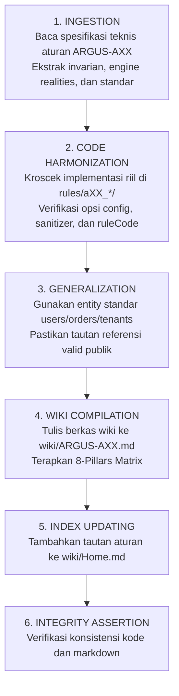

# Argus Public Wiki Builder Skill (`argus-wikis-builder`)

> **Mandat Utama:** Mentransformasikan spesifikasi teknis menjadi **Dokumentasi Wiki Publik Resmi** bertaraf industri di [`wiki/ARGUS-AXX.md`](wiki/) dengan menjaga standar dokumentasi terbuka dan mandiri.

---

## 1. Perimeter Dokumentasi Bersih (Clean Documentation Boundary)

Dokumentasi publik Argus (`github.com/will2469/argus`) harus bersifat agnostik dan mandiri:

### Aturan Konvensi Dokumentasi:

| Kategori                             | Format yang Dilarang                                           | Format Standar Terbuka (Allowed Public Standard)                                            |
| :----------------------------------- | :------------------------------------------------------------- | :------------------------------------------------------------------------------------------ |
| **Konteks Entitas / Domain**         | Istilah privat / entitas proprietary tertutup                   | Entitas generik standar: `users`, `accounts`, `tenant_id`, `orders`, `transactions`         |
| **Package / Path Proyek**            | Path direktori privat di luar repositori                       | Jalur standar Go / App: `github.com/will2469/argus`, `app/repo`, `migrations`              |
| **Tautan Referensi**                 | Tautan file lokal privat                                       | Tautan publik resmi: link PostgreSQL official docs, CWE, OWASP, atau link Wiki Argus        |
| **Path Sistem**                      | Path absolut mesin tertentu                                    | Path relatif standar proyek (`internal/repository/user.go`)                                 |

---

## 2. Struktur Standar Dokumen Wiki Publik (8 Pillars Matrix)

Setiap berkas Wiki di [`wiki/ARGUS-AXX.md`](wiki/) **wajib** mengikuti struktur 8 pilar berikut secara konsisten:

```markdown
# ARGUS-AXX: [Judul Aturan dalam Title Case]

> **Rule Code:** `ARGUS-AXX`
> **Identifier:** `[RULE_IDENTIFIER]`
> **Severity:** `CRITICAL` | `HIGH` | `MEDIUM` | `LOW`
> **Category:** `Security & Data Integrity` | `Performance & Concurrency` | `Schema & Migration Safety` | `Resource & Connection Lifecycle`
> **Target Standards:** [CWE-XXX, OWASP ASVS v4.0.3/v5.0 §VX.X.X, OWASP Top 10]

---

## 1. Overview & Core Invariant

[Penjelasan singkat 1-2 paragraf mengenai prinsip dasar aturan dan apa yang ditegakkannya]

---

## 2. Technical Grounding & PostgreSQL Engine Realities

[Penjelasan mendalam tentang interaksi runtime Go dengan PostgreSQL engine:

- Extended Query Protocol v3.0 (Parse, Bind, Execute)
- Multi-statement command defense
- Generic Plan vs Custom Plan optimization & Plan Cache Thrashing
- Lock trees (AccessExclusiveLock), WAL logging, atau connection pool starvation]

---

## 3. How Argus Detects Violations (Static Analysis Architecture)

[Diagram Mermaid alur deteksi + rincian:

- Sources (dari mana input berasal: Parameter HTTP, Request DTOs, Filter struct)
- Propagators (bagaimana taint/kondisi menyebar: Binary '+', fmt.Sprintf, strings.Builder, re-assignment)
- Sinks (di mana eksekusi terlarang dipicu: pool.Query, QueryRow, Exec, loop block)
- Sanitizers & Safe Builders (pola yang mematahkan deteksi secara sah)]

---

## 4. Vulnerability & Risk Taxonomy

[Tabel rincian risiko jika aturan dilanggar: konsekuensi performa, keamanan, dan stabilitas produksi]

---

## 5. Non-Compliant Code Patterns (Bad Examples)

[Contoh-contoh kode Go atau SQL migrasi yang melanggar aturan beserta penjelasan alasan deteksinya]

---

## 6. Compliant Implementation Patterns (Good Examples)

[Contoh-contoh kode Go atau SQL migrasi yang patuh dan direkomendasikan sebagai solusi remedi]

---

## 7. How to Suppress (Ignore Directives)

[Panduan sintaks penekanan false positive menggunakan directive resmi Argus beserta aturan alasan minimal 2 kata]

---

## 8. Configuration Reference (`.argus.yaml`)

[Opsi konfigurasi yang relevan untuk aturan ini pada file .argus.yaml]
```

---

## 3. Alur Kerja Eksekusi Pembuatan Wiki (The Wiki Generation SOP)

Saat diminta membuat atau memvalidasi Rule Wiki untuk aturan `ARGUS-AXX`:



---

## 4. Format Index Wiki (`Home.md`)

Setiap penambahan Rule Wiki baru wajib dicatatkan pada [`wiki/Home.md`](wiki/Home.md) dengan format tabel kategori:

| Rule Code                   | Identifier                 | Category                        | Severity   | Default   |
| :-------------------------- | :------------------------- | :------------------------------ | :--------- | :-------- |
| [`ARGUS-A01`](ARGUS-A01.md) | `UNSAFE_SQL_CONCATENATION` | Security & Data Integrity       | `CRITICAL` | `enabled` |
| [`ARGUS-A02`](ARGUS-A02.md) | `MISSING_DEFER_CLOSE`      | Resource & Connection Lifecycle | `HIGH`     | `enabled` |
| ...                         | ...                        | ...                             | ...        | ...       |

---

## 5. Standar Nada Tulisan (Voice & Tone)

- **Otoritatif & Ilmiah:** Jelaskan dengan istilah resmi PostgreSQL engine (seperti _plan cache thrashing_, _tuple lock contention_, _connection pool starvation_).
- **Edukatif & Solutif:** Setiap contoh pelanggaran wajib disertai contoh kode solusi (_positive pattern_) yang siap pakai (_copy-pasteable_).
- **Ringkas & Bebas Narasi:** Tidak boleh ada narasi cerita bertele-tele; gunakan format langsung to-the-point yang ramah pengembang (_developer-first documentation_).
