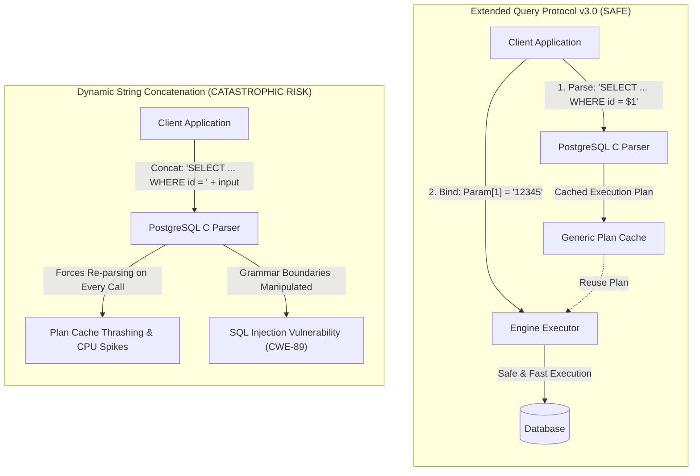
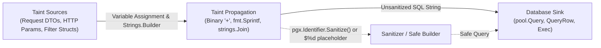

# ARGUS-A01: Unsafe SQL Concatenation

> **Rule Code:** `ARGUS-A01`
> **Identifier:** `UNSAFE_SQL_CONCATENATION`
> **Severity:** `CRITICAL` (Security Blocker)
> **Category:** `Security & Data Integrity`
> **Target Standards:** CWE-89 (SQL Injection), OWASP ASVS v4.0.3/v5.0 §V5.3.1, OWASP Top 10 A03:2021 (Injection)

---

## 1. Overview & Core Invariant

Every SQL query string executed through database drivers (such as `pgx` or `database/sql`) **must** be a compile-time constant string literal or assembled strictly with **parameterized placeholders (`$1, $2, ...`)**.

Dynamic string concatenation using the `+` operator, `fmt.Sprintf`, `fmt.Sprint`, `strings.Join`, `strings.Builder`, or custom string formatters on runtime arguments is strictly prohibited. This invariant guarantees absolute, physical isolation between the **SQL AST grammar structure** and **runtime data values**.

---

## 2. Technical Grounding & PostgreSQL Engine Realities

In PostgreSQL architectures, query execution through the **Extended Query Protocol v3.0** operates across distinct phases:

1. **Parse:** The server parses the SQL statement containing `$n` parameter symbols into a prepared statement and stores it in the query plan cache.
2. **Bind:** Concrete parameter values (in binary or text format) are bound directly to parameter slots without re-parsing the SQL AST grammar.
3. **Describe & Execute:** The query executor runs the pre-compiled execution plan with negligible latency.



When queries are concatenated dynamically, every invocation generates a distinct SQL string. This triggers **Plan Cache Thrashing** inside `src/backend/tcop/postgres.c`, starving database CPU and opening critical injection vectors.

### 2.1. The Multi-Statement Protection Boundary

Under the Extended Query Protocol v3.0, PostgreSQL's `Parse` message strictly enforces a single prepared statement per command. If an attacker injects a command delimiter (`;`) intending to execute stacked queries (e.g. `'; DROP TABLE users; --`), the PostgreSQL engine immediately rejects the command with:

```
ERROR: cannot insert multiple commands into a prepared statement
```

Dynamic string concatenation undermines this fundamental database engine invariant by conflating AST code structure with untrusted runtime values.

### 2.2. Generic Plan vs. Custom Plan Optimization

When using parameterized queries (`$1, $2, ...`), PostgreSQL evaluates whether to switch to a re-usable **Generic Plan** after 5 executions. When queries are dynamically concatenated with runtime literals:

- PostgreSQL is forced to generate a brand new **Custom Plan** on every single request.
- The shared plan cache (`pg_stat_statements`) suffers catastrophic bloat and eviction churn.
- Database CPU spikes dramatically under concurrent OLTP workloads.

---

## 3. How Argus Detects Violations (Taint Flow Architecture)

Argus utilizes an intra-procedural AST taint-tracking engine to trace untrusted input from source to execution sink:



1. **Taint Sources:**
   - Universal technical parameters carrying request payloads (`param`, `params`, `query`, `q`, `search`, `filter`, `sort`, `order`, `orderby`, `order_by`, `table`, `column`, `rawsql`, `sql`, `input`, `userinput`, `user_input`, `id`).
   - Types ending with `Request`, `DTO`, `Input`, `Params`, as well as `*http.Request`.
   - Domain-specific parameter names explicitly configured via `custom_taint_sources` in `.argus.yaml` (e.g., `nik`, `email`, `user_id`, `no_rekening`, `customer_id`).
2. **Taint Propagators:**
   - Variable assignments (`:=`, `=`) across multiple intermediate assignments.
   - String concatenation operators (`+`).
   - Dynamic buffer mutations (`strings.Builder.WriteString`, `strings.Builder.Write`).
   - Unbounded string formatting (`fmt.Sprintf` with `%s` or `%v`, `strings.Join`).
3. **Legitimate Sanitizers:**
   - Formal identifier sanitization: `pgx.Identifier{table}.Sanitize()` or `SanitizeIdentifier(name)`.
   - Parameter counter formatting: `fmt.Sprintf(" AND col = $%d", idx)` where only numeric parameter positions are formatted into the query text.
4. **Execution Sinks:**
   - Method calls matching `Query`, `QueryRow`, or `Exec` on database executor interfaces or `pgxpool.Pool`.

---

## 4. Vulnerability & Risk Taxonomy

| Attack Vector / Failure Mode | Technical Impact                                                                     | Risk Level   |
| :--------------------------- | :----------------------------------------------------------------------------------- | :----------- |
| **SQL Injection (CWE-89)**   | Arbitrary SQL command execution, data breach, authentication bypass, data tampering. | **CRITICAL** |
| **Plan Cache Thrashing**     | Continuous CPU load and memory fragmentation due to endless uncacheable query plans. | **HIGH**     |
| **Lexer Token Manipulation** | Unescaped quotes (`'`) or operators break query semantic boundaries unexpectedly.    | **HIGH**     |

---

## 5. Non-Compliant Code Patterns (Bad Examples)

### Example 1: Direct Binary String Concatenation

```go
// VIOLATION: Concatenating runtime input directly with operator '+'
func GetUserByID(ctx context.Context, pool *pgxpool.Pool, id string) (*User, error) {
    query := "SELECT id, username, email FROM users WHERE id = '" + id + "'"
    row := pool.QueryRow(ctx, query)
    // ...
}
```

### Example 2: String Formatting via `fmt.Sprintf`

```go
// VIOLATION: Using %s format specifier to interpolate string arguments
func DeleteUser(ctx context.Context, pool *pgxpool.Pool, r *http.Request) error {
    userID := r.URL.Query().Get("id")
    query := fmt.Sprintf("DELETE FROM users WHERE id = '%s'", userID)
    _, err := pool.Exec(ctx, query)
    return err
}
```

### Example 3: Unsafe Dynamic `strings.Builder`

```go
// VIOLATION: Appending raw input into a strings.Builder query buffer
var sb strings.Builder
sb.WriteString("SELECT id, name FROM users WHERE status = '")
sb.WriteString(req.Status) // Tainted variable
sb.WriteString("'")
rows, err := pool.Query(ctx, sb.String())
```

---

## 6. Compliant Implementation Patterns (Good Examples)

### Solution 1: Static Parameterized Query (Standard)

```go
// COMPLIANT: Query constant with parameterized placeholder $1
func GetUserByID(ctx context.Context, pool *pgxpool.Pool, id string) (*User, error) {
    const query = "SELECT id, username, email FROM users WHERE id = $1"
    row := pool.QueryRow(ctx, query, id)
    // ...
}
```

### Solution 2: Parameterized Dynamic Query Builder

When building dynamic search filters, only append **static query clauses with indexed placeholders (`$%d`)**, while accumulating parameter values in a typed argument slice:

```go
// COMPLIANT: Dynamic query builder with parameterized placeholders
func SearchUsers(ctx context.Context, pool *pgxpool.Pool, filter UserFilter) ([]User, error) {
    query := "SELECT id, username, email FROM users WHERE 1=1"
    var args []any
    idx := 1

    if filter.Role != "" {
        query += fmt.Sprintf(" AND role = $%d", idx)
        args = append(args, filter.Role)
        idx++
    }
    if filter.Status != "" {
        query += fmt.Sprintf(" AND status = $%d", idx)
        args = append(args, filter.Status)
        idx++
    }

    rows, err := pool.Query(ctx, query, args...)
    // ...
}
```

### Solution 3: Dynamic Table / Column Identifiers via Sanitizer

If table or column names must be selected dynamically, they cannot use `$n` placeholders. You **must** sanitize them using `pgx.Identifier`:

```go
// COMPLIANT: Dynamic identifier safely quoted and escaped
func GetTableCount(ctx context.Context, pool *pgxpool.Pool, tableName string) (int64, error) {
    // Validates and safely double-quotes the identifier
    safeTable := pgx.Identifier{tableName}.Sanitize()
    query := "SELECT COUNT(*) FROM " + safeTable

    var count int64
    err := pool.QueryRow(ctx, query).Scan(&count)
    return count, err
}
```

---

## 7. How to Suppress (Ignore Directives)

If you encounter an isolated legacy script or verified internal tool where dynamic query construction is proven safe, you can suppress the warning with a mandatory reason consisting of **at least 2 words**:

```go
// argus:ignore ARGUS-A01 internal bootstrap migration script
rows, err := dbpool.Query(ctx, rawDynamicQuery)
```

Alternatively, use the identifier alias:

```go
// argus:ignore UNSAFE_SQL_CONCATENATION verified internal maintenance query
rows, err := dbpool.Query(ctx, rawDynamicQuery)
```

---

## 8. Configuration Reference (`.argus.yaml`)

You can toggle or configure this rule globally in `.argus.yaml`:

```yaml
rules:
  ARGUS-A01:
    enabled: true
    # Domain-specific parameter or column names to treat as untrusted taint sources
    custom_taint_sources:
      - "nik"
      - "email"
      - "user_id"
      - "customer_id"
      - "no_rekening"
```
