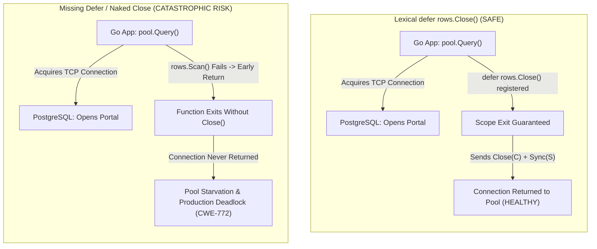
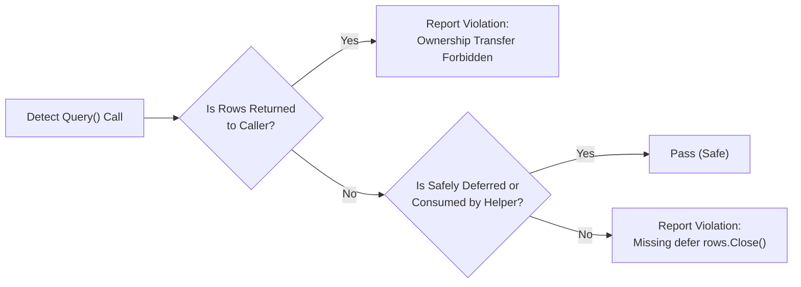

# ARGUS-A02: Missing Defer Rows Close

> **Rule Code:** `ARGUS-A02`
> **Identifier:** `MISSING_DEFER_CLOSE`
> **Severity:** `HIGH` (Connection Leak & Pool Starvation Blocker)
> **Category:** `Resource & Connection Lifecycle`
> **Target Standards:** CWE-772 (Missing Release of Resource after Effective Lifetime), CWE-404 (Improper Resource Shutdown), OWASP ASVS v4.0.3/v5.0 §V1.4.3

---

## 1. Overview & Core Invariant

Every database call that produces a `pgx.Rows` instance (`dbpool.Query`, `tx.Query`, `conn.Query`) **must** immediately register resource release through `defer rows.Close()` within the **same lexical scope**, or be consumed by an auto-closing helper (`pgx.CollectRows`, `pgx.CollectOneRow`, `pgx.ForEachRow`).

Transferring ownership of active `pgx.Rows` outside the constructing function (such as returning `pgx.Rows` to a caller service or HTTP handler) is strictly prohibited. The opening function must fully scan and map all rows into domain structs or values before returning.

---

## 2. Technical Grounding & PostgreSQL Engine Realities

When an application invokes `Query()`, the PostgreSQL backend opens an active server-side **Portal**:

1. **Physical Socket Pinning:** An active `pgx.Rows` object holds an exclusive lease on an underlying TCP socket connection checked out from `*pgxpool.Pool`.
2. **Wire Protocol Handshake:** Until the client explicitly transmits the wire protocol `Close (C)` and `Sync (S)` messages, the PostgreSQL backend process holds active buffer locks and stays in `idle in transaction` or unclosed portal state.
3. **Connection Starvation Cascade:** If the function exits early (e.g. during `rows.Scan(&val)` error) without `defer rows.Close()`, the TCP connection remains orphaned. Within seconds under concurrent production traffic, the pool's `MaxConns` limit is exhausted, causing a catastrophic backend freeze and HTTP 503 / gateway timeout errors (ref: `jackc/pgx` issue #2153).



---

## 3. How Argus Detects Violations (Static Analysis Architecture)

Argus examines function declarations (`*ast.FuncDecl`) and closures (`*ast.FuncLit`) using dedicated lexical AST traversal:



1. **Direct Return Detection:** Flags any `return db.Query(...)` that directly passes unconsumed rows to the caller.
2. **Variable Ownership Tracking:** Verifies if the variable assigned to the result of `Query()` appears in any subsequent `*ast.ReturnStmt`.
3. **Lexical Defer Verification:** Scans the enclosing function body for `defer rows.Close()` or closure `defer func() { rows.Close() }()`.
4. **Auto-Closing Helper Whitelist:** Automatically accepts official `pgx` streaming helpers that guarantee internal cleanup:
   - `pgx.CollectRows(rows, ...)`
   - `pgx.CollectOneRow(rows, ...)`
   - `pgx.ForEachRow(rows, ...)`

---

## 4. Vulnerability & Risk Taxonomy

| Failure Mode                                    | Technical Impact                                                                          | Risk Severity |
| :---------------------------------------------- | :---------------------------------------------------------------------------------------- | :------------ |
| **Missing `defer rows.Close()`**                | Unclosed server-side portals leak TCP socket connections on any scan or iteration error.  | **CRITICAL**  |
| **Non-Deferred `rows.Close()` at Function End** | Any early return inside `rows.Next()` bypasses the closing call completely.               | **HIGH**      |
| **Returning `pgx.Rows` to Caller**              | Shifts cleanup responsibility to outer layers, creating widespread blind spots and leaks. | **HIGH**      |

---

## 5. Non-Compliant Code Patterns (Bad Examples)

### Example 1: Non-Deferred Close at Function End

```go
// VIOLATION: Calling rows.Close() without defer
func GetActiveUsers(ctx context.Context, pool *pgxpool.Pool) ([]User, error) {
    rows, err := pool.Query(ctx, "SELECT id, name FROM users WHERE active = true")
    if err != nil {
        return nil, err
    }

    var users []User
    for rows.Next() {
        var u User
        if err := rows.Scan(&u.ID, &u.Name); err != nil {
            // CATASTROPHIC: Early return bypasses rows.Close() below, leaking connection!
            return nil, err
        }
        users = append(users, u)
    }

    rows.Close() // Too late: skipped on any Scan error!
    return users, nil
}
```

### Example 2: Transferring Rows Ownership to Caller

```go
// VIOLATION: Returning pgx.Rows outside the constructing function
func QueryUsersRaw(ctx context.Context, pool *pgxpool.Pool) (pgx.Rows, error) {
    rows, err := pool.Query(ctx, "SELECT id, name FROM users")
    if err != nil {
        return nil, err
    }
    // FORBIDDEN: Transfers resource management responsibility to caller
    return rows, nil
}
```

### Example 3: Missing Close Entirely

```go
// VIOLATION: Rows object is never closed
func UserExists(ctx context.Context, pool *pgxpool.Pool, id string) (bool, error) {
    rows, err := pool.Query(ctx, "SELECT 1 FROM users WHERE id = $1", id)
    if err != nil {
        return false, err
    }
    // Rows remains open permanently in connection pool!
    return rows.Next(), nil
}
```

---

## 6. Compliant Implementation Patterns (Good Examples)

### Solution 1: Immediate `defer rows.Close()` (Standard)

```go
// COMPLIANT: defer rows.Close() registered immediately after error verification
func GetActiveUsers(ctx context.Context, pool *pgxpool.Pool) ([]User, error) {
    rows, err := pool.Query(ctx, "SELECT id, name FROM users WHERE active = true")
    if err != nil {
        return nil, err
    }
    defer rows.Close() // Guaranteed execution on ANY exit path

    var users []User
    for rows.Next() {
        var u User
        if err := rows.Scan(&u.ID, &u.Name); err != nil {
            return nil, err
        }
        users = append(users, u)
    }

    if err := rows.Err(); err != nil {
        return nil, err
    }
    return users, nil
}
```

### Solution 2: Auto-Closing Helper (`pgx.CollectRows`)

```go
// COMPLIANT: pgx.CollectRows guarantees internal rows.Close() execution
func GetActiveUsers(ctx context.Context, pool *pgxpool.Pool) ([]User, error) {
    rows, err := pool.Query(ctx, "SELECT id, name FROM users WHERE active = true")
    if err != nil {
        return nil, err
    }
    return pgx.CollectRows(rows, pgx.RowToStructByName[User])
}
```

### Solution 3: Deferred Closure

```go
// COMPLIANT: Defer within closure wrapper
func QueryWithMetric(ctx context.Context, pool *pgxpool.Pool) error {
    rows, err := pool.Query(ctx, "SELECT id FROM users")
    if err != nil {
        return err
    }
    defer func() {
        rows.Close()
    }()
    // ...
    return nil
}
```

---

## 7. How to Suppress (Ignore Directives)

For mock generators or test fixtures where resource management is intentionally tested:

```go
// argus:ignore ARGUS-A02 test mock stream generator
rows, err := dbpool.Query(ctx, testQuery)
```

Alternatively, use the identifier alias:

```go
// argus:ignore MISSING_DEFER_CLOSE simulated unclosed connection fixture
rows, err := dbpool.Query(ctx, testQuery)
```

---

## 8. Configuration Reference (`.argus.yaml`)

Enable or disable this rule globally in `.argus.yaml`:

```yaml
rules:
  ARGUS-A02:
    enabled: true
```
