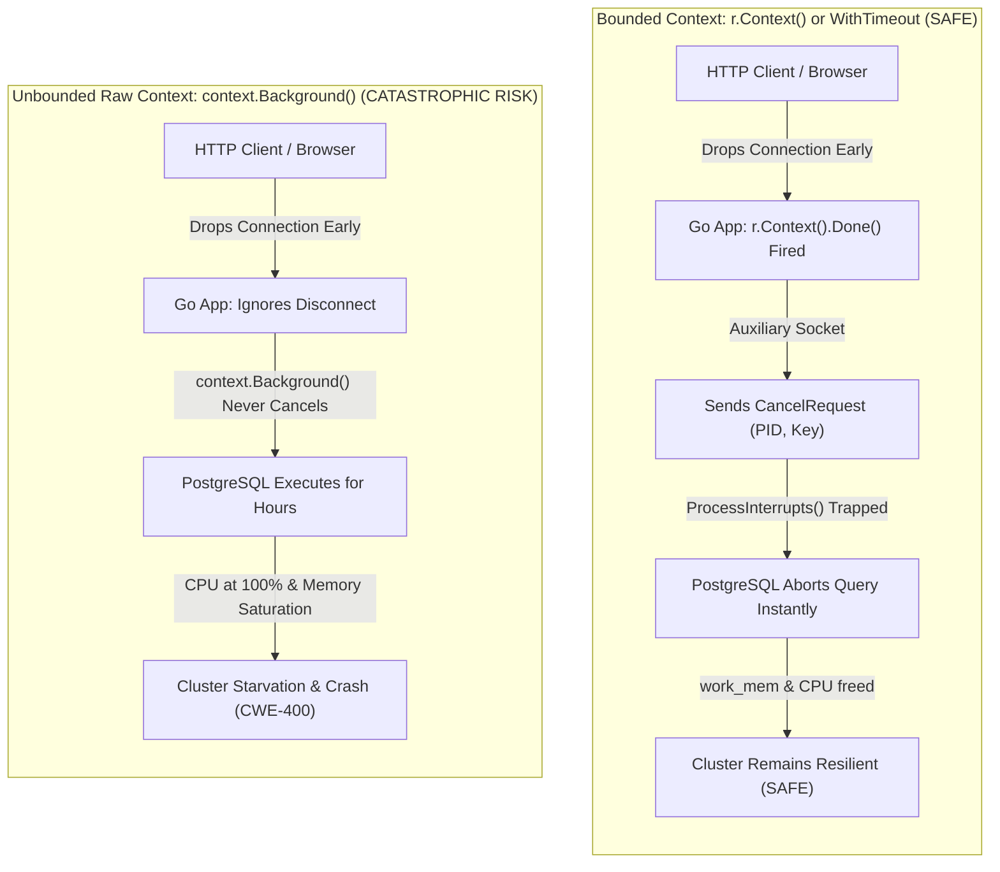
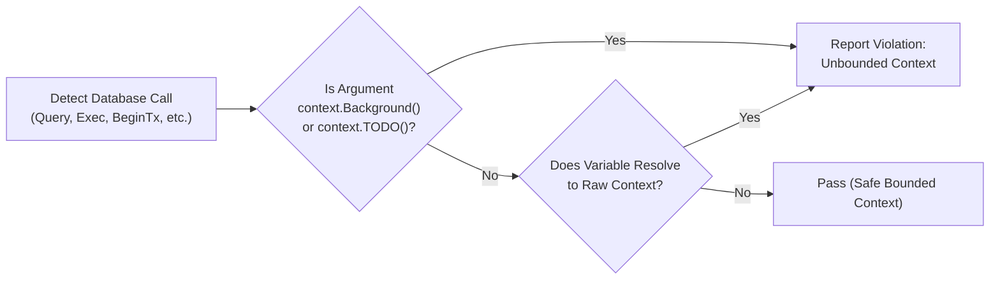

# ARGUS-A03: Unbounded Context in Database Operations

> **Rule Code:** `ARGUS-A03`
> **Identifier:** `UNBOUNDED_CONTEXT`
> **Severity:** `HIGH` (Zombie Query & CPU/Memory Saturation Blocker)
> **Category:** `Resource & Connection Lifecycle`
> **Target Standards:** CWE-400 (Uncontrolled Resource Consumption), OWASP ASVS v4.0.3/v5.0 §V1.5.1

---

## 1. Overview & Core Invariant

Every database I/O invocation (`Query`, `QueryRow`, `Exec`, `Begin`, `BeginTx`, `SendBatch`, `CopyFrom`, `Ping`) **must** receive and propagate a `context.Context` configured with an explicit timeout/deadline or bound to a cancellable lifecycle (such as `r.Context()` from HTTP requests, `context.WithCancel()`, `context.WithTimeout()`, or worker envelopes).

Executing database calls with raw, inert, unbounded root contexts—specifically direct or indirect usages of `context.Background()` or `context.TODO()`—is strictly prohibited in production application code.

---

## 2. Technical Grounding & PostgreSQL Engine Realities

PostgreSQL utilizes an asynchronous, out-of-band wire protocol cancellation mechanism defined in **PostgreSQL Protocol Formats §54.2 (`CancelRequest`)**:

1. **Out-of-Band Cancellation:** When a Go `context.Context` expires or cancels (for instance, when an HTTP client terminates an in-flight request), driver engines like `pgx` do not sever the primary query socket.
2. **Auxiliary Socket Dispatch:** Instead, `pgx` immediately establishes an auxiliary, lightweight TCP connection to PostgreSQL and transmits a `CancelRequest` message containing the target backend process PID and its session Secret Key.
3. **Instant Engine Abortion:** The PostgreSQL engine traps this signal via `ProcessInterrupts()`, terminating the active statement instantly, releasing `work_mem` sort/hash buffers, and relinquishing relation lock pins.



### 2.1. Defense-in-Depth vs. Server Timeouts

While server-side safety guards such as `statement_timeout` (`ARGUS-A12`) and `transaction_timeout` (`ARGUS-A23`) exist, PostgreSQL cannot autonomously detect when a downstream HTTP client or mobile user has abandoned a request. Propagating a bounded Go `context.Context` is the only reactive mechanism capable of neutralizing zombie queries at the exact millisecond of abandonment.

---

## 3. How Argus Detects Violations (Static Analysis Architecture)

Argus inspects all function declarations (`*ast.FuncDecl`) outside test files (`_test.go` are exempted):



1. **Target Method Filter:** Matches database I/O methods: `Query`, `QueryRow`, `Exec`, `Begin`, `BeginTx`, `SendBatch`, `CopyFrom`, and `Ping` (excluding non-database selector methods like `r.URL.Query()`).
2. **Direct Call Detection:** Identifies `*ast.CallExpr` directly calling `context.Background()` or `context.TODO()`, resolving any package import aliases (e.g., `import stdctx "context"`).
3. **Flow-Sensitive & Scope-Aware Variable Resolution:** Evaluates local identifier assignments (`*ast.AssignStmt`) with lattice-based control-flow join and lexical scope stack tracking. Correctly isolates shadowed variables and flags incomplete branch assignments.
4. **Bounded & Cancellable Whitelist:** Recognizes valid context creators:
   - Request & lifecycle contexts: `r.Context()`, `c.Request.Context()`
   - Deadline & timeout contexts: `context.WithTimeout(...)`, `context.WithDeadline(...)`
   - Active cancellation contexts: `context.WithCancel(...)`, `context.WithCancelCause(...)`, `signal.NotifyContext(...)`
   - Function parameter contexts: `ctx context.Context` passed down from caller functions

---

## 4. Vulnerability & Risk Taxonomy

| Failure Mode                                    | Technical Impact                                                                          | Risk Severity |
| :---------------------------------------------- | :---------------------------------------------------------------------------------------- | :------------ |
| **Zombie Query Accumulation**                   | Abandoned client queries continue burning database CPU and memory for extended durations. | **HIGH**      |
| **Connection Pool Blockade**                    | Pool connections remain checked out by orphaned queries, blocking incoming requests.      | **HIGH**      |
| **Uncontrolled Resource Consumption (CWE-400)** | Exhaustion of `work_mem` and temp disk space causing database cluster instability.        | **HIGH**      |

---

## 5. Non-Compliant Code Patterns (Bad Examples)

### Example 1: Direct `context.Background()` in Query

```go
// VIOLATION: Using context.Background() directly in database call
func GetUserProfile(pool *pgxpool.Pool, userID string) (*User, error) {
    query := "SELECT id, username, email FROM users WHERE id = $1"
    row := pool.QueryRow(context.Background(), query, userID) // Flagged!
    // ...
}
```

### Example 2: Direct `context.TODO()` in Execution

```go
// VIOLATION: Using context.TODO() as a placeholder in production
func DeleteExpiredSessions(pool *pgxpool.Pool) error {
    _, err := pool.Exec(context.TODO(), "DELETE FROM sessions WHERE expires_at < NOW()")
    return err
}
```

### Example 3: Indirect Raw Context via Local Assignment

```go
// VIOLATION: Initializing raw context in variable and passing to BeginTx
func TransferFunds(pool *pgxpool.Pool, fromID, toID string, amount int64) error {
    ctx := context.Background() // Tracked by context_resolver
    tx, err := pool.BeginTx(ctx, pgx.TxOptions{})
    if err != nil {
        return err
    }
    defer tx.Rollback(ctx)
    // ...
}
```

---

## 6. Compliant Implementation Patterns (Good Examples)

### Solution 1: Bound to Request Lifecycle (HTTP / gRPC Handlers)

```go
// COMPLIANT: Propagating request context from HTTP server
func (h *UserHandler) HandleGetProfile(w http.ResponseWriter, r *http.Request) {
    user, err := h.repo.FindByID(r.Context(), r.PathValue("id"))
    if err != nil {
        http.Error(w, "Not found", http.StatusNotFound)
        return
    }
    json.NewEncoder(w).Encode(user)
}
```

### Solution 2: Explicit Timeout for Background Workers / Cron Jobs

```go
// COMPLIANT: Explicit timeout with deferred cancellation
func (w *CleanupWorker) RunHourlyCleanup(pool *pgxpool.Pool) error {
    ctx, cancel := context.WithTimeout(context.Background(), 10*time.Second)
    defer cancel()

    _, err := pool.Exec(ctx, "DELETE FROM audit_temp WHERE created_at < NOW() - INTERVAL '7 days'")
    return err
}
```

### Solution 3: Context Propagation Across Repository Layer

```go
// COMPLIANT: Context passed as first parameter across domain boundaries
func (r *UserRepository) FindByID(ctx context.Context, id string) (*User, error) {
    const query = "SELECT id, username, email FROM users WHERE id = $1"
    row := r.pool.QueryRow(ctx, query, id)
    // ...
}
```

---

## 7. How to Suppress (Ignore Directives)

For maintenance daemons with custom internal watchdog cancellation loops:

```go
// argus:ignore ARGUS-A03 dedicated maintenance worker with external process watchdog
row := pool.QueryRow(context.Background(), maintenanceQuery)
```

Alternatively, use the identifier alias:

```go
// argus:ignore UNBOUNDED_CONTEXT verified internal background migration loop
_, err := pool.Exec(context.Background(), bootstrapQuery)
```

---

## 8. Configuration Reference (`.argus.yaml`)

Enable or configure this rule globally in `.argus.yaml`:

```yaml
rules:
  ARGUS-A03:
    enabled: true
```
