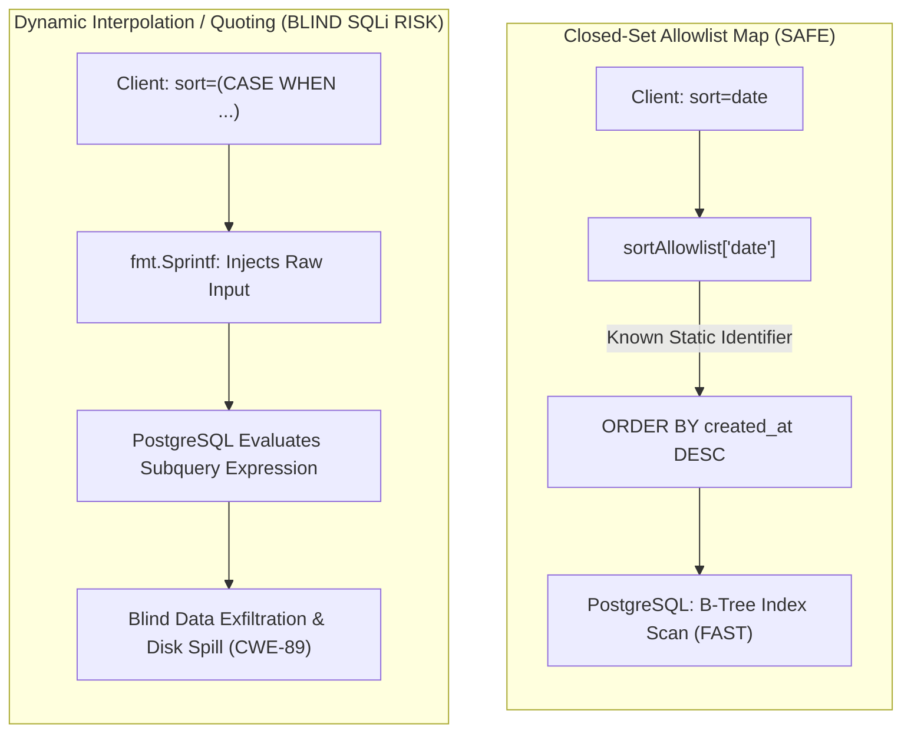
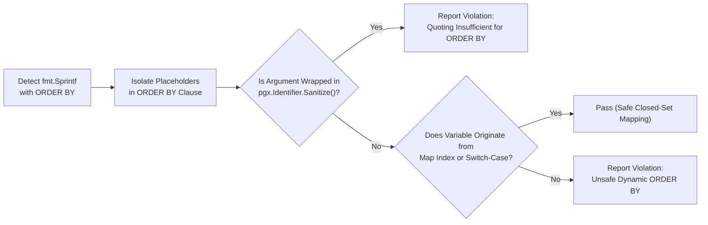

# ARGUS-A04: Unsafe Dynamic ORDER BY Clause

> **Rule Code:** `ARGUS-A04`
> **Identifier:** `UNSAFE_ORDER_BY`
> **Severity:** `HIGH` (Inferential Blind SQLi & Information Leakage Blocker)
> **Category:** `Security & Data Integrity`
> **Target Standards:** CWE-89 (SQL Injection via Order By), OWASP ASVS v4.0.3/v5.0 §V5.3.1

---

## 1. Overview & Core Invariant

Dynamic SQL identifiers within the **`ORDER BY`** clause (column names) and sort directions (`ASC` / `DESC`) **must be validated and mapped exclusively via compile-time closed-set allowlist maps** (`map[string]string`) or static `switch-case` branches with default fallbacks.

Interpolating raw user input directly into `ORDER BY` is strictly forbidden. Crucially, simple identifier quoting-such as `pgx.Identifier{userInput}.Sanitize()`-is **insufficient and prohibited** because quoting prevents syntax-breaking attacks but does not prevent attackers from ordering results by unauthorized private columns (e.g. `password_hash`, `totp_secret`, `deleted_at`).

---

## 2. Technical Grounding & PostgreSQL Engine Realities

### 2.1. Why Bind Parameters ($1) Do Not Work in ORDER BY

In PostgreSQL Extended Query Protocol v3.0, parameter placeholders (`$1, $2, ...`) cannot represent SQL column identifiers:

- If a developer executes `SELECT id FROM users ORDER BY $1`, PostgreSQL evaluates `$1` as a scalar constant literal for every tuple.
- The query executes as a **no-op sort**, leaving rows in non-deterministic physical order.
- This protocol limitation tempts developers into dynamic string formatting (`fmt.Sprintf`), exposing applications to inferential SQL injection.

### 2.2. Inferential Blind SQL Injection (CWE-89)

Because `ORDER BY` accepts arbitrary SQL expressions, an attacker can extract private data bit-by-bit by injecting conditional expressions:

```
sort=(CASE WHEN (SELECT ASCII(SUBSTRING(password_hash, 1, 1))
                 FROM admin_users WHERE id = 1) = 97
           THEN created_at ELSE id END)
```

PostgreSQL evaluates the subquery for every request:

- If `True`: The result set is ordered by `created_at`.
- If `False`: The result set is ordered by `id`.

By observing the order of returned rows, the attacker reconstructs entire confidential tables without triggering any database errors or audit logs.



### 2.3. Performance Impact in PostgreSQL 18

Arbitrary or expression-based sort targets disable modern PostgreSQL 18 optimizations such as **B-tree Index Skip Scan** and **Incremental Sort**. PostgreSQL is forced to allocate a memory-intensive _Sort Node_ inside `work_mem` or spill intermediate sort runs to temporary disk files, drastically increasing query latency.

---

## 3. How Argus Detects Violations (Static Analysis Architecture)

Argus combines Go AST data flow analysis with SQL SortClause inspection:



1. **Clause Isolation:** Identifies `fmt.Sprintf` calls containing an `ORDER BY` clause and maps argument placeholder indices specifically residing inside the sorting clause.
2. **Quoting Rejection:** Detects calls to `pgx.Identifier.Sanitize()` or `SanitizeIdentifier()` and rejects them explicitly.
3. **Data Flow Validation:** Inspects local variable assignments (`*ast.AssignStmt`) with strict CFG path invariants:
   - **Map Provenance Verification:** Accepts map index lookups (`safeCol := sortMap[userSort]`) ONLY when `sortMap` is proven to be a closed-set composite map literal where all mapped values are compile-time string constants and no runtime mutations exist. Rejects arbitrary or unverified runtime maps.
   - **Exhaustive Switch-Case Verification:** Requires every reachable branch in a `switch` (including `default`) to assign an approved static string literal or terminate control flow (`return`, `panic`). Rejects switches where a fallback branch assigns untrusted input.
   - **Path-Complete Sort Direction Verification:** Ensures sort direction variables strictly evaluate to `"ASC"` or `"DESC"` along all execution paths.
4. **PostgreSQL AST Parser:** Validates static and dynamic queries using `pg_query_go` to confirm that `SortClause` expressions do not contain complex, untrusted expression trees.

---

## 4. Vulnerability & Risk Taxonomy

| Failure Mode                     | Technical Impact                                                                                 | Risk Severity |
| :------------------------------- | :----------------------------------------------------------------------------------------------- | :------------ |
| **Direct Parameter Injection**   | Inferential Blind SQL Injection (CWE-89) extracting sensitive credentials without syntax errors. | **CRITICAL**  |
| **Identifier Quoting Bypass**    | Access and sorting on private columns (`password_hash`, `totp_secret`, `deleted_at`).            | **HIGH**      |
| **Unvalidated Sort Direction**   | Injection of arbitrary clauses via the sort direction parameter.                                 | **HIGH**      |
| **Arbitrary Expression Sorting** | Bypasses B-tree index sort paths, triggering unindexed disk spills and CPU spikes.               | **MEDIUM**    |

---

## 5. Non-Compliant Code Patterns (Bad Examples)

### Example 1: Direct Injection from HTTP Request

```go
// VIOLATION: Directly interpolating query parameter into ORDER BY
func ListUsers(ctx context.Context, pool *pgxpool.Pool, r *http.Request) ([]User, error) {
    sortBy := r.URL.Query().Get("sort")
    // Flagged: Unsafe dynamic ORDER BY expression!
    query := fmt.Sprintf("SELECT id, name FROM users ORDER BY %s ASC", sortBy)
    rows, err := pool.Query(ctx, query)
    // ...
}
```

### Example 2: False Security via Quoting Sanitizer

```go
// VIOLATION: Relying on pgx.Identifier quoting for ORDER BY
func ListUsers(ctx context.Context, pool *pgxpool.Pool, r *http.Request) ([]User, error) {
    sortBy := r.URL.Query().Get("sort")
    safeCol := pgx.Identifier{sortBy}.Sanitize()
    // Flagged: Quoting does NOT restrict sorting to public columns!
    query := fmt.Sprintf("SELECT id, name FROM users ORDER BY %s ASC", safeCol)
    rows, err := pool.Query(ctx, query)
    // ...
}
```

### Example 3: Unvalidated Sort Direction

```go
// VIOLATION: Dynamic sort direction without strict ASC/DESC constraint
func ListOrders(ctx context.Context, pool *pgxpool.Pool, dir string) ([]Order, error) {
    // Flagged: dir can be injected with arbitrary SQL expressions
    query := fmt.Sprintf("SELECT id, total FROM orders ORDER BY created_at %s", dir)
    rows, err := pool.Query(ctx, query)
    // ...
}
```

---

## 6. Compliant Implementation Patterns (Good Examples)

### Solution 1: Closed-Set Allowlist Map (Standard)

```go
// COMPLIANT: Validated against a closed-set allowlist map with static fallback
var userSortAllowlist = map[string]string{
    "name":  "name",
    "email": "email",
    "date":  "created_at",
}

func ListUsers(ctx context.Context, pool *pgxpool.Pool, r *http.Request) ([]User, error) {
    sortBy := r.URL.Query().Get("sort")
    column, ok := userSortAllowlist[sortBy]
    if !ok {
        column = "id" // Safe deterministic fallback
    }

    query := fmt.Sprintf("SELECT id, name, email FROM users ORDER BY %s ASC", column)
    rows, err := pool.Query(ctx, query)
    // ...
}
```

### Solution 2: Explicit Switch-Case Mapping

```go
// COMPLIANT: Every branch maps to a compile-time string literal
func GetSortColumn(sortBy string) string {
    switch sortBy {
    case "name":
        return "name"
    case "date":
        return "created_at"
    default:
        return "id"
    }
}
```

### Solution 3: Strict Direction Validation

```go
// COMPLIANT: Explicit validation for sort direction
direction := "ASC"
if strings.ToUpper(r.URL.Query().Get("dir")) == "DESC" {
    direction = "DESC"
}
query := fmt.Sprintf("SELECT id, name FROM users ORDER BY created_at %s", direction)
```

---

## 7. How to Suppress (Ignore Directives)

For internal reporting scripts or batch utilities where dynamic ordering has been manually verified:

```go
// argus:ignore ARGUS-A04 internal reporting analytics query with trusted admin input
query := fmt.Sprintf("SELECT id, name FROM users ORDER BY %s ASC", userSort)
```

Alternatively, use the identifier alias:

```go
// argus:ignore UNSAFE_ORDER_BY verified batch exporter sort column
query := fmt.Sprintf("SELECT id, name FROM users ORDER BY %s ASC", userSort)
```

---

## 8. Configuration Reference (`.argus.yaml`)
 
 Enable or configure this rule globally in `.argus.yaml`:
 
 ```yaml
 rules:
   ARGUS-A04:
     enabled: true
     # Optional allowlist of permitted column names for dynamic ORDER BY.
     # When configured, any column name assigned via map, switch, or variable
     # must strictly exist within this approved list.
     allowed_columns:
       - "id"
       - "created_at"
       - "updated_at"
       - "deleted_at"
       - "name"
       - "nama"
       - "email"
       - "status"
       - "role"
       - "created_by"
       - "updated_by"
       - "is_active"
 ```
