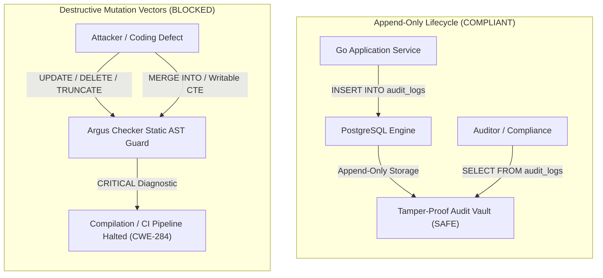
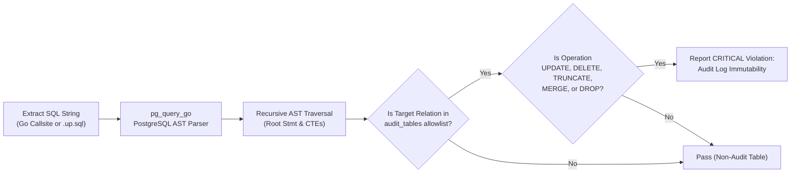

# ARGUS-A05: Audit Log Immutability

> **Rule Code:** `ARGUS-A05`
> **Identifier:** `AUDIT_LOG_IMMUTABILITY`
> **Severity:** `CRITICAL` (Tampering & Non-Repudiation Blocker)
> **Category:** `Security & Data Integrity`
> **Target Standards:** CWE-284 (Improper Access Control), CWE-778 (Insufficient Logging), OWASP ASVS v4.0.3/v5.0 §V7.2.1, §V7.2.2, ISO 27001 / SOC 2 Type II

---

## 1. Overview & Core Invariant

All audit trail tables (`audit_logs`, `security_events`, and configured ledger entities) **must remain strictly append-only**.

Runtime application services and database migration scripts are strictly prohibited from executing modifying or destructive operations on audit tables:

- **`UPDATE`**
- **`DELETE`**
- **`TRUNCATE`**
- **`DROP TABLE`**
- **`MERGE`** (specifically PostgreSQL 17/18 `WHEN MATCHED THEN UPDATE/DELETE`)
- **Writable CTEs** (`WITH del AS (DELETE FROM audit_logs ...)`)

The only permissible SQL Data Manipulation Language (DML) operations on audit tables are **`INSERT`** (recording events) and **`SELECT`** (forensic querying).

---

## 2. Technical Grounding & PostgreSQL Engine Realities

### 2.1. Forensic Integrity & Legal Non-Repudiation

Audit trails provide tamper-evident proof of critical system events (e.g. citizen identity mutations, security authentications, and financial authorizations). Every mutating action is anchored with a publicly verifiable transaction identifier (`public_tx_id`). Allowing modifications or deletions destroys forensic non-repudiation, violating legal compliance regulations (GDPR, ISO 27001, SOC 2 Type II).

### 2.2. Multi-Layer Engine Defense (Role-Based Privileges)

Static analysis by Argus must be paired with engine-level PostgreSQL privilege isolation:

```sql
-- Runtime application role must only read and append
REVOKE UPDATE, DELETE, TRUNCATE ON audit_logs FROM app_user;
GRANT SELECT, INSERT ON audit_logs TO app_user;
```

### 2.3. PostgreSQL 17/18 MERGE & Writable CTE Bypass Prevention

PostgreSQL 17/18 SQL dialect supports `MERGE` commands and Writable Common Table Expressions (`WITH`). An attacker or misguided developer could attempt to alter logs using:

- `MERGE INTO audit_logs USING ... WHEN MATCHED THEN UPDATE`
- `WITH deleted AS (DELETE FROM audit_logs WHERE ...) SELECT 1`

Argus performs deep recursive SQL AST inspection, analyzing root queries and nested CTEs alike.



### 2.4. Data Retention via Partition Rotation (Never Bulk DELETE)

Where data retention laws permit pruning audit records after statutory retention windows (e.g. 5 or 7 years), pruning **must never execute `DELETE FROM audit_logs`**, which causes table lockups and severe VACUUM bloat. Instead, retention is managed via partition rotation by scheduled administrative tooling:

```sql
-- Administrative partition detachment (scheduled maintenance, NOT runtime code)
ALTER TABLE audit_logs DETACH PARTITION audit_logs_y2020;
DROP TABLE audit_logs_y2020;
```

---

## 3. How Argus Detects Violations (Static Analysis Architecture)

Argus inspects both Go application source code and SQL migration files:



1. **Callsite Extraction:** Inspects all database execution sites (`Query`, `QueryRow`, `Exec`, `BeginTx`, `SendBatch`).
2. **Recursive AST Traversal (`ast_visitor.go`):** Evaluates `UpdateStmt`, `DeleteStmt`, `TruncateStmt`, `MergeStmt`, `DropStmt`, and traverses all `WithClause` CTEs.
3. **Configurable Target List:** Matches against `.argus.yaml` audit table definitions (`audit_logs`, `security_events`, or custom tables).
4. **Migration Scanner (`migration_check.go`):** Automatically analyzes all `.up.sql` migration scripts to ensure no destructive operations slip through database schema changes.

---

## 4. Vulnerability & Risk Taxonomy

| Failure Mode                             | Technical Impact                                                               | Risk Severity |
| :--------------------------------------- | :----------------------------------------------------------------------------- | :------------ |
| **Audit Record Modification (`UPDATE`)** | Falsification of historical state, invalidating forensic evidence (CWE-284).   | **CRITICAL**  |
| **Audit Record Deletion (`DELETE`)**     | Erasure of malicious activity footprints, blinding security operations.        | **CRITICAL**  |
| **Table Truncation (`TRUNCATE`)**        | Total catastrophic erasure of enterprise audit history.                        | **CRITICAL**  |
| **MERGE Statement Tampering**            | PostgreSQL 17/18 feature bypass updating records during synchronizations.      | **CRITICAL**  |
| **Writable CTE Deletion**                | Nested sub-statement bypass concealing destructive actions in `SELECT` bodies. | **CRITICAL**  |

---

## 5. Non-Compliant Code Patterns (Bad Examples)

### Example 1: Updating an Audit Log Record

```go
// VIOLATION: Attempting to modify audit payload
func SanitizeLog(ctx context.Context, pool *pgxpool.Pool, logID string) error {
    // Flagged: forbidden UPDATE on audit table "audit_logs"
    query := "UPDATE audit_logs SET payload = '{}' WHERE id = $1"
    _, err := pool.Exec(ctx, query, logID)
    return err
}
```

### Example 2: Pruning Logs via Direct DELETE

```go
// VIOLATION: Using runtime DELETE for cleanup
func DeleteOldLogs(ctx context.Context, pool *pgxpool.Pool) error {
    // Flagged: forbidden DELETE on audit table "audit_logs"
    query := "DELETE FROM audit_logs WHERE created_at < NOW() - INTERVAL '30 days'"
    _, err := pool.Exec(ctx, query)
    return err
}
```

### Example 3: Circumventing via PostgreSQL MERGE

```go
// VIOLATION: Using MERGE to mutate audit logs
func SyncAuditEntries(ctx context.Context, pool *pgxpool.Pool) error {
    // Flagged: forbidden MERGE on audit table "audit_logs"
    query := `
        MERGE INTO audit_logs a
        USING temp_sync t ON a.id = t.id
        WHEN MATCHED THEN
            UPDATE SET payload = t.payload
    `
    _, err := pool.Exec(ctx, query)
    return err
}
```

### Example 4: Nested Deletion Inside Writable CTE

```go
// VIOLATION: Hiding a DELETE inside a Common Table Expression
func EvictWithCTE(ctx context.Context, pool *pgxpool.Pool, id string) error {
    // Flagged: forbidden DELETE on audit table "audit_logs" inside CTE!
    query := `
        WITH deleted AS (
            DELETE FROM audit_logs WHERE id = $1
        )
        SELECT 1
    `
    _, err := pool.Exec(ctx, query, id)
    return err
}
```

---

## 6. Compliant Implementation Patterns (Good Examples)

### Solution 1: Strictly Append-Only Recording (`INSERT`)

```go
// COMPLIANT: Only appending new immutable audit event records
func RecordAuditEvent(ctx context.Context, pool *pgxpool.Pool, event AuditEvent) error {
    const query = `
        INSERT INTO audit_logs (
            id, public_tx_id, actor_id, event_type, payload, ip_address, created_at
        ) VALUES (
            $1, $2, $3, $4, $5, $6, NOW()
        )
    `
    _, err := pool.Exec(ctx, query,
        event.ID,
        event.PublicTxID,
        event.ActorID,
        event.EventType,
        event.Payload,
        event.IPAddress,
    )
    return err
}
```

### Solution 2: Forensic Analysis Reading (`SELECT`)

```go
// COMPLIANT: Read-only query for compliance monitoring
func GetAuditHistory(ctx context.Context, pool *pgxpool.Pool, entityID string) ([]AuditEvent, error) {
    const query = `
        SELECT id, public_tx_id, actor_id, event_type, payload, created_at
        FROM audit_logs
        WHERE payload->>'entity_id' = $1
        ORDER BY created_at DESC
        LIMIT 50
    `
    rows, err := pool.Query(ctx, query, entityID)
    if err != nil {
        return nil, err
    }
    defer rows.Close()

    return pgx.CollectRows(rows, pgx.RowToStructByName[AuditEvent])
}
```

---

## 7. How to Suppress (Ignore Directives)

For disaster recovery utilities or approved administrative repartitioning scripts:

```go
// argus:ignore ARGUS-A05 authorized disaster recovery deduplication script
_, err := pool.Exec(ctx, deduplicateQuery)
```

In SQL migration scripts:

```sql
-- argus:ignore ARGUS-A05 emergency schema repartitioning
TRUNCATE TABLE audit_logs;
```

Alternatively, use the identifier alias:

```go
// argus:ignore AUDIT_LOG_IMMUTABILITY administrative archival migration
_, err := pool.Exec(ctx, partitionMigrationQuery)
```

---

## 8. Configuration Reference (`.argus.yaml`)

Define audit tables in `.argus.yaml`:

```yaml
rules:
  ARGUS-A05:
    enabled: true
    audit_tables:
      - audit_logs
      - security_events
      - auth_sessions_history
```
