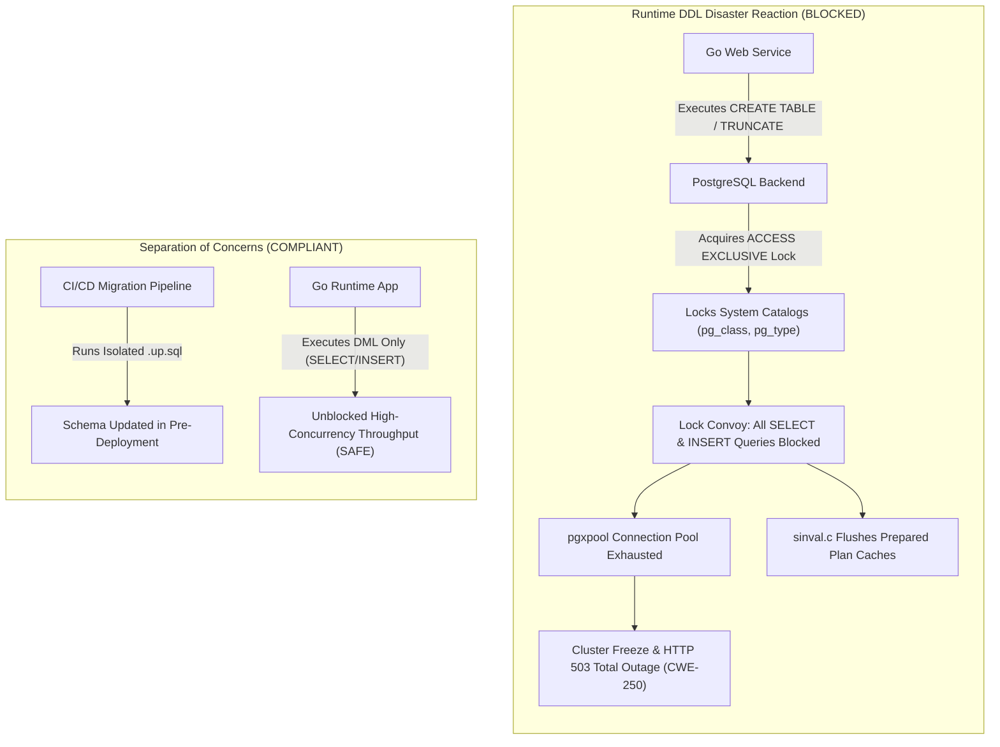
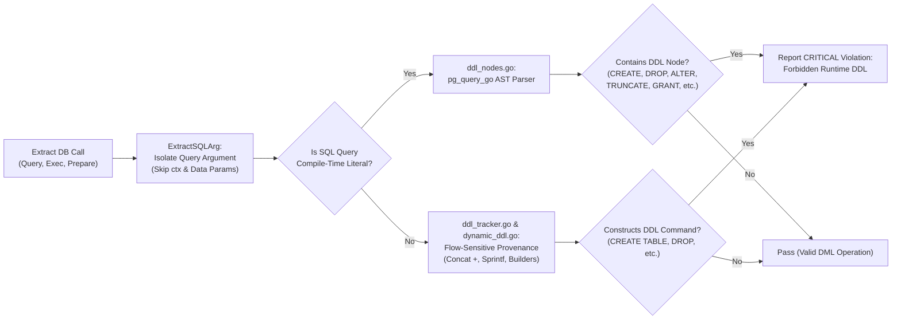

# ARGUS-A06: Runtime DDL Execution

> **Rule Code:** `ARGUS-A06`
> **Identifier:** `RUNTIME_DDL`
> **Severity:** `CRITICAL` (Catalog Lock Outage & Cluster Freeze Blocker)
> **Category:** `Security & Operational Safety`
> **Target Standards:** CWE-250 (Execution with Unnecessary Privileges), OWASP ASVS v4.0.3/v5.0 §V4.1.3

---

## 1. Overview & Core Invariant

Application runtime code **is strictly prohibited from executing Data Definition Language (DDL) commands** such as `CREATE`, `ALTER`, `DROP`, `TRUNCATE`, `RENAME`, `GRANT`, `REVOKE`, `COMMENT`, or anonymous procedural blocks (`DO $$ ... $$`).

Database schema evolution must be isolated exclusively within dedicated migration scripts (`db/migrations/`) executed during deployment by a privileged migrator role. The runtime application database role must be restricted strictly to Data Manipulation Language (DML: `SELECT`, `INSERT`, `UPDATE`, `DELETE`).

---

## 2. Technical Grounding & PostgreSQL Engine Realities

### 2.1. ACCESS EXCLUSIVE Locks & The Global Lock Convoy

Executing DDL in runtime code during live application traffic is the single most frequent cause of catastrophic database cluster outages:

1. **Catalog & Relation Locking:** Every DDL operation (e.g. `CREATE TABLE`, `ALTER TABLE`, `TRUNCATE`) acquires an **`ACCESS EXCLUSIVE`** lock on target relations and updates system catalogs (`pg_class`, `pg_attribute`, `pg_type`).
2. **Lock Convoy:** An `ACCESS EXCLUSIVE` lock blocks **all other operations without exception**-including lightweight read queries (`SELECT`). Hundreds of concurrent web requests queue up behind the lock, exhausting connection pools (`pgxpool.Pool`) within seconds.

### 2.2. Plan Cache Invalidation Thrashing (`plancache.c` & `sinval.c`)

In PostgreSQL 18.x, DDL operations broadcast shared invalidation messages via `sinval.c`. This forces every active backend process to discard and re-parse its prepared statement cache (`plancache.c`), triggering 100% CPU spikes across the database cluster.



### 2.3. The Fallacy of `CREATE TEMP TABLE` in Web Runtimes

Creating temporary tables (`CREATE TEMP TABLE`) during request handling is frequently proposed for batch data staging. However, temporary tables still write to PostgreSQL system catalogs and induce catalog table bloat and lock contention. Runtime batch processing must utilize Go slice arrays with `UNNEST($1::type[])`, Common Table Expressions (`WITH ...`), or static staging tables defined in migrations.

---

## 3. How Argus Detects Violations (Static Analysis Architecture)

Argus inspects all Go application database call sites outside test files:



1. **Deterministic SQL Argument Isolation (`shared/callsite/sql_arg.go`):** Identifies the exact SQL query argument while skipping `context.Context` parameters and completely ignoring bound data arguments (`$1`, `$2`), eliminating false positives when data parameter values contain DDL strings.
2. **Comprehensive DDL Node Registry (`ddl_nodes.go`):** Traverses all statements in multi-statement queries (`SELECT 1; DROP TABLE users;`) and checks for all PostgreSQL DDL node types via `pg_query_go`:
   - `CreateStmt`, `DropStmt`, `AlterTableStmt`, `TruncateStmt`
   - `GrantStmt`, `GrantRoleStmt`, `IndexStmt`, `RenameStmt`, `CommentStmt`
   - `CreateSeqStmt`, `AlterSeqStmt`, `CreateSchemaStmt`, `CreateExtensionStmt`, `ViewStmt`, `DoStmt`
3. **Flow-Sensitive Provenance & Dynamic DDL Tracker (`ddl_tracker.go`, `command_matcher.go`, `dynamic_ddl.go`):** Tracks dynamic string concatenation (`"CREATE " + objectType + " TABLE " + table`), `fmt.Sprintf`, `strings.Builder`, clean overrides (`q = "SELECT 1"`), and lattice joins across branching statements (`if/else`).
4. **Exemptions:** Automatic exemption for `_test.go` files and migration runner packages.

---

## 4. Vulnerability & Risk Taxonomy

| Failure Mode                            | Technical Impact                                                                            | Risk Severity |
| :-------------------------------------- | :------------------------------------------------------------------------------------------ | :------------ |
| **Catalog Lock Convoy**                 | `ACCESS EXCLUSIVE` lock stalls all application reads and writes, crashing connection pools. | **CRITICAL**  |
| **Plan Cache Thrashing**                | Shared invalidation messages flush prepared statement caches across all backend workers.    | **CRITICAL**  |
| **Privilege Escalation Risk (CWE-250)** | Granting DDL privileges to runtime app roles enables attackers to drop tables via SQLi.     | **CRITICAL**  |
| **Catalog Bloat via Temp Tables**       | High-frequency `CREATE TEMP TABLE` leads to system catalog bloat and autovacuum spikes.     | **HIGH**      |

---

## 5. Non-Compliant Code Patterns (Bad Examples)

### Example 1: Creating Tables at Runtime

```go
// VIOLATION: Creating tables inside request handler
func ProvisionTenant(ctx context.Context, pool *pgxpool.Pool, tenantID string) error {
    // Flagged: forbidden DDL statement (CREATE TABLE)
    query := fmt.Sprintf("CREATE TABLE tenant_%s (id int, data text)", tenantID)
    _, err := pool.Exec(ctx, query)
    return err
}
```

### Example 2: Truncating Tables for Cache Clearing

```go
// VIOLATION: Using TRUNCATE inside runtime application service
func FlushAuthTokenCache(ctx context.Context, pool *pgxpool.Pool) error {
    // Flagged: forbidden DDL statement (TRUNCATE)
    _, err := pool.Exec(ctx, "TRUNCATE TABLE cached_tokens")
    return err
}
```

### Example 3: Multi-Statement DDL Injection

```go
// VIOLATION: Concealed DDL inside multi-statement query
func ExecuteBatchCleanup(ctx context.Context, pool *pgxpool.Pool) error {
    // Flagged: forbidden DDL statement (DROP)
    _, err := pool.Exec(ctx, "SELECT 1; DROP TABLE legacy_sessions;")
    return err
}
```

---

## 6. Compliant Implementation Patterns (Good Examples)

### Solution 1: Pure DML Execution (Standard)

```go
// COMPLIANT: Runtime operations strictly use DML
func DeleteExpiredTokens(ctx context.Context, pool *pgxpool.Pool) error {
    const query = "DELETE FROM cached_tokens WHERE expires_at < NOW()"
    _, err := pool.Exec(ctx, query)
    return err
}
```

### Solution 2: Isolating Schema Changes into Migrations

```sql
-- COMPLIANT: Placed in db/migrations/000042_add_tenant_tables.up.sql
CREATE TABLE IF NOT EXISTS tenants (
    id UUID PRIMARY KEY DEFAULT gen_random_uuid(),
    name VARCHAR(255) NOT NULL,
    created_at TIMESTAMPTZ NOT NULL DEFAULT NOW()
);
```

### Solution 3: In-Memory Batch Staging with UNNEST (Replacing Temp Tables)

```go
// COMPLIANT: Use PostgreSQL UNNEST instead of CREATE TEMP TABLE
func BatchInsertUsers(ctx context.Context, pool *pgxpool.Pool, ids []int, names []string) error {
    const query = `
        INSERT INTO users (id, name)
        SELECT * FROM UNNEST($1::int[], $2::text[])
    `
    _, err := pool.Exec(ctx, query, ids, names)
    return err
}
```

---

## 7. How to Suppress (Ignore Directives)

For test harnesses, benchmark harnesses, or disaster recovery tools:

```go
// argus:ignore ARGUS-A06 ephemeral test database fixture setup
_, err := pool.Exec(ctx, "CREATE TABLE test_fixture (id int)")
```

Alternatively, use the identifier alias:

```go
// argus:ignore RUNTIME_DDL dedicated schema migration driver utility
_, err := pool.Exec(ctx, ddlMigrationStatement)
```

---

## 8. Configuration Reference (`.argus.yaml`)

Enable or configure this rule in `.argus.yaml`:

```yaml
rules:
  ARGUS-A06:
    enabled: true
```
