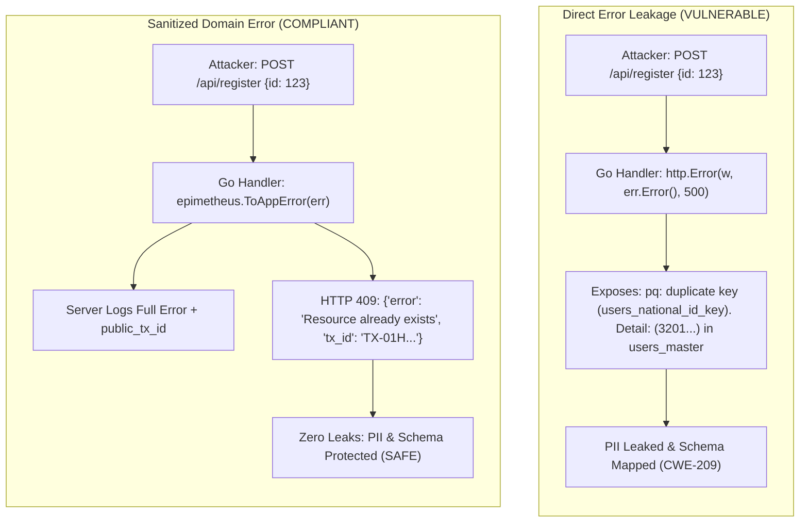
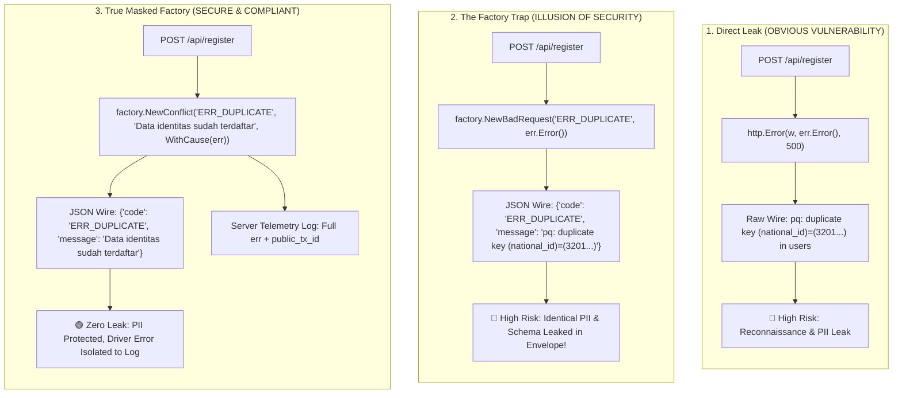
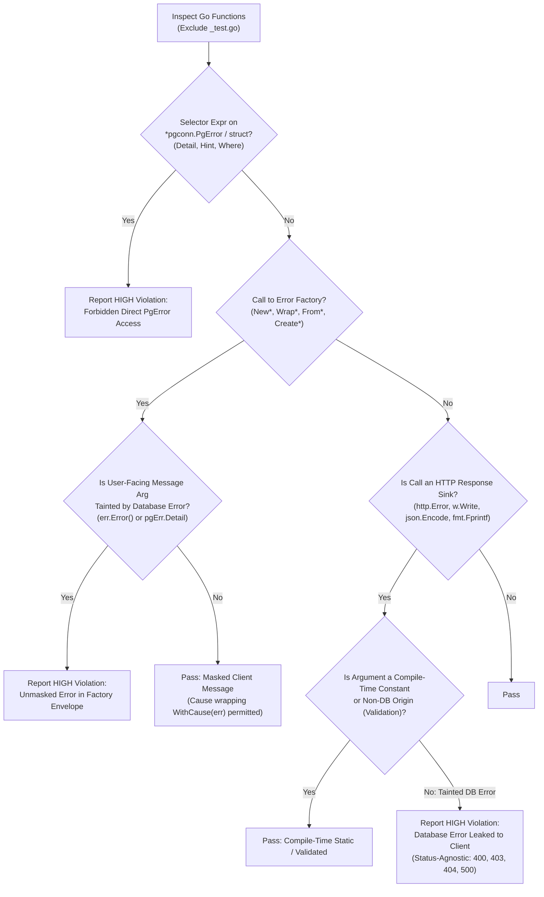

# ARGUS-A07: Database Error Leakage in API Responses

> **Rule Code:** `ARGUS-A07`
> **Identifier:** `ERROR_LEAK`
> **Severity:** `HIGH` (Information Disclosure & Reconnaissance Blocker)
> **Category:** `Security & Data Integrity`
> **Target Standards:** CWE-209 (Generation of Error Message Containing Sensitive Information), CWE-200 (Exposure of Sensitive Information), OWASP ASVS v4.0.3/v5.0 §V7.1.1, §V7.1.2

---

## 1. Overview & Core Invariant

Raw internal database error strings-specifically `*pgconn.PgError.Message`, `Detail`, `Hint`, `Where`, SQL query fragments, or unmapped `err.Error()` strings originating from database operations-**must never be exposed directly to external clients** across HTTP, gRPC, or WebSocket API responses.

Database driver errors must be intercepted at repository or handler boundaries, logged to secure server-side telemetry alongside a public transaction trace ID (`public_tx_id`), and mapped to human-friendly, domain-level response envelopes.

---

## 2. Technical Grounding & PostgreSQL Engine Realities

### 2.1. Wire Protocol `ErrorResponse` (§54.7) & PII Leaks

When an execution error occurs in PostgreSQL 18.x, the server returns an `ErrorResponse` packet containing deep diagnostic metadata:

- **`'M'` (Message):** Primary error summary (e.g. `relation "accounts" does not exist` or `null value in column "email" violates not-null constraint`).
- **`'D'` (Detail):** Specific row values that failed execution (e.g. `Key (national_id)=(3201012345670001) already exists in table "users"`). **This leaks raw citizen PII!**
- **`'H'` (Hint) & `'n'` (Constraint Name):** Guidance and exact internal constraint identifiers (e.g. `fk_orders_customer_id`).

### 2.2. Reconnaissance & Enumeration Attacks (CWE-209)

Attackers submit probing payloads to discover internal table schemas, existing identifiers, and private foreign key structures. Leaking database error messages enables attackers to map database topology without authorization.



### 2.3. The Error Factory Trap: The Illusion of Security

Many engineering teams adopt structured Error Factories (e.g. `factory.NewBadRequest("CODE", err.Error())` or `apperrors.Wrap(err)`) under the false assumption that wrapping an error inside a JSON envelope automatically mitigates the vulnerability.

**This is a dangerous trap.** Packaging a raw database error inside a structured envelope simply delivers the exact same reconnaissance surface and citizen PII to the attacker in a formatted JSON field:



### 2.4. Legitimate Exception: SQLSTATE Code Branching (`pgErr.Code`)

Applications **are explicitly permitted** to inspect standard SQLSTATE codes (e.g. `"23505"` for `unique_violation`, `"23503"` for `foreign_key_violation`) using `errors.As(err, &pgErr)` and evaluating `pgErr.Code`. This enables safe domain branching as long as the raw message or detail strings are not passed to client sinks.

---

## 3. How Argus Detects Violations (Static Analysis Architecture)

Argus combines AST selector validation, independent error factory constructor inspection, and type-aware response sink data flow tracking:



### 3.1. Error Masking & Response Boundary Decision Matrix

| Skenario Pola | Tipe Sink / Konstruktor | Sumber Pesan Klien | Sumber Penyebab (`Cause`) | Status Evaluasi Argus | Rationale / Mitigasi Risiko |
| :--- | :--- | :--- | :--- | :--- | :--- |
| **Raw Inline Sink (500)** | `http.Error(w, err.Error(), 500)` | `err.Error()` (DB Tainted) | - | 🔴 **VIOLATION** | Membocorkan driver error, query, dan skema ke client |
| **Unmasked 404/400 Sink** | `http.Error(w, err.Error(), 404)` | `err.Error()` (DB Tainted) | - | 🔴 **VIOLATION** | Reconnaissance skema & PII via status 4xx |
| **The Error Factory Trap** | `NewBadRequest("ERR", err.Error())` | `err.Error()` (DB Tainted) | - | 🔴 **VIOLATION** | Ilusi keamanan: envelope rapi namun payload bocor |
| **Formatted String Sink** | `fmt.Fprintf(w, "%s", err.Error())` | `fmt.Sprintf` with `err` | - | 🔴 **VIOLATION** | Refleksi string dinamis membocorkan isi database |
| **Direct Driver Field** | `response.ErrorJSON(w, 400, pgErr.Detail)`| `pgErr.Detail` | - | 🔴 **CRITICAL** | Membocorkan nilai PII baris unik ke penyerang |
| **Masked Factory With Cause** | `NewNotFound("ERR", "Msg", WithCause(err))` | Compile-time String Literal | `WithCause(err)` | 🟢 **COMPLIANT** | Pesan client aman, error mentah hanya di server log |
| **Static Constant 4xx/5xx** | `http.Error(w, "Entity not found", 404)` | Compile-time String Literal | - | 🟢 **COMPLIANT** | String konstan kebal dari runtime error reflection |
| **SQLSTATE Code Branching** | `if pgErr.Code == "23505" { ... }` | Compile-time String Literal | - | 🟢 **COMPLIANT** | Evaluasi kode error tanpa mengekspos pesan mentah |
| **Client Validation Error** | `http.Error(w, valErr.Error(), 400)` | Non-DB (`validate()`) | - | 🟢 **COMPLIANT** | Provenance bukan database (pesan validasi aman) |
| **In-Memory Buffer Write** | `buf.Write([]byte(err.Error()))` | `err.Error()` | - | 🟢 **COMPLIANT** | Target adalah memory buffer, bukan HTTP client |

---

### 3.2. Static Analysis Implementation Components

1. **Sensitive Field Access (`error_flow.go`):** Identifies selector expressions referencing `Detail`, `Hint`, or `Where` on `*pgconn.PgError` instances via semantic type resolution and struct field definitions.
2. **Type-Aware Response Sink Recognition (`sinks.go`):**
   - Validates that the receiver implements `net/http.ResponseWriter` (method set `WriteHeader(int)` and `Header()`).
   - Strictly excludes arbitrary `io.Writer` targets (e.g. `bytes.Buffer`, `*os.File`, `strings.Builder`, `&buf`).
   - Sinks tracked:
     - `http.Error(w, errText, code)`
     - `response.ErrorJSON(w, code, errText)`
     - `w.Write([]byte(errText))`
     - `json.NewEncoder(w).Encode(...)`
     - `fmt.Fprintf(w, "%s", errText)`
3. **Semantic Error Provenance & Data Flow (`provenance.go` & `call_classifier.go`):**
   - Classifies error origins into `OriginDatabase`, `OriginNonDatabase`, and `OriginGeneric`.
   - Tracks data flow from database calls (`callsite.IsPgxOrSQLType`, `callsite.IsDBQueryMethod`, repository/DAO calls).
   - Distinguishes non-database errors (validation logic, `strconv`, `encoding/json` decoders) so valid user-facing error messages are never falsely flagged.
4. **Generic Error Masking & Factory Inspection (`masking_checker.go`):**
   - **Compile-Time Constant Verification:** Proves that response string arguments originate from compile-time string literals (`*ast.BasicLit`) or package-level constants (`types.Const`), guaranteeing immunity against runtime database error reflection.
   - **Independent Error Factory Constructor Analysis:** Inspects error factory constructors (`New*`, `Wrap*`, `From*`, `Create*`) independently—without hardcoding any proprietary framework or package names. Flags any unmasked database error (`err.Error()` or `pgErr.Detail`) passed as the client-facing message parameter, while permitting internal cause wrapping (`WithCause(err)`).
   - **HTTP Status Code Independence:** Rejects unmasked database errors across *all* status codes (400, 401, 403, 404, 409, 500).

---

## 4. Vulnerability & Risk Taxonomy

| Failure Mode                         | Technical Impact                                                           | Risk Severity |
| :----------------------------------- | :------------------------------------------------------------------------- | :------------ |
| **Direct `err.Error()` to Client**   | Exposes internal database error details, table names, and query fragments. | **HIGH**      |
| **Access to `pgErr.Detail`**         | Leaks raw data values (PII, unique key contents) directly to attackers.    | **CRITICAL**  |
| **Access to `pgErr.Hint` / `Where`** | Discloses server-side PL/pgSQL call stacks and engine hints.               | **HIGH**      |
| **The Error Factory Trap**           | Provides false sense of security; wraps raw database errors inside envelope| **HIGH**      |
| **Unmasked Error in 4xx (400/404)**  | Leaks schema & PII under the false assumption that 4xx is safe.            | **HIGH**      |
| **JSON Serializer Error Leakage**    | Obfuscates error leaks inside JSON maps bypass basic string audits.        | **HIGH**      |

---

## 5. Non-Compliant Code Patterns (Bad Examples)

### Example 1: Passing `err.Error()` to `http.Error`

```go
// VIOLATION: Emitting raw error string directly to HTTP response
func HandleGetUser(w http.ResponseWriter, r *http.Request) {
    user, err := repo.FindByID(r.Context(), r.PathValue("id"))
    if err != nil {
        // Flagged: raw err.Error() passed directly to HTTP response
        http.Error(w, err.Error(), http.StatusInternalServerError)
        return
    }
    // ...
}
```

### Example 2: Emitting `pgErr.Detail`

```go
// VIOLATION: Exposing raw database detail string containing PII
func HandleCreateCitizen(w http.ResponseWriter, r *http.Request) {
    var pgErr *pgconn.PgError
    if err := service.Create(r.Context(), data); errors.As(err, &pgErr) {
        // Flagged: forbidden direct access to pgconn.PgError.Detail
        response.ErrorJSON(w, http.StatusBadRequest, pgErr.Detail)
        return
    }
}
```

### Example 3: Indirect Variable Assignment

```go
// VIOLATION: Storing raw error in variable and emitting to sink
func HandleUpdateProfile(w http.ResponseWriter, r *http.Request) {
    err := repo.Update(r.Context(), profile)
    if err != nil {
        errMsg := err.Error() // Tracked by error_flow
        http.Error(w, errMsg, http.StatusInternalServerError)
        return
    }
}
```

### Example 4: The Error Factory Trap (False Sense of Security)

```go
// VIOLATION: Wrapping raw database error inside a structured factory constructor
func HandleCreateCitizen(w http.ResponseWriter, r *http.Request) {
    err := repo.InsertCitizen(r.Context(), citizen)
    if err != nil {
        // Flagged: unmasked database error passed as message argument to error factory NewBadRequest
        // The structured envelope gives a false sense of security, but leaks raw table/PII in the "message" field!
        appErr := factory.NewBadRequest("INVALID_CITIZEN_DATA", err.Error())
        response.WriteAppError(w, appErr)
        return
    }
}
```

### Example 5: Unmasked 404 / 400 Database Error Leaks

```go
// VIOLATION: Emitting raw database error strings under the assumption that 4xx is safe
func HandleFindAccount(w http.ResponseWriter, r *http.Request) {
    account, err := repo.FindByID(r.Context(), r.PathValue("id"))
    if err != nil {
        // Flagged: raw err.Error() passed directly to HTTP response (404 Not Found)
        // Leaks table name "accounts", query constraints, and schema topology!
        http.Error(w, err.Error(), http.StatusNotFound)
        return
    }
}
```

---

## 6. Compliant Implementation Patterns (Good Examples)

### Solution 1: Sanitized Domain Error Mapping (Standard)

```go
// COMPLIANT: Internal logging with sanitized client response
func HandleGetUser(w http.ResponseWriter, r *http.Request) {
    user, err := repo.FindByID(r.Context(), r.PathValue("id"))
    if err != nil {
        // Secure server-side telemetry
        logger.Error("failed retrieving user profile", "error", err, "tx_id", txID)

        // Sanitized human-friendly client response
        response.ErrorJSON(w, http.StatusInternalServerError, "Gagal memproses data pengguna")
        return
    }
    json.NewEncoder(w).Encode(user)
}
```

### Solution 2: SQLSTATE Code Branching (Safe PII Handling)

```go
// COMPLIANT: Inspecting SQLSTATE code without leaking message text
func HandleRegisterCitizen(w http.ResponseWriter, r *http.Request) {
    var pgErr *pgconn.PgError
    if err := service.Register(r.Context(), req); errors.As(err, &pgErr) {
        if pgErr.Code == "23505" { // unique_violation
            response.ErrorJSON(w, http.StatusConflict, "Data identitas sudah terdaftar di sistem")
            return
        }
        response.ErrorJSON(w, http.StatusInternalServerError, "Gagal mendaftarkan data pengguna")
        return
    }
}
```

### Solution 3: Client Validation Error (Non-DB Origin Safe)

```go
// COMPLIANT: Non-database errors (validation, format, bad request) are safe to return
func HandleValidateUser(w http.ResponseWriter, r *http.Request) {
    validationErr := validator.Validate(req)
    if validationErr != nil {
        userFacingErr := validationErr.Error()
        http.Error(w, userFacingErr, http.StatusBadRequest) // Permitted: non-database provenance
        return
    }
}
```

### Solution 4: Local In-Memory Buffer Writing (Non-Sink Safe)

```go
// COMPLIANT: Writing error to internal memory buffer or file logger is not an HTTP response sink
func LogToBuffer(err error) {
    var buf bytes.Buffer
    _, _ = buf.Write([]byte(err.Error()))       // Permitted: bytes.Buffer is not http.ResponseWriter
    fmt.Fprintf(&buf, "diagnostics: %s", err.Error())
}
```

---

## 7. How to Suppress (Ignore Directives)

For internal debugging harnesses or developer test endpoints:

```go
// argus:ignore ARGUS-A07 internal developer diagnostic endpoint
http.Error(w, err.Error(), http.StatusInternalServerError)
```

Alternatively, use the identifier alias:

```go
// argus:ignore ERROR_LEAK verified internal debug log exporter
response.ErrorJSON(w, http.StatusInternalServerError, err.Error())
```

---

## 8. Configuration Reference (`.argus.yaml`)

Enable or configure this rule in `.argus.yaml`:

```yaml
rules:
  ARGUS-A07:
    enabled: true
```
