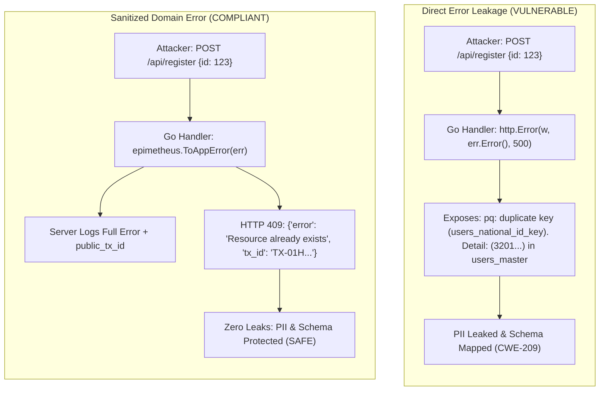
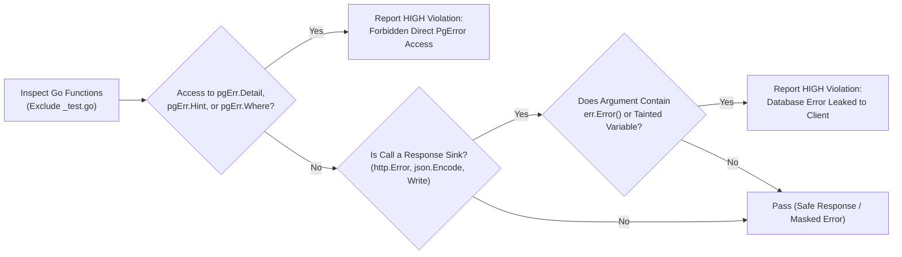

# ARGUS-A07: Database Error Leakage in API Responses

> **Rule Code:** `ARGUS-A07`
> **Identifier:** `ERROR_LEAK`
> **Severity:** `HIGH` (Information Disclosure & Reconnaissance Blocker)
> **Category:** `Security & Data Integrity`
> **Target Standards:** CWE-209 (Generation of Error Message Containing Sensitive Information), CWE-200 (Exposure of Sensitive Information), OWASP ASVS v4.0.3/v5.0 §V7.1.1, §V7.1.2

---

## 1. Overview & Core Invariant

Raw internal database error strings-specifically `*pgconn.PgError.Message`, `Detail`, `Hint`, `Where`, SQL query fragments, or unmapped `err.Error()` strings originating from database operations-**must never be exposed directly to external clients** across HTTP, gRPC, or WebSocket API responses.

Database driver errors must be intercepted at repository or handler boundaries, logged to secure server-side telemetry alongside a public transaction trace ID (`public_tx_id`), and mapped to human-friendly, domain-level response envelopes.

---

## 2. Technical Grounding & PostgreSQL Engine Realities

### 2.1. Wire Protocol `ErrorResponse` (§54.7) & PII Leaks

When an execution error occurs in PostgreSQL 18.x, the server returns an `ErrorResponse` packet containing deep diagnostic metadata:

- **`'M'` (Message):** Primary error summary (e.g. `relation "accounts" does not exist` or `null value in column "email" violates not-null constraint`).
- **`'D'` (Detail):** Specific row values that failed execution (e.g. `Key (national_id)=(3201012345670001) already exists in table "users"`). **This leaks raw citizen PII!**
- **`'H'` (Hint) & `'n'` (Constraint Name):** Guidance and exact internal constraint identifiers (e.g. `fk_orders_customer_id`).

### 2.2. Reconnaissance & Enumeration Attacks (CWE-209)

Attackers submit probing payloads to discover internal table schemas, existing identifiers, and private foreign key structures. Leaking database error messages enables attackers to map database topology without authorization.



### 2.3. Legitimate Exception: SQLSTATE Code Branching (`pgErr.Code`)

Applications **are explicitly permitted** to inspect standard SQLSTATE codes (e.g. `"23505"` for `unique_violation`, `"23503"` for `foreign_key_violation`) using `errors.As(err, &pgErr)` and evaluating `pgErr.Code`. This enables safe domain branching as long as the raw message or detail strings are not passed to client sinks.

---

## 3. How Argus Detects Violations (Static Analysis Architecture)

Argus combines AST selector validation with response sink data flow tracking:



1. **Sensitive Field Access (`error_flow.go`):** Identifies selector expressions referencing `Detail`, `Hint`, or `Where` on `*pgconn.PgError` instances.
2. **Response Sink Recognition (`sinks.go`):**
   - `http.Error(w, errText, code)`
   - `response.ErrorJSON(w, code, errText)`
   - `w.Write([]byte(errText))`
   - `json.NewEncoder(w).Encode(...)`
   - `fmt.Fprintf(w, "%s", errText)`
3. **Data Flow Tracing (`error_flow.go`):** Detects both direct calls (`err.Error()`) and indirect local variables (`errStr := err.Error()`) emitted into response sinks.

---

## 4. Vulnerability & Risk Taxonomy

| Failure Mode                         | Technical Impact                                                           | Risk Severity |
| :----------------------------------- | :------------------------------------------------------------------------- | :------------ |
| **Direct `err.Error()` to Client**   | Exposes internal database error details, table names, and query fragments. | **HIGH**      |
| **Access to `pgErr.Detail`**         | Leaks raw data values (PII, unique key contents) directly to attackers.    | **CRITICAL**  |
| **Access to `pgErr.Hint` / `Where`** | Discloses server-side PL/pgSQL call stacks and engine hints.               | **HIGH**      |
| **JSON Serializer Error Leakage**    | Obfuscates error leaks inside JSON maps bypass basic string audits.        | **HIGH**      |

---

## 5. Non-Compliant Code Patterns (Bad Examples)

### Example 1: Passing `err.Error()` to `http.Error`

```go
// VIOLATION: Emitting raw error string directly to HTTP response
func HandleGetUser(w http.ResponseWriter, r *http.Request) {
    user, err := repo.FindByID(r.Context(), r.PathValue("id"))
    if err != nil {
        // Flagged: raw err.Error() passed directly to HTTP response
        http.Error(w, err.Error(), http.StatusInternalServerError)
        return
    }
    // ...
}
```

### Example 2: Emitting `pgErr.Detail`

```go
// VIOLATION: Exposing raw database detail string containing PII
func HandleCreateCitizen(w http.ResponseWriter, r *http.Request) {
    var pgErr *pgconn.PgError
    if err := service.Create(r.Context(), data); errors.As(err, &pgErr) {
        // Flagged: forbidden direct access to pgconn.PgError.Detail
        response.ErrorJSON(w, http.StatusBadRequest, pgErr.Detail)
        return
    }
}
```

### Example 3: Indirect Variable Assignment

```go
// VIOLATION: Storing raw error in variable and emitting to sink
func HandleUpdateProfile(w http.ResponseWriter, r *http.Request) {
    err := repo.Update(r.Context(), profile)
    if err != nil {
        errMsg := err.Error() // Tracked by error_flow
        http.Error(w, errMsg, http.StatusInternalServerError)
        return
    }
}
```

---

## 6. Compliant Implementation Patterns (Good Examples)

### Solution 1: Sanitized Domain Error Mapping (Standard)

```go
// COMPLIANT: Internal logging with sanitized client response
func HandleGetUser(w http.ResponseWriter, r *http.Request) {
    user, err := repo.FindByID(r.Context(), r.PathValue("id"))
    if err != nil {
        // Secure server-side telemetry
        logger.Error("failed retrieving user profile", "error", err, "tx_id", txID)

        // Sanitized human-friendly client response
        response.ErrorJSON(w, http.StatusInternalServerError, "Gagal memproses data pengguna")
        return
    }
    json.NewEncoder(w).Encode(user)
}
```

### Solution 2: SQLSTATE Code Branching (Safe PII Handling)

```go
// COMPLIANT: Inspecting SQLSTATE code without leaking message text
func HandleRegisterCitizen(w http.ResponseWriter, r *http.Request) {
    var pgErr *pgconn.PgError
    if err := service.Register(r.Context(), req); errors.As(err, &pgErr) {
        if pgErr.Code == "23505" { // unique_violation
            response.ErrorJSON(w, http.StatusConflict, "Data identitas sudah terdaftar di sistem")
            return
        }
        response.ErrorJSON(w, http.StatusInternalServerError, "Gagal mendaftarkan data pengguna")
        return
    }
}
```

---

## 7. How to Suppress (Ignore Directives)

For internal debugging harnesses or developer test endpoints:

```go
// argus:ignore ARGUS-A07 internal developer diagnostic endpoint
http.Error(w, err.Error(), http.StatusInternalServerError)
```

Alternatively, use the identifier alias:

```go
// argus:ignore ERROR_LEAK verified internal debug log exporter
response.ErrorJSON(w, http.StatusInternalServerError, err.Error())
```

---

## 8. Configuration Reference (`.argus.yaml`)

Enable or configure this rule in `.argus.yaml`:

```yaml
rules:
  ARGUS-A07:
    enabled: true
```
