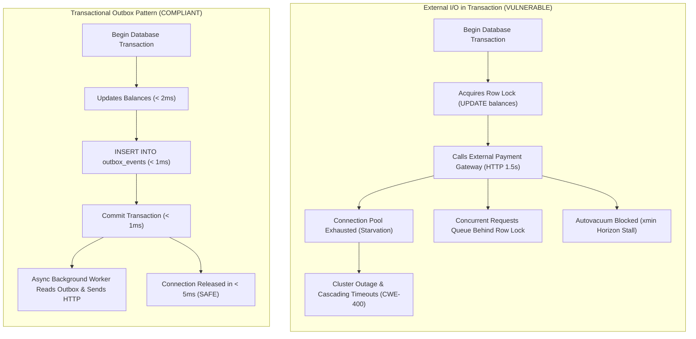
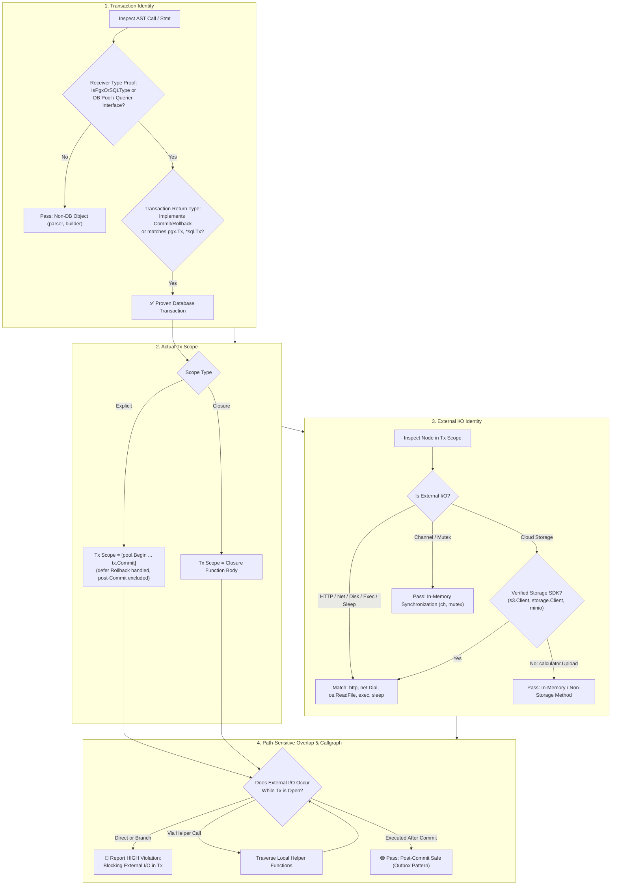

# ARGUS-A08: External Blocking I/O Inside Transactions

> **Rule Code:** `ARGUS-A08`
> **Identifier:** `TX_EXTERNAL_IO`
> **Severity:** `HIGH / CRITICAL` (Connection Pool Starvation & Lock Cascading Blocker)
> **Category:** `Concurrency, Performance & Transactional Integrity`
> **Target Standards:** CWE-400 (Uncontrolled Resource Consumption), CWE-662 (Improper Synchronization), OWASP ASVS v4.0.3/v5.0 §V11.1.4

---

## 1. Overview & Core Invariant

Database transaction scopes—enclosed via `pgx.Tx`, `pool.Begin`, `pool.BeginTx`, `pgx.BeginFunc`, or transaction helpers (`ExecuteTx`, `WithTx`)—**must never enclose blocking external non-database I/O operations**.

Forbidden external I/O operations within transaction blocks include:

- **Outbound HTTP / gRPC Requests:** `http.Get`, `http.Post`, `(*http.Client).Do`, gRPC invoke
- **Network Sockets & TLS Handshakes:** `net.Dial`, `net.DialTimeout`, `net.Listen`, `tls.Dial`
- **Cloud & Object Storage SDKs:** `PutObject`, `Upload`, `GetObject` on verified storage SDKs (AWS S3, Google Cloud Storage, MinIO)
- **Disk Filesystem Operations:** `os.ReadFile`, `os.WriteFile`, `os.Create`, `os.Open`, `os.Remove`
- **Subprocess Execution:** `exec.Command`, `exec.CommandContext`
- **Arbitrary Thread Pauses:** `time.Sleep`

### Important Clarification: In-Memory Synchronization vs. External I/O
Argus strictly distinguishes between **external I/O** (which ties up database connections waiting on network/disk/external systems) and **in-memory Go runtime synchronization** (such as `sync.Mutex.Lock()`, `sync.RWMutex.RLock()`, and channel send/receive `ch <- val`, `<-ch`). In-memory synchronization primitives belong to Go concurrency coordination and are **not** flagged as external I/O.

---

## 2. Technical Grounding & PostgreSQL Engine Realities

### 2.1. Connection Pool Starvation & Latency Amplification

A database connection checked out from a pool (`pgxpool.Pool`) remains dedicated to the active transaction until `COMMIT` or `ROLLBACK`. If an application executes an external HTTP call averaging 500ms–2000ms inside the transaction, connection turnover collapses. Under moderate traffic, all pooled connections become exhausted, causing immediate application-wide cascading timeouts (HTTP 503).

### 2.2. Lock Cascades & Autovacuum Horizon Stalls

1. **Row & Table Locks:** Any row updated or locked (`SELECT FOR UPDATE`) within the transaction remains locked against concurrent modifications until commit.
2. **`xmin` Horizon Stalls:** PostgreSQL's autovacuum engine cannot prune dead tuples created after the `xmin` horizon of the oldest active transaction. Holding long-running transactions stalls cluster vacuuming, leading to table bloat and performance degradation.



---

## 3. How Argus Detects Violations (Static Analysis Architecture)

Argus enforces a 4-stage pipeline combining type-safe receiver proof, exact scope delimitation, external I/O classification, and path-sensitive overlap tracking:



### 3.1. External I/O vs. In-Memory Operations Decision Matrix

| Skenario Operasi | Kategori | Contoh Sintaks | Status Evaluasi Argus | Rationale / Dampak Sistem |
| :--- | :--- | :--- | :--- | :--- |
| **HTTP Request** | External Network I/O | `http.Post("https://...", ...)` | 🔴 **VIOLATION** | Menahan koneksi database selama latensi jaringan luar (500ms–2s) |
| **HTTP Client Call** | External Network I/O | `client.Do(req)` (*http.Client) | 🔴 **VIOLATION** | Mengunci baris data dan menunda autovacuum cluster |
| **Network Socket Dial** | External Network I/O | `net.Dial("tcp", "host:port")` | 🔴 **VIOLATION** | Handshake socket memblokir pool connection |
| **Disk Filesystem Read/Write** | External Disk I/O | `os.WriteFile(...)`, `os.ReadFile` | 🔴 **VIOLATION** | Disk I/O latency memblokir transaksi database |
| **Subprocess Execution** | External Process Exec | `exec.Command("echo", ...)` | 🔴 **VIOLATION** | Fork/exec OS process menyebabkan thread starvation |
| **Thread Sleep / Pause** | External Latency Injection | `time.Sleep(2 * time.Second)` | 🔴 **VIOLATION** | Sengaja menahan transaksi terbuka tanpa ada aktivitas SQL |
| **Cloud Storage SDK** | External Cloud I/O | `s3Client.PutObject(...)` | 🔴 **VIOLATION** | Upload cloud storage menahan pool connection |
| **Non-Storage Method** | In-Memory Computation | `calculator.Upload(123)` | 🟢 **COMPLIANT** | Receiver bukan storage SDK; method lokal dalam memori |
| **Channel Communication** | In-Memory Synchronization | `ch <- val`, `<-ch` | 🟢 **COMPLIANT** | Koordinasi goroutine lokal dalam memori, bukan external I/O |
| **Mutex Lock / Unlock** | In-Memory Synchronization | `mu.Lock()`, `mu.Unlock()` | 🟢 **COMPLIANT** | Proteksi konkurensi memori lokal, bukan external I/O |
| **Post-Commit I/O** | Outbox Pattern Dispatch | `time.Sleep(...)` after `tx.Commit()` | 🟢 **COMPLIANT** | Transaksi sudah di-commit sebelum I/O dijalankan |
| **Non-DB Transaction** | Domain Parser/Builder | `parser.Begin() ... parser.Commit()` | 🟢 **COMPLIANT** | Receiver terbukti bukan database connection/pool |

---

## 4. Vulnerability & Risk Taxonomy

| Failure Mode                        | Technical Impact                                                                 | Risk Severity |
| :---------------------------------- | :------------------------------------------------------------------------------- | :------------ |
| **HTTP Request Inside Tx**          | Ties up pool connection during external latency; causes cluster-wide starvation. | **CRITICAL**  |
| **`time.Sleep` Inside Tx**          | Intentionally locks connection and held rows for arbitrary duration.             | **CRITICAL**  |
| **Disk I/O Inside Tx**              | Disk write latency and filesystem lock stalls block transaction throughput.      | **HIGH**      |
| **Cloud Storage Upload Inside Tx**  | Heavy multi-part or streaming upload exhausts pool connections.                  | **HIGH**      |
| **Helper Function I/O Bypass**      | Obfuscated I/O behind internal helper functions escapes basic surface linters.   | **HIGH**      |

---

## 5. Non-Compliant Code Patterns (Bad Examples)

### Example 1: HTTP Call Inside `BeginFunc`

```go
// VIOLATION: Calling external API inside transaction closure
func ProcessPayment(ctx context.Context, pool *pgxpool.Pool, orderID string) error {
    return pool.BeginFunc(ctx, func(tx pgx.Tx) error {
        _ = tx.Exec(ctx, "UPDATE orders SET status = 'PROCESSING' WHERE id = $1", orderID)

        // Flagged: blocking external I/O (http.Post) detected inside database transaction
        resp, err := http.Post("https://api.payment.com/charge", "application/json", nil)
        if err != nil {
            return err
        }
        return nil
    })
}
```

### Example 2: Helper Function with Hidden I/O

```go
func sendNotification(userID string) {
    // Outbound HTTP call
    _, _ = http.Get("https://notify.service/send?user=" + userID)
}

// VIOLATION: Calling helper that performs I/O inside explicit transaction
func ActivateAccount(ctx context.Context, pool *pgxpool.Pool, userID string) error {
    tx, err := pool.Begin(ctx)
    if err != nil {
        return err
    }
    defer tx.Rollback(ctx)

    _ = tx.Exec(ctx, "UPDATE users SET active = true WHERE id = $1", userID)

    // Flagged: blocking external I/O (http.Get) detected via helper "sendNotification"
    sendNotification(userID)

    return tx.Commit(ctx)
}
```

### Example 3: Cloud Storage Upload Inside Transaction

```go
// VIOLATION: Cloud storage upload inside database transaction
func SaveInvoice(ctx context.Context, pool *pgxpool.Pool, s3Client *s3.Client, invoice []byte) error {
    return pool.BeginFunc(ctx, func(tx pgx.Tx) error {
        _ = tx.Exec(ctx, "INSERT INTO invoices (status) VALUES ('PENDING')")

        // Flagged: blocking external I/O (storage.PutObject) detected inside database transaction
        _, err := s3Client.PutObject(ctx, &s3.PutObjectInput{Bucket: &b, Key: &k, Body: bytes.NewReader(invoice)})
        return err
    })
}
```

---

## 6. Compliant Implementation Patterns (Good Examples)

### Solution 1: Transactional Outbox Pattern (Standard)

```go
// COMPLIANT: Decoupled notification via outbox table
func ActivateAccount(ctx context.Context, pool *pgxpool.Pool, userID string) error {
    return pool.BeginFunc(ctx, func(tx pgx.Tx) error {
        // 1. Mutate application state
        if _, err := tx.Exec(ctx, "UPDATE users SET active = true WHERE id = $1", userID); err != nil {
            return err
        }

        // 2. Record outbox event in the same atomic transaction (< 2ms)
        const outboxSQL = "INSERT INTO outbox_events (event_type, payload) VALUES ($1, $2)"
        _, err := tx.Exec(ctx, outboxSQL, "user.activated", userID)
        return err
    })
}
```

### Solution 2: Pre-fetching or Post-Commit I/O

```go
// COMPLIANT: Perform external I/O outside transaction boundaries
func ProcessOrder(ctx context.Context, pool *pgxpool.Pool, req PaymentRequest) error {
    // 1. External I/O executed before transaction
    chargeResult, err := paymentGateway.Charge(ctx, req)
    if err != nil {
        return err
    }

    // 2. Fast database update inside short transaction
    return pool.BeginFunc(ctx, func(tx pgx.Tx) error {
        _, err := tx.Exec(ctx, "UPDATE orders SET paid = true, ref = $1 WHERE id = $2", chargeResult.ID, req.OrderID)
        return err
    })
}
```

### Solution 3: In-Memory Synchronization Inside Transaction

```go
// COMPLIANT: In-memory mutex and channels are NOT external I/O
func ProcessQueue(ctx context.Context, pool *pgxpool.Pool, mu *sync.Mutex, ch chan string) error {
    return pool.BeginFunc(ctx, func(tx pgx.Tx) error {
        mu.Lock()
        defer mu.Unlock()

        ch <- "job-started"
        return tx.Exec(ctx, "UPDATE queue SET status = 'RUNNING'")
    })
}
```

---

## 7. How to Suppress (Ignore Directives)

For test harnesses, benchmark harnesses, or intentional latency injection:

```go
// argus:ignore ARGUS-A08 load testing artificial latency injection
time.Sleep(200 * time.Millisecond)
```

Alternatively, use the identifier alias:

```go
// argus:ignore TX_EXTERNAL_IO verified test harness mock dispatch
resp, err := http.Post(testServerURL, "application/json", body)
```

---

## 8. Configuration Reference (`.argus.yaml`)

Enable or configure this rule in `.argus.yaml`:

```yaml
rules:
  ARGUS-A08:
    enabled: true
```
