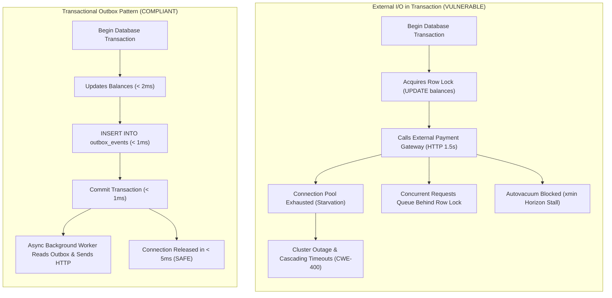
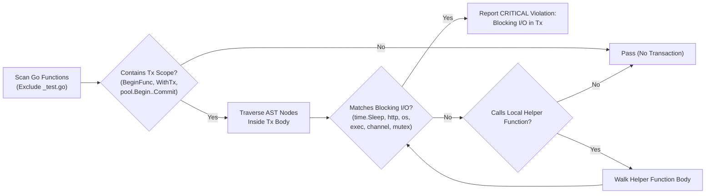

# ARGUS-A08: External Blocking I/O Inside Transactions

> **Rule Code:** `ARGUS-A08`
> **Identifier:** `TX_EXTERNAL_IO`
> **Severity:** `HIGH / CRITICAL` (Connection Pool Starvation & Lock Cascading Blocker)
> **Category:** `Concurrency, Performance & Transactional Integrity`
> **Target Standards:** CWE-400 (Uncontrolled Resource Consumption), CWE-662 (Improper Synchronization), OWASP ASVS v4.0.3/v5.0 §V11.1.4

---

## 1. Overview & Core Invariant

Database transaction scopes-enclosed via `pgx.Tx`, `pool.Begin`, `pool.BeginTx`, `pgx.BeginFunc`, or application transaction helpers (`argus.ExecuteTx`)-**must never enclose blocking external non-database I/O operations**.

Forbidden operations within transaction blocks include:

- Outbound HTTP / gRPC client requests
- Third-party webhook dispatches
- Disk filesystem operations (`os.ReadFile`, `os.WriteFile`)
- Subprocess execution (`exec.Command`)
- Arbitrary thread pauses (`time.Sleep`)
- Blocking channel communications (`ch <- val`, `<-ch`)
- Mutex lock acquisitions (`sync.Mutex.Lock`)

Transactions must strictly execute rapid, atomic SQL operations that commit within milliseconds. Side-effects and external communications must be decoupled using the **Transactional Outbox Pattern** or asynchronous background job queues.

---

## 2. Technical Grounding & PostgreSQL Engine Realities

### 2.1. Connection Pool Starvation & Latency Amplification

A database connection checked out from a pool (`pgxpool.Pool`) remains dedicated to the active transaction until `COMMIT` or `ROLLBACK`. If an application executes an external HTTP call averaging 500ms-2000ms inside the transaction, connection turnover collapses. Under moderate traffic, all pooled connections become exhausted, causing immediate application-wide cascading timeouts (HTTP 503).

### 2.2. Lock Cascades & Autovacuum Horizon Stalls

1. **Row & Table Locks:** Any row updated or locked (`SELECT FOR UPDATE`) within the transaction remains locked against concurrent modifications until commit.
2. **`xmin` Horizon Stalls:** PostgreSQL's autovacuum engine cannot prune dead tuples created after the `xmin` horizon of the oldest active transaction. Holding long-running transactions stalls cluster vacuuming, leading to table bloat and performance degradation.



---

## 3. How Argus Detects Violations (Static Analysis Architecture)

Argus conducts AST inspection combined with interprocedural call graph traversal:



1. **Transaction Boundary Detection (`tx_detector.go`):** Identifies both closure-based transactions (`pgx.BeginFunc`, `ExecuteTx`) and explicit block scopes (`pool.Begin` through `tx.Commit`/`tx.Rollback`).
2. **Blocking I/O Registry (`io_registry.go`):** Detects standard library blocking operations (`time.Sleep`, `http.Get/Post/Client.Do`, `net.Dial`, `os.ReadFile/WriteFile`, `exec.Command`, channel send/receive, and mutex locking).
3. **Interprocedural Call Graph (`callgraph_walker.go`):** Follows local function calls made within the transaction block to detect hidden I/O invocations inside helpers.

---

## 4. Vulnerability & Risk Taxonomy

| Failure Mode                        | Technical Impact                                                                 | Risk Severity |
| :---------------------------------- | :------------------------------------------------------------------------------- | :------------ |
| **HTTP Request Inside Tx**          | Ties up pool connection during external latency; causes cluster-wide starvation. | **CRITICAL**  |
| **`time.Sleep` Inside Tx**          | Intentionally locks connection and held rows for arbitrary duration.             | **CRITICAL**  |
| **Disk I/O Inside Tx**              | Disk write latency and filesystem lock stalls block transaction throughput.      | **HIGH**      |
| **Helper Function I/O Bypass**      | Obfuscated I/O behind internal helper functions escapes basic surface linters.   | **HIGH**      |
| **Channel / Mutex Synchronization** | Goroutine deadlocks freeze transactions indefinitely, causing connection leaks.  | **HIGH**      |

---

## 5. Non-Compliant Code Patterns (Bad Examples)

### Example 1: HTTP Call Inside `BeginFunc`

```go
// VIOLATION: Calling external API inside transaction closure
func ProcessPayment(ctx context.Context, pool *pgxpool.Pool, orderID string) error {
    return pool.BeginFunc(ctx, func(tx pgx.Tx) error {
        _ = tx.Exec(ctx, "UPDATE orders SET status = 'PROCESSING' WHERE id = $1", orderID)

        // Flagged: blocking external I/O (http.Post) detected inside database transaction
        resp, err := http.Post("https://api.payment.com/charge", "application/json", nil)
        if err != nil {
            return err
        }
        return nil
    })
}
```

### Example 2: Helper Function with Hidden I/O

```go
func sendNotification(userID string) {
    // Outbound HTTP call
    _, _ = http.Get("https://notify.service/send?user=" + userID)
}

// VIOLATION: Calling helper that performs I/O inside explicit transaction
func ActivateAccount(ctx context.Context, pool *pgxpool.Pool, userID string) error {
    tx, err := pool.Begin(ctx)
    if err != nil {
        return err
    }
    defer tx.Rollback(ctx)

    _ = tx.Exec(ctx, "UPDATE users SET active = true WHERE id = $1", userID)

    // Flagged: blocking external I/O (http.Get) detected via helper "sendNotification"
    sendNotification(userID)

    return tx.Commit(ctx)
}
```

---

## 6. Compliant Implementation Patterns (Good Examples)

### Solution 1: Transactional Outbox Pattern (Standard)

```go
// COMPLIANT: Decoupled notification via outbox table
func ActivateAccount(ctx context.Context, pool *pgxpool.Pool, userID string) error {
    return pool.BeginFunc(ctx, func(tx pgx.Tx) error {
        // 1. Mutate application state
        if _, err := tx.Exec(ctx, "UPDATE users SET active = true WHERE id = $1", userID); err != nil {
            return err
        }

        // 2. Record outbox event in the same atomic transaction (< 2ms)
        const outboxSQL = "INSERT INTO outbox_events (event_type, payload) VALUES ($1, $2)"
        _, err := tx.Exec(ctx, outboxSQL, "user.activated", userID)
        return err
    })
}
```

### Solution 2: Pre-fetching or Post-Execution I/O

```go
// COMPLIANT: Perform external I/O outside transaction boundaries
func ProcessOrder(ctx context.Context, pool *pgxpool.Pool, req PaymentRequest) error {
    // 1. External I/O executed before transaction
    chargeResult, err := paymentGateway.Charge(ctx, req)
    if err != nil {
        return err
    }

    // 2. Fast database update inside short transaction
    return pool.BeginFunc(ctx, func(tx pgx.Tx) error {
        _, err := tx.Exec(ctx, "UPDATE orders SET paid = true, ref = $1 WHERE id = $2", chargeResult.ID, req.OrderID)
        return err
    })
}
```

---

## 7. How to Suppress (Ignore Directives)

For test harnesses, benchmark harnesses, or intentional latency injection:

```go
// argus:ignore ARGUS-A08 load testing artificial latency injection
time.Sleep(200 * time.Millisecond)
```

Alternatively, use the identifier alias:

```go
// argus:ignore TX_EXTERNAL_IO verified test harness mock dispatch
resp, err := http.Post(testServerURL, "application/json", body)
```

---

## 8. Configuration Reference (`.argus.yaml`)

Enable or configure this rule in `.argus.yaml`:

```yaml
rules:
  ARGUS-A08:
    enabled: true
```
