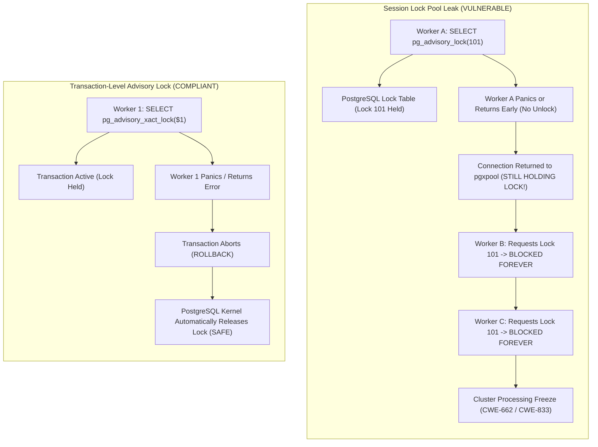
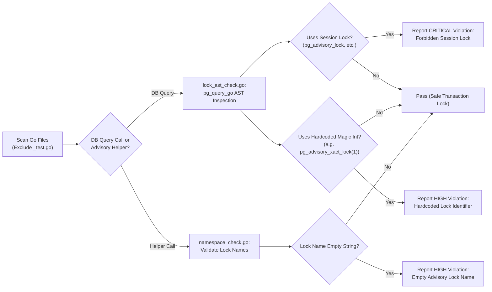

# ARGUS-A09: PostgreSQL Advisory Lock Leaks & Namespace Collisions

> **Rule Code:** `ARGUS-A09`
> **Identifier:** `ADVISORY_LOCK`
> **Severity:** `HIGH / CRITICAL` (Permanent Lock Leak & Deadlock Convoy Blocker)
> **Category:** `Concurrency, Deadlock Prevention & Namespace Hygiene`
> **Target Standards:** CWE-662 (Improper Synchronization), CWE-833 (Deadlock), OWASP ASVS v4.0.3/v5.0 §V1.4.3

---

## 1. Overview & Core Invariant

1. **Mandatory Transaction-Scoped Locks:** Application concurrency control utilizing PostgreSQL Advisory Locks **must use transaction-level lock functions** (`pg_advisory_xact_lock`, `pg_advisory_xact_lock_shared`, `pg_try_advisory_xact_lock`, `pg_try_advisory_xact_lock_shared`). Session-level advisory locks (`pg_advisory_lock`, `pg_try_advisory_lock`) are strictly prohibited on connections managed by connection pools (`*pgxpool.Pool`).
2. **Structured Namespace Identifiers:** Lock identifiers must use a single 64-bit `bigint` or a 32-bit integer pair (`(class_id, object_id)`) sourced from a registered constant registry or deterministic hash function (`argus.LockKey(domain, resource)`). Arbitrary hardcoded integer literals (e.g. `1`, `42`, `100`) are prohibited to prevent cross-feature lock collisions.

---

## 2. Technical Grounding & PostgreSQL Engine Realities

### 2.1. Shared Memory Lock Table & The Connection Pool Leak Disaster

PostgreSQL stores advisory locks directly in kernel shared memory (`LockMethodData`). The lifecycle differences between session and transaction locks govern application stability:

- **`pg_advisory_xact_lock`:** Tied to the current PostgreSQL Transaction ID (`xid`). The engine automatically releases the lock when the transaction commits or aborts (`ROLLBACK`), even during application crashes or network dropouts.
- **`pg_advisory_lock` (Session-Level):** Tied to the physical backend TCP connection. The lock is **never automatically released** until the connection is closed or `pg_advisory_unlock()` is explicitly invoked with the identical ID.

In connection-pooled architectures (`pgxpool.Pool`), if a worker acquires `pg_advisory_lock(101)` and panics or fails to unlock, the physical connection returns to the pool **still holding lock 101 in PostgreSQL memory**. All subsequent workers requesting lock 101 block indefinitely, creating a permanent deadlock convoy (CWE-833).



### 2.2. Dedicated Connection Exception for Leader Election

Session-level advisory locks are permitted only for distributed leader election when executed on an explicitly dedicated connection (`pool.Acquire(ctx)`), never shared with standard application request pools, and explicitly closed on process termination.

---

## 3. How Argus Detects Violations (Static Analysis Architecture)

Argus combines PostgreSQL AST query inspection with Go helper argument validation:



1. **AST Function Inspection (`lock_ast_check.go`):** Identifies `FuncCall` nodes in PostgreSQL AST matching forbidden session lock functions (`pg_advisory_lock`, `pg_try_advisory_lock`, `pg_advisory_unlock`).
2. **Hardcoded Integer Constant Detection (`lock_ast_check.go`):** Detects raw integer constants (`c.GetIval()`) passed directly to lock functions without bind parameters.
3. **Helper Namespace Validation (`namespace_check.go`):** Validates calls to `argus.WithAdvisoryLock` and `argus.ExecuteLockedTx`, preventing empty lock names.

---

## 4. Vulnerability & Risk Taxonomy

| Failure Mode                | Technical Impact                                                               | Risk Severity |
| :-------------------------- | :----------------------------------------------------------------------------- | :------------ |
| **Session Lock in Pool**    | Panic or uncaught error permanently holds lock in pool, blocking all workers.  | **CRITICAL**  |
| **Hardcoded Magic Numbers** | Collisions across unrelated domain modules lead to accidental lock starvation. | **HIGH**      |
| **Empty Helper String**     | Lock fails to isolate specific resource, leading to race conditions.           | **HIGH**      |

---

## 5. Non-Compliant Code Patterns (Bad Examples)

### Example 1: Session-Level Lock on Connection Pool

```go
// VIOLATION: Session lock leaks if function returns error or panics
func ProcessPayout(ctx context.Context, pool *pgxpool.Pool, payoutID int64) error {
    // Flagged: forbidden session-level advisory lock "pg_advisory_lock"
    _, err := pool.Exec(ctx, "SELECT pg_advisory_lock($1)", payoutID)
    if err != nil {
        return err
    }
    defer pool.Exec(ctx, "SELECT pg_advisory_unlock($1)", payoutID)
    return executePayout(ctx, payoutID)
}
```

### Example 2: Hardcoded Magic Number Lock Key

```go
// VIOLATION: Hardcoded literal key risks cross-feature namespace collision
func SyncDailyExchangeRates(ctx context.Context, pool *pgxpool.Pool) error {
    // Flagged: hardcoded integer advisory lock key in SQL
    _, err := pool.Exec(ctx, "SELECT pg_advisory_xact_lock(42)")
    return err
}
```

### Example 3: Empty Lock Identifier in Helper

```go
// VIOLATION: Empty lock name bypasses concurrency isolation
func ReconcileAccounts(ctx context.Context, tx pgx.Tx) error {
    // Flagged: empty advisory lock name
    return argus.WithAdvisoryLock(ctx, tx, "", true, func() error {
        return executeReconciliation(ctx, tx)
    })
}
```

---

## 6. Compliant Implementation Patterns (Good Examples)

### Solution 1: Parameterized Transaction Lock (Standard)

```go
// COMPLIANT: Automatically released when transaction ends
func ProcessPayout(ctx context.Context, pool *pgxpool.Pool, payoutKey int64) error {
    return pool.BeginFunc(ctx, func(tx pgx.Tx) error {
        const query = "SELECT pg_advisory_xact_lock($1)"
        if _, err := tx.Exec(ctx, query, payoutKey); err != nil {
            return err
        }
        return executePayout(ctx, tx)
    })
}
```

### Solution 2: Two-Argument 32-Bit Namespace Lock

```go
// COMPLIANT: Class ID and Object ID namespace isolation
func LockTenantResource(ctx context.Context, tx pgx.Tx, classID, objectID int32) error {
    const query = "SELECT pg_advisory_xact_lock($1, $2)"
    _, err := tx.Exec(ctx, query, classID, objectID)
    return err
}
```

### Solution 3: Structured Helper with Namespaced Lock Key

```go
// COMPLIANT: Explicit domain-namespaced lock identifier
func ProcessOrder(ctx context.Context, tx pgx.Tx, orderID string) error {
    lockKey := fmt.Sprintf("orders:processing:%s", orderID)
    return argus.WithAdvisoryLock(ctx, tx, lockKey, true, func() error {
        return executeOrderProcessing(ctx, tx, orderID)
    })
}
```

---

## 7. How to Suppress (Ignore Directives)

For long-lived cluster leader election or specialized single-connection runners:

```go
// argus:ignore ARGUS-A09 dedicated non-pooled connection leader election
_, err := conn.Exec(ctx, "SELECT pg_advisory_lock($1)", leaderKey)
```

Alternatively, use the identifier alias:

```go
// argus:ignore ADVISORY_LOCK verified dedicated connection single-worker lease
_, err := conn.Exec(ctx, "SELECT pg_advisory_lock($1)", leaseID)
```

---

## 8. Configuration Reference (`.argus.yaml`)

Enable or configure this rule in `.argus.yaml`:

```yaml
rules:
  ARGUS-A09:
    enabled: true
```
