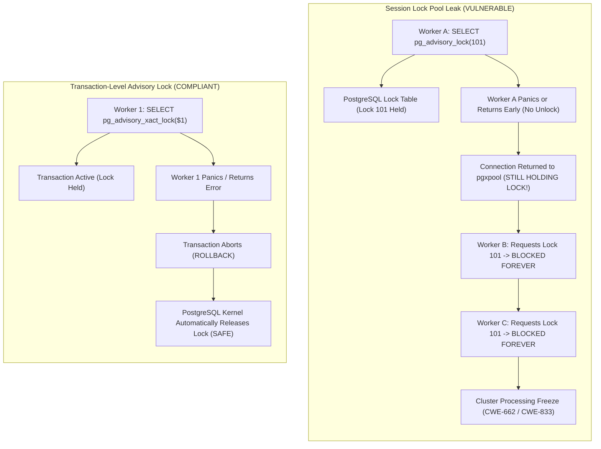

# ARGUS-A09: PostgreSQL Advisory Lock Leaks & Namespace Collisions

> **Rule Code:** `ARGUS-A09`
> **Identifier:** `ADVISORY_LOCK`
> **Severity:** `HIGH / CRITICAL` (Permanent Lock Leak & Deadlock Convoy Blocker)
> **Category:** `Concurrency, Deadlock Prevention & Namespace Hygiene`
> **Target Standards:** CWE-662 (Improper Synchronization), CWE-833 (Deadlock), OWASP ASVS v4.0.3/v5.0 §V1.4.3

---

## 1. Overview & Core Invariant

1. **Mandatory Transaction-Scoped Locks:** Application concurrency control utilizing PostgreSQL Advisory Locks **must use transaction-level lock functions** (`pg_advisory_xact_lock`, `pg_advisory_xact_lock_shared`, `pg_try_advisory_xact_lock`, `pg_try_advisory_xact_lock_shared`). Session-level advisory locks (`pg_advisory_lock`, `pg_try_advisory_lock`, `pg_advisory_unlock`) are strictly prohibited on connections managed by connection pools (`*pgxpool.Pool`).
2. **Structured Namespace Identifiers:**
   - **PostgreSQL 1-Key Form (`pg_advisory_xact_lock(key)`):** The single 64-bit key must be dynamic, bound via parameters (`$1`), or generated via deterministic domain hashing (e.g. `hashtext('domain:' || resource)`). Arbitrary raw integer literals (e.g. `42`, `100`) are prohibited because they lack namespace segregation in the global database namespace.
   - **PostgreSQL 2-Key Form (`pg_advisory_xact_lock(classid, objid)`):** PostgreSQL splits the 64-bit space into `(classid int, objid int)`. A constant integer class ID (e.g. `1001` or `namespace_id`) is explicitly permitted when paired with a dynamic or bound resource parameter (`$1`, `$2`, or column reference). However, hardcoding the resource object ID (e.g. `($1, 42)` or `(1, 2)`) is prohibited.
   - **Go Advisory Lock Helpers:** Identifiers passed to Go transaction helpers (`WithAdvisoryLock`, `ExecuteLockedTx`, `TryAdvisoryLock`) must use a structured namespace format containing a delimiter (`":"`, `"/"`, or `"."`, or generated via `fmt.Sprintf("domain:%s", id)`). Empty strings `""` and bare unqualified literals like `"foo"` or `"lock"` are prohibited.

---

## 2. Technical Grounding & PostgreSQL Engine Realities

### 2.1. Shared Memory Lock Table & The Connection Pool Leak Disaster

PostgreSQL stores advisory locks directly in kernel shared memory (`LockMethodData`). The lifecycle differences between session and transaction locks govern application stability:

- **`pg_advisory_xact_lock`:** Tied to the current PostgreSQL Transaction ID (`xid`). The engine automatically releases the lock when the transaction commits or aborts (`ROLLBACK`), even during application crashes or network dropouts.
- **`pg_advisory_lock` (Session-Level):** Tied to the physical backend TCP connection. The lock is **never automatically released** until the connection is closed or `pg_advisory_unlock()` is explicitly invoked with the identical ID.

In connection-pooled architectures (`pgxpool.Pool`), if a worker acquires `pg_advisory_lock(101)` and panics or fails to unlock, the physical connection returns to the pool **still holding lock 101 in PostgreSQL memory**. All subsequent workers requesting lock 101 block indefinitely, creating a permanent deadlock convoy (CWE-833).



---

## 3. How Argus Detects Violations (Static Analysis Architecture)

Argus enforces deterministic AST inspection combined with structured namespace hygiene:

```mermaid
flowchart TD
    subgraph S1 ["1. Query Extraction"]
        direction TB
        Call["Inspect DB Call"] --> ExtractSQL["callsite.ExtractSQLArg(call, pass)"]
        ExtractSQL -->|Target Found| ParseSQL["Parse via pg_query_go"]
        ExtractSQL -->|Non-SQL Param| IgnoreArg["Ignore Bind Parameter Values"]
    end

    subgraph S2 ["2. PostgreSQL AST Lock Inspection"]
        direction TB
        ParseSQL --> CheckFunc{"Is Advisory Lock Function?"}
        CheckFunc -->|Session Lock: pg_advisory_lock...| ReportSession["🔴 Report CRITICAL Violation:<br/>Forbidden Session-Level Lock"]
        CheckFunc -->|Transaction Lock: pg_advisory_xact_lock...| CheckArgs{"Arg Count"}
        
        CheckArgs -->|1 Arg: (key)| Check1Arg{"Is key a raw integer literal?"}
        Check1Arg -->|Yes: (42)| ReportMagic1["🔴 Report HIGH Violation:<br/>Hardcoded Magic Number (Unnamespaced)"]
        Check1Arg -->|No: ($1, hashtext)| Pass1["🟢 Pass: Parameterized / Hashed"]

        CheckArgs -->|2 Args: (classid, objid)| Check2Arg{"Inspect (classid, objid)"}
        Check2Arg -->|objid is Magic Int ($1, 42) or Both are Ints (1, 2)| ReportMagic2["🔴 Report HIGH Violation:<br/>Hardcoded Magic Resource Key"]
        Check2Arg -->|classid is const int & objid is dynamic ($1)| Pass2["🟢 Pass: Namespaced (classid + resource param)"]
        Check2Arg -->|Both are dynamic ($1, $2)| Pass3["🟢 Pass: Dynamic Namespaced Pair"]
    end

    subgraph S3 ["3. Go Helper Namespace Hygiene"]
        direction TB
        HelperCall["WithAdvisoryLock / ExecuteLockedTx"] --> GetLockArg["Extract lockName Argument"]
        GetLockArg --> CheckEmpty{"Is lockName empty?"}
        CheckEmpty -->|Yes| ReportEmpty["🔴 Report HIGH Violation:<br/>Empty Advisory Lock Name"]
        CheckEmpty -->|No| CheckDelim{"Contains Delimiter (':', '/', '.')<br/>or fmt.Sprintf?"}
        CheckDelim -->|No: 'foo', 'lock'| ReportBare["🔴 Report HIGH Violation:<br/>Unnamespaced Lock Identifier"]
        CheckDelim -->|Yes: 'orders:123', 'payout:lock'| PassHelper["🟢 Pass: Structured Namespace"]
    end

    S1 --> S2
```

### 3.1. Advisory Lock & Namespace Hygiene Decision Matrix

| Skenario Pola | Kategori | Contoh Sintaks | Status Evaluasi Argus | Rationale / Dampak Sistem |
| :--- | :--- | :--- | :--- | :--- |
| **Session-Level Lock** | Session Lock | `SELECT pg_advisory_lock($1)` | 🔴 **CRITICAL** | Leak permanen ke connection pool saat panic/unhandled error |
| **1-Arg Magic Integer** | Unnamespaced Key | `SELECT pg_advisory_xact_lock(42)` | 🔴 **VIOLATION** | Magic number tanpa domain namespace memicu tabrakan global |
| **2-Arg Magic Resource** | Hardcoded Resource | `SELECT pg_advisory_xact_lock(1001, 42)` | 🔴 **VIOLATION** | Resource ID statis; tidak membedakan entitas dinamis |
| **Both Args Magic Int** | Hardcoded Key Pair | `SELECT pg_advisory_xact_lock(1, 2)` | 🔴 **VIOLATION** | Pasangan integer statis tanpa parameterisasi entitas |
| **Empty Helper String** | Missing Name | `WithAdvisoryLock(ctx, tx, "", ...)` | 🔴 **VIOLATION** | String kosong menggagalkan isolasi konkurensi |
| **Bare Helper String** | Unnamespaced Name | `WithAdvisoryLock(ctx, tx, "foo", ...)` | 🔴 **VIOLATION** | Tanpa domain prefix (`:`/`/`/`.`); memicu tabrakan antar-modul |
| **1-Arg Parameterized** | Transaction Lock | `SELECT pg_advisory_xact_lock($1)` | 🟢 **COMPLIANT** | Kunci terikat parameter dinamis dan auto-release di tx |
| **2-Arg Namespace + Param**| Namespaced Lock | `SELECT pg_advisory_xact_lock(1001, $1)`| 🟢 **COMPLIANT** | Class ID (1001) sebagai namespace, $1 sebagai resource |
| **2-Arg Dynamic Columns** | Namespaced Lock | `SELECT pg_advisory_xact_lock(c1, c2)` | 🟢 **COMPLIANT** | Keduanya kolom query dinamis |
| **Hashed 1-Arg Key** | Hashed Key | `SELECT pg_advisory_xact_lock(hashtext(...))`| 🟢 **COMPLIANT** | Hashing string namespace menjadi 64-bit integer |
| **Delimited Helper Key** | Namespaced Helper | `WithAdvisoryLock(ctx, tx, "orders:123", ...)`| 🟢 **COMPLIANT** | Memiliki kualifikasi domain terstruktur (`domain:resource`) |
| **Sprintf Helper Key** | Formatted Helper | `WithAdvisoryLock(ctx, tx, fmt.Sprintf("orders:%s", id))`| 🟢 **COMPLIANT** | Format string mengandung delimiter namespace yang valid |
| **Bind Param Query Text**| Non-SQL Parameter | `db.Query(ctx, "SELECT ... WHERE msg = $1", "SELECT ...")`| 🟢 **COMPLIANT** | String adalah nilai argumen bind param, bukan query SQL |

---

## 4. Vulnerability & Risk Taxonomy

| Failure Mode                | Technical Impact                                                               | Risk Severity |
| :-------------------------- | :----------------------------------------------------------------------------- | :------------ |
| **Session Lock in Pool**    | Panic or uncaught error permanently holds lock in pool, blocking all workers.  | **CRITICAL**  |
| **Hardcoded Magic Numbers** | Collisions across unrelated domain modules lead to accidental lock starvation. | **HIGH**      |
| **Unnamespaced Helper Key** | Bare strings (`"foo"`) collide across different services or application modules.| **HIGH**      |
| **Empty Helper String**     | Lock fails to isolate specific resource, leading to race conditions.           | **HIGH**      |

---

## 5. Non-Compliant Code Patterns (Bad Examples)

### Example 1: Session-Level Lock on Connection Pool

```go
// VIOLATION: Session lock leaks if function returns error or panics
func ProcessPayout(ctx context.Context, pool *pgxpool.Pool, payoutID int64) error {
    // Flagged: forbidden session-level advisory lock "pg_advisory_lock"
    _, err := pool.Exec(ctx, "SELECT pg_advisory_lock($1)", payoutID)
    if err != nil {
        return err
    }
    defer pool.Exec(ctx, "SELECT pg_advisory_unlock($1)", payoutID)
    return executePayout(ctx, payoutID)
}
```

### Example 2: Hardcoded Magic Number Lock Key (1-Arg)

```go
// VIOLATION: Hardcoded literal key risks cross-feature namespace collision
func SyncDailyExchangeRates(ctx context.Context, pool *pgxpool.Pool) error {
    // Flagged: hardcoded integer advisory lock key in SQL
    _, err := pool.Exec(ctx, "SELECT pg_advisory_xact_lock(42)")
    return err
}
```

### Example 3: Bare Unnamespaced Lock Identifier in Helper

```go
// VIOLATION: Bare string "foo" lacks domain qualification
func ProcessOrder(ctx context.Context, tx pgx.Tx) error {
    // Flagged: unnamespaced advisory lock identifier "foo"
    return argus.WithAdvisoryLock(ctx, tx, "foo", true, func() error {
        return executeOrder(ctx, tx)
    })
}
```

---

## 6. Compliant Implementation Patterns (Good Examples)

### Solution 1: 2-Argument 32-Bit Namespace Lock

```go
// COMPLIANT: Class ID (1001) as namespace constant, objID ($1) as resource parameter
func LockTenantResource(ctx context.Context, tx pgx.Tx, objectID int32) error {
    const query = "SELECT pg_advisory_xact_lock(1001, $1)"
    _, err := tx.Exec(ctx, query, objectID)
    return err
}
```

### Solution 2: Structured Helper with Namespaced Lock Key

```go
// COMPLIANT: Explicit domain-namespaced lock identifier
func ProcessOrder(ctx context.Context, tx pgx.Tx, orderID string) error {
    lockKey := fmt.Sprintf("orders:processing:%s", orderID)
    return argus.WithAdvisoryLock(ctx, tx, lockKey, true, func() error {
        return executeOrderProcessing(ctx, tx, orderID)
    })
}
```

### Solution 3: Parameterized 1-Arg Transaction Lock

```go
// COMPLIANT: Automatically released when transaction ends
func ProcessPayout(ctx context.Context, pool *pgxpool.Pool, payoutKey int64) error {
    return pool.BeginFunc(ctx, func(tx pgx.Tx) error {
        const query = "SELECT pg_advisory_xact_lock($1)"
        if _, err := tx.Exec(ctx, query, payoutKey); err != nil {
            return err
        }
        return executePayout(ctx, tx)
    })
}
```

---

## 7. How to Suppress (Ignore Directives)

For long-lived cluster leader election or specialized single-connection runners:

```go
// argus:ignore ARGUS-A09 dedicated non-pooled connection leader election
_, err := conn.Exec(ctx, "SELECT pg_advisory_lock($1)", leaderKey)
```

Alternatively, use the identifier alias:

```go
// argus:ignore ADVISORY_LOCK verified dedicated connection single-worker lease
_, err := conn.Exec(ctx, "SELECT pg_advisory_lock($1)", leaseID)
```

---

## 8. Configuration Reference (`.argus.yaml`)

Enable or configure this rule in `.argus.yaml`:

```yaml
rules:
  ARGUS-A09:
    enabled: true
```
