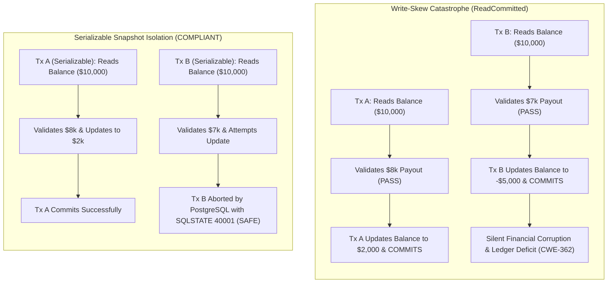
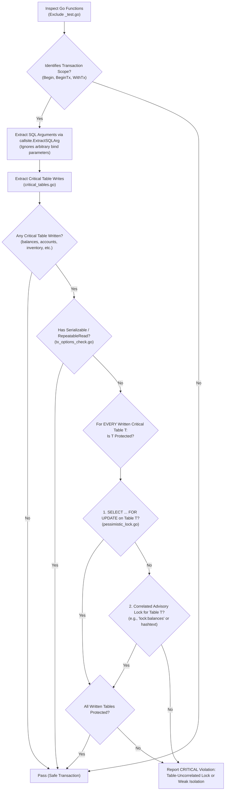

# ARGUS-A10: Unisolated Critical Table Transactions

> **Rule Code:** `ARGUS-A10`
> **Identifier:** `ISOLATION_LEVEL`
> **Severity:** `HIGH / CRITICAL` (Financial Write-Skew & Silent Data Corruption Blocker)
> **Category:** `Data Integrity, Concurrency & Financial Correctness`
> **Target Standards:** CWE-362 (Race Condition / Concurrent Execution), CWE-662 (Improper Synchronization), OWASP ASVS v4.0.3/v5.0 §V11.1.4, ACID Isolation Standards

---

## 1. Overview & Core Invariant

Database transactions mutating **critical tables-such as financial accounts, balances, inventory quotas, or sequential numbering** (`balances`, `accounts`, `inventory`, `wallets`, `ledger`, `sequence_counters`)-**must not implicitly rely on default `ReadCommitted` isolation**.

Every transaction writing to critical tables must enforce at least one of 3 concurrency safeguards:

1. Specifying **`pgx.RepeatableRead`** or **`pgx.Serializable`** explicitly via `pgx.TxOptions`, **OR**
2. Acquiring explicit pessimistic row locks (**`SELECT ... FOR UPDATE`**) on the target rows before mutation under `ReadCommitted`, **OR**
3. Enclosing the transaction within a transaction-level advisory lock (**`argus.WithAdvisoryLock`**).

---

## 2. Technical Grounding & PostgreSQL Engine Realities

### 2.1. The Write-Skew Anomaly in Default `ReadCommitted`

Under PostgreSQL's default `ReadCommitted` isolation level, each SQL statement within a transaction executes against a fresh MVCC snapshot:

1. **Concurrent Overlapping Reads:** Two concurrent transactions (Tx A and Tx B) read the current ledger balance of $10,000 simultaneously.
2. **False Precondition Validation:** Tx A validates a $8,000 withdrawal (`10,000 >= 8,000` -> valid). Tx B validates a $7,000 withdrawal (`10,000 >= 7,000` -> valid).
3. **Sequential Commit Catastrophe:** Both transactions commit sequential `UPDATE` statements. The resulting balance drops to -$5,000, creating silent financial corruption (CWE-362).



### 2.2. PostgreSQL 18 Serializable Snapshot Isolation (SSI)

PostgreSQL implements true mathematical SSI (`src/backend/storage/lmgr/predicate.c`, Cahill et al.). SSI tracks read-write anti-dependencies (`SIReadLock`) in shared memory without blocking reads. When an anomaly cycle is detected, PostgreSQL automatically aborts one transaction with SQLSTATE `40001` (serialization failure), guaranteeing 100% data integrity without manual lock coordination.

---

## 3. How Argus Detects Violations (Static Analysis Architecture)

Argus inspects transaction scopes across database calls and helper closures using compiler-grade deterministic AST inspection:



### 3.1. Table-Correlated Lock Proof (Zero-Defect Concurrency Proof)

A major correctness trap in concurrency linters is treating lock acquisition as a global boolean (`hasRowLock = true`). In reality:
- `SELECT * FROM audit_log FOR UPDATE` does **NOT** protect `UPDATE balances SET amount = ...`.
- `SELECT pg_advisory_xact_lock(999)` does **NOT** protect `balances` unless the lock identifier explicitly correlates with the critical table domain.

Argus enforces a strict **Table-Correlated Lock Proof**:
1. **Pessimistic Row Lock Correlation:** `ExtractLockedTables` parses PostgreSQL AST `LockingClause` (`LCS_FORUPDATE` / `LCS_FORNOKEYUPDATE`) and extracts relations from `FromClause`. The lock must match the mutated critical table (`TableRef.Matches`).
2. **Advisory Lock Correlation:** Advisory locks (`WithAdvisoryLock` or `pg_advisory_xact_lock`) must explicitly correlate to the target critical table or domain name (e.g., `"lock:balances"`, `hashtext('balances:' || id)`).
3. **Multi-Table Protection Completeness:** If a transaction writes to multiple critical tables (`balances` and `inventory`), **every** written critical table must be individually locked or the entire transaction must run under `Serializable` / `RepeatableRead`.

### 3.2. Schema Identity & String-Literal Safety

1. **Schema Qualification Identity:** Default critical tables (`balances`, `saldo`, `accounts`, etc.) only apply to the default or `public` schema. A query targeting `archive.balances` or `backup.accounts` is not mistakenly flagged as critical unless explicitly configured in `.argus.yaml`.
2. **String-Literal Stripping:** SQL regex fallbacks automatically strip quoted string literals (`'...'`) before evaluating DML targets. Queries like `INSERT INTO audit_log (message) VALUES ('updated balances successfully')` are never misclassified as critical writes to `balances`.
3. **Bound Argument Isolation:** Using `callsite.ExtractSQLArg(call, pass)`, Argus inspects only the SQL AST node, preventing bound parameters from leaking into query string analysis.

---

## 4. Vulnerability & Risk Taxonomy

| Failure Mode                            | Technical Impact                                                                   | Risk Severity |
| :-------------------------------------- | :--------------------------------------------------------------------------------- | :------------ |
| **Default `ReadCommitted` on Balances** | Triggers write-skew anomalies leading to negative balances and ledger corruption.  | **CRITICAL**  |
| **Quota Allocation Race Conditions**    | Over-allocates constrained inventory or subsidy quotas beyond authorized limits.   | **HIGH**      |
| **Sequential Numbering Collision**      | Concurrent counter reads generate duplicate invoice or certificate serial numbers. | **HIGH**      |

---

## 5. Non-Compliant Code Patterns (Bad Examples)

### Example 1: Default `pool.Begin` Mutating Balance

```go
// VIOLATION: Mutating balance under default ReadCommitted without row locking
func DeductAccountBalance(ctx context.Context, pool *pgxpool.Pool, accountID int, amount int64) error {
    // Flagged: transaction writing to critical table without explicit isolation or row lock
    tx, err := pool.Begin(ctx)
    if err != nil {
        return err
    }
    defer tx.Rollback(ctx)

    _, err = tx.Exec(ctx, "UPDATE saldo SET amount = amount - $1 WHERE account_id = $2", amount, accountID)
    if err != nil {
        return err
    }
    return tx.Commit(ctx)
}
```

### Example 2: Helper `WithTx` Without Isolation Level

```go
// VIOLATION: WithTx on critical table without TxOptions
func AllocateQuota(ctx context.Context, pool *pgxpool.Pool, quotaID int) error {
    // Flagged: transaction writing to critical table without explicit isolation or row lock
    return argus.WithTx(ctx, pool, func(tx pgx.Tx) error {
        _, err := tx.Exec(ctx, "UPDATE kuota SET sisa = sisa - 1 WHERE id = $1", quotaID)
        return err
    })
}
```

---

## 6. Compliant Implementation Patterns (Good Examples)

### Solution 1: Explicit `Serializable` Isolation

```go
// COMPLIANT: Serializable isolation prevents write-skew mathematically
func DeductAccountBalance(ctx context.Context, pool *pgxpool.Pool, accountID int, amount int64) error {
    opts := pgx.TxOptions{IsoLevel: pgx.Serializable}
    tx, err := pool.BeginTx(ctx, opts)
    if err != nil {
        return err
    }
    defer tx.Rollback(ctx)

    _, err = tx.Exec(ctx, "UPDATE saldo SET amount = amount - $1 WHERE account_id = $2", amount, accountID)
    if err != nil {
        return err
    }
    return tx.Commit(ctx)
}
```

### Solution 2: Pessimistic Row Lock (`SELECT ... FOR UPDATE`)

```go
// COMPLIANT: Explicit row lock under ReadCommitted
func TransferFunds(ctx context.Context, pool *pgxpool.Pool, fromID, toID int, amount int64) error {
    tx, err := pool.Begin(ctx)
    if err != nil {
        return err
    }
    defer tx.Rollback(ctx)

    // Lock rows exclusively before mutation
    const lockSQL = "SELECT amount FROM saldo WHERE id = $1 FOR UPDATE"
    var balance int64
    if err := tx.QueryRow(ctx, lockSQL, fromID).Scan(&balance); err != nil {
        return err
    }

    _, err = tx.Exec(ctx, "UPDATE saldo SET amount = amount - $1 WHERE id = $2", amount, fromID)
    if err != nil {
        return err
    }
    return tx.Commit(ctx)
}
```

### Solution 3: Wrapped with Advisory Lock

```go
// COMPLIANT: Protected by distributed advisory lock
func AllocateQuota(ctx context.Context, pool *pgxpool.Pool, quotaID int) error {
    lockKey := fmt.Sprintf("quota:allocation:%d", quotaID)
    return argus.WithAdvisoryLock(ctx, lockKey, func() error {
        return argus.WithTx(ctx, pool, func(tx pgx.Tx) error {
            _, err := tx.Exec(ctx, "UPDATE kuota SET sisa = sisa - 1 WHERE id = $1", quotaID)
            return err
        })
    })
}
```

---

## 7. How to Suppress (Ignore Directives)

For manual database migrations, admin reconciliation scripts, or batch repair tools:

```go
// argus:ignore ARGUS-A10 manual single-operator data migration
tx, err := pool.Begin(ctx)
```

Alternatively, use the identifier alias:

```go
// argus:ignore ISOLATION_LEVEL single-tenant reconciliation batch
err := argus.WithTx(ctx, pool, migrationFn)
```

---

## 8. Configuration Reference (`.argus.yaml`)

Configure additional custom critical tables in `.argus.yaml`:

```yaml
rules:
  ARGUS-A10:
    enabled: true
    critical_tables:
      - ledger_entries
      - voucher_pool
      - order_sequence
```
