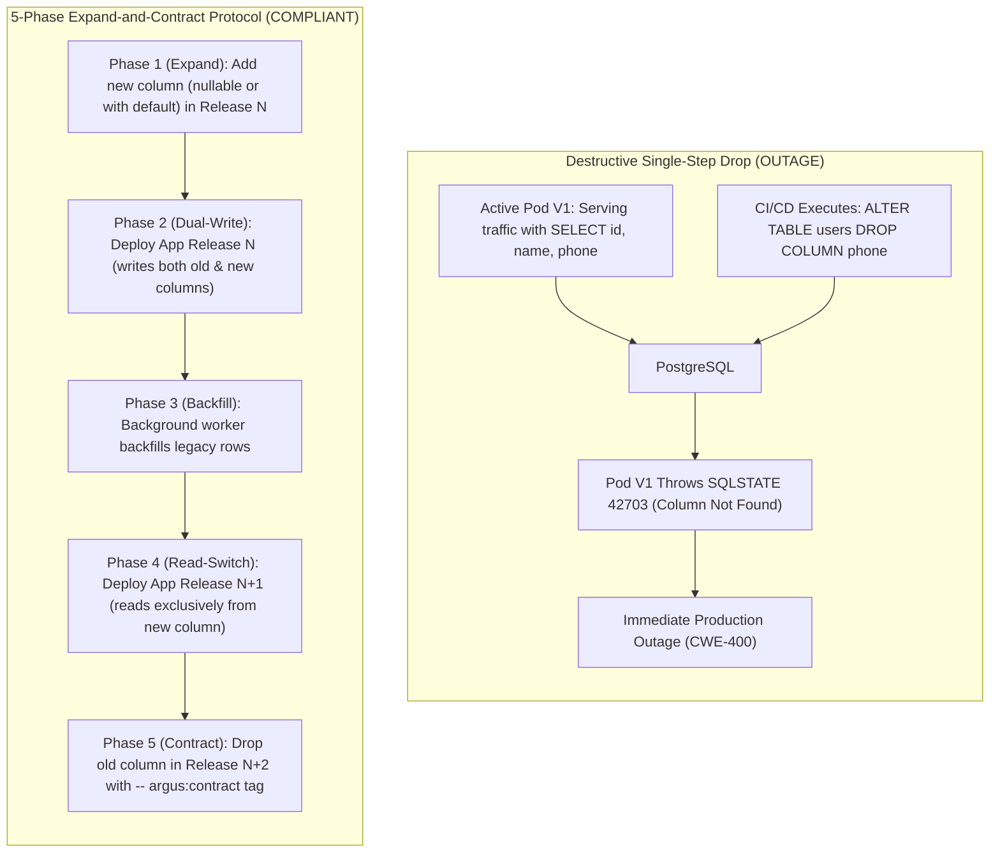
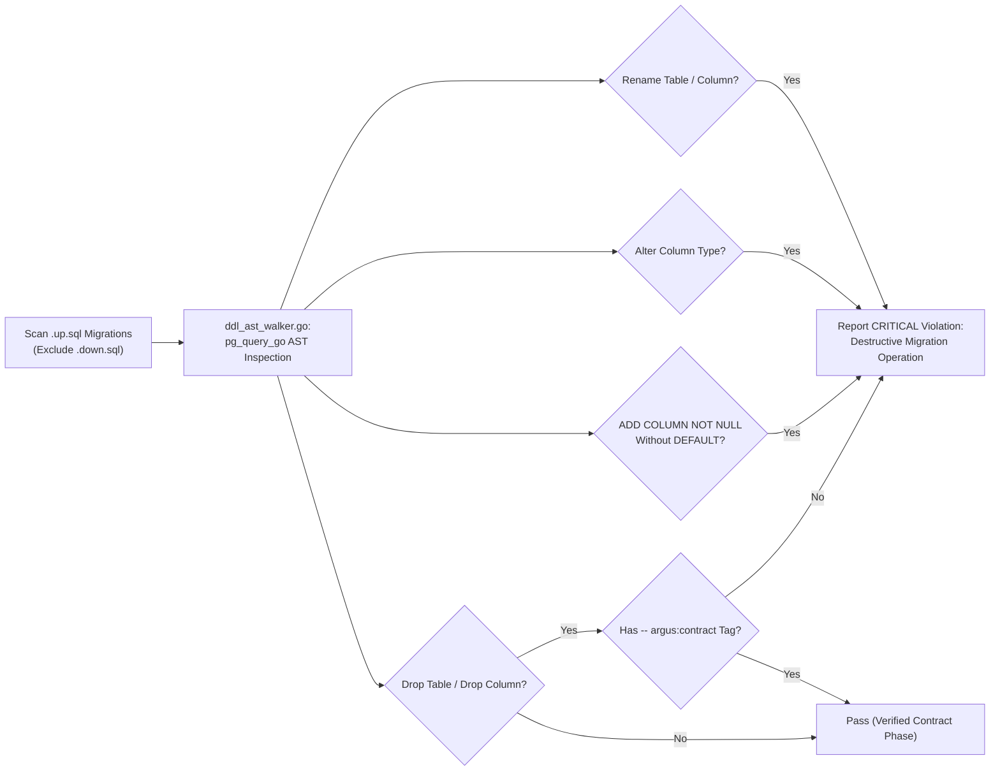

# ARGUS-A11: Destructive Schema Migrations & Zero-Downtime Violations

> **Rule Code:** `ARGUS-A11`
> **Identifier:** `DESTRUCTIVE_MIGRATION`
> **Severity:** `CRITICAL` (Rolling Deployment Crash & Full Table Rewrite Blocker)
> **Category:** `Schema Evolution, Zero-Downtime DDL & Deployment Safety`
> **Target Standards:** CWE-400 (Uncontrolled Resource Consumption), Operational Zero-Downtime Standards, OWASP ASVS v4.0.3/v5.0 §V1.4.3

---

## 1. Overview & Core Invariant

Database schema evolution across migration files (`db/migrations/`) **must adhere to the Expand and Contract (Parallel Run) zero-downtime paradigm**.

Directly destructive DDL operations are strictly prohibited in `.up.sql` migration scripts:

- **`DROP COLUMN`**
- **`RENAME COLUMN`**
- **`RENAME TABLE`**
- **`ALTER COLUMN TYPE`** (in-place column type modification)
- **`ADD COLUMN ... NOT NULL`** without a `DEFAULT` clause
- **`TRUNCATE TABLE`**

All breaking schema changes must be split into non-destructive expand phases, application transition phases (dual-write and backfill), and contract phases across separated release cycles.

---

## 2. Technical Grounding & PostgreSQL Engine Realities

### 2.1. Full Table Heap Rewrite & Lock Starvation

In PostgreSQL:

- Executing `ALTER COLUMN TYPE` (e.g. converting `VARCHAR(50)` to `INT`, or `INT` to `BIGINT`) or adding a `NOT NULL` column without a default value **forces PostgreSQL to rewrite every physical table tuple on disk (_full heap rewrite_)** under an **`ACCESS EXCLUSIVE`** lock.
- On large production tables, this operation holds exclusive locks for minutes to hours. During this lock window, **all application reads (`SELECT`) and writes (`INSERT`/`UPDATE`) are queued and blocked completely**.

### 2.2. Rolling Deployment Crashes (SQLSTATE 42703)

In modern rolling deployment architectures (Kubernetes):

1. **Active Pre-Migration Pods:** Pods running Version 1 (V1) remain active serving traffic while the CI/CD pipeline runs the migration for Version 2 (V2).
2. **Prepared Statement Cache:** Driver connections on V1 maintain cached generic prepared statements expecting column `phone` (e.g., `SELECT id, name, phone FROM users`).
3. **Immediate Crash on Column Drop:** When migration V2 executes `ALTER TABLE users DROP COLUMN phone;`, V1 pods immediately throw runtime fatal errors:
   ```
   ERROR: column "phone" of relation "users" does not exist (SQLSTATE 42703)
   ```
   This triggers widespread service outages before V2 pods finish spinning up.



---

## 3. How Argus Detects Violations (Static Analysis Architecture)

Argus inspects all `.up.sql` migration files using pure PostgreSQL AST parsing:



1. **AST Statement Inspection (`ddl_ast_walker.go`):** Identifies `DropStmt`, `TruncateStmt`, `RenameStmt`, and `AlterTableCmd` (`AT_DropColumn`, `AT_AlterColumnType`, `AT_AddColumn` with `CONSTR_NOTNULL` and no `CONSTR_DEFAULT`).
2. **Contract Phase Tag Verification (`contract_tag.go`):** Validates `-- argus:contract <release_tag>` comments immediately preceding legitimate contract-phase drop statements.
3. **Standalone Scanner (`standalone_runner.go`):** Provides independent migration directory validation capable of running in pre-commit hooks.

---

## 4. Vulnerability & Risk Taxonomy

| Failure Mode                             | Technical Impact                                                                             | Risk Severity |
| :--------------------------------------- | :------------------------------------------------------------------------------------------- | :------------ |
| **`DROP COLUMN` in Single Release**      | Breaks generic prepared statements on active rolling-deployment pods with SQLSTATE `42703`.  | **CRITICAL**  |
| **`ALTER COLUMN TYPE` In-Place**         | Triggers full table heap rewrite under `ACCESS EXCLUSIVE` lock, freezing production traffic. | **CRITICAL**  |
| **`ADD COLUMN ... NOT NULL` No Default** | Table modification fails immediately on existing tables and locks writes.                    | **HIGH**      |
| **`TRUNCATE TABLE` in Up Migration**     | Irrevocably purges live application data during schema deployment.                           | **CRITICAL**  |

---

## 5. Non-Compliant Code Patterns (Bad Examples)

### Example 1: Direct Column Deletion in Up Migration

```sql
-- VIOLATION: Breaks active application pods executing prepared queries
-- 000042_remove_legacy_phone.up.sql
ALTER TABLE users DROP COLUMN phone;
```

### Example 2: In-Place Column Type Alteration

```sql
-- VIOLATION: Forces full table rewrite under AccessExclusiveLock
-- 000043_upgrade_balance_type.up.sql
ALTER TABLE accounts ALTER COLUMN balance TYPE BIGINT;
```

### Example 3: Adding NOT NULL Without Default

```sql
-- VIOLATION: Fails on non-empty tables and locks relation
-- 000044_add_user_email.up.sql
ALTER TABLE users ADD COLUMN email VARCHAR(255) NOT NULL;
```

---

## 6. Compliant Implementation Patterns (Good Examples)

### Solution 1: Safe Expand Step (Column Addition with Default)

```sql
-- COMPLIANT: Instant metadata update in PostgreSQL without heap rewrite
-- 000042_add_user_email_expand.up.sql
ALTER TABLE users ADD COLUMN email VARCHAR(255) NOT NULL DEFAULT '';
```

### Solution 2: Verified Contract Step with Annotation

```sql
-- COMPLIANT: Verified contract phase drop after all old pods have been retired
-- 000045_cleanup_legacy_phone.up.sql
-- argus:contract release_v2_cleanup
ALTER TABLE users DROP COLUMN phone;
```

### Solution 3: Safe Table Creation

```sql
-- COMPLIANT: Standard table initialization
-- 000001_init_schema.up.sql
CREATE TABLE users (
    id UUID PRIMARY KEY,
    name VARCHAR(255) NOT NULL,
    created_at TIMESTAMPTZ NOT NULL DEFAULT NOW()
);
```

---

## 7. How to Suppress (Ignore Directives)

For one-off temporary tables or pre-production test harness scripts:

```sql
-- argus:ignore-a11 temporary staging test table cleanup
DROP TABLE temp_audit_staging;
```

Alternatively, use the canonical identifier alias:

```sql
-- argus:ignore DESTRUCTIVE_MIGRATION sandbox environment reset script
TRUNCATE TABLE sandbox_mock_data;
```

---

## 8. Configuration Reference (`.argus.yaml`)

Enable or configure migration directory paths in `.argus.yaml`:

```yaml
rules:
  ARGUS-A11:
    enabled: true
```
