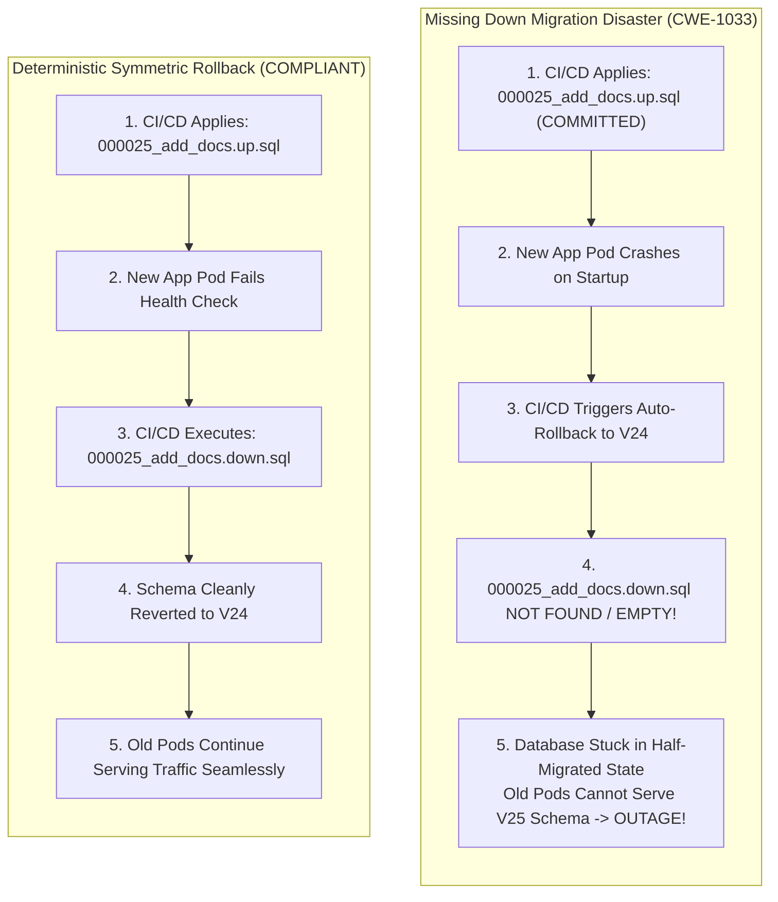
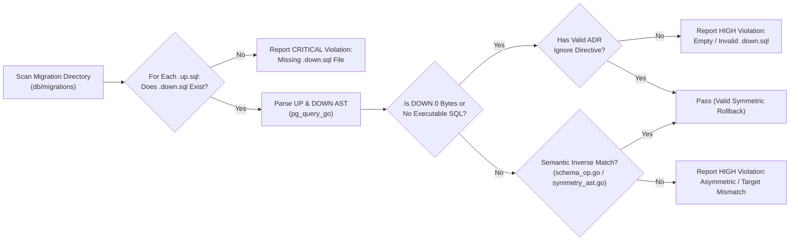

# ARGUS-A13: Missing or Empty Rollback Down Migrations

> **Rule Code:** `ARGUS-A13`
> **Identifier:** `MISSING_DOWN_MIGRATION`
> **Severity:** `HIGH / CRITICAL` (Failed Automated Rollback & Half-Migrated State Blocker)
> **Category:** `Schema Evolution, Incident Recovery & Deployment Safety`
> **Target Standards:** CWE-1033 (Incomplete Component Recovery), Operational Zero-Downtime Standards, OWASP ASVS v4.0.3/v5.0 §V1.4.3

---

## 1. Overview & Core Invariant

Every forward database schema migration file (`.up.sql`) **must have a corresponding, non-empty, and executable reverse rollback migration file (`.down.sql`)**.

Automated deployment orchestrators and CI/CD pipelines require instantaneous rollback capabilities if application health checks fail during release deployment. Rollback scripts must never be omitted, left as 0-byte placeholders, or contain only whitespace and comments.

---

## 2. Technical Grounding & PostgreSQL Engine Realities

### 2.1. Transactional DDL & Post-Commit Failures

PostgreSQL supports transactional DDL (`BEGIN ... DDL ... COMMIT`), allowing multi-statement migrations to roll back if a syntax or constraint error occurs during execution. However, once a migration commits successfully and the subsequent application startup fails (e.g. environment variable misconfiguration or startup panic), transactional DDL cannot revert committed catalog modifications. Reversion requires executing the corresponding `.down.sql` script.

### 2.2. The Half-Migrated Production Disaster (CWE-1033)

When deployment automation triggers a rollback to the previous release:

1. **Unpaired Migration:** Migration `000025_add_documents.up.sql` was applied to the database.
2. **Application Startup Failure:** The new application version fails post-deployment health checks.
3. **Rollback Attempt:** CI/CD initiates an automated rollback to version `000024`, looking for `000025_add_documents.down.sql`.
4. **Catastrophic Outage:** Because the `.down.sql` file is missing or empty, the automated rollback fails. The database remains stuck in a half-migrated state where old application pods fail to run against the new schema, triggering extended downtime.



### 2.3. Irreversible Data Migrations Protocol

For historical migrations involving lossy or mathematically irreversible data transformations:

- A physical `.down.sql` file is **still mandatory**.
- The file must contain a no-op statement (`SELECT 1;`) accompanied by an approved ADR reference and suppression directive:
  ```sql
  -- argus:ignore ARGUS-A13 ADR-0042 irreversible historical data migration
  SELECT 1;
  ```

---

## 3. How Argus Detects Violations (Static Analysis Architecture)

Argus evaluates migration directory pairings and enforces **deterministic semantic inverse rollback symmetry**:



1. **Pairing Matcher (`pair_matcher.go`):** Validates 1-to-1 filesystem mapping between `NNNN_name.up.sql` and `NNNN_name.down.sql`.
2. **AST Statement Validator (`symmetry_ast.go`):** Ensures `.down.sql` contains executable SQL statements using `pg_query_go`.
3. **Semantic Inverse Rollback Engine (`schema_op.go`):** Extracts schema operations (`CreateStmt`, `DropStmt`, `AlterTableStmt`, `IndexStmt`, `ViewStmt`, `CreateSeqStmt`, `CreateSchemaStmt`) from both UP and DOWN ASTs. Asserts that every object created or modified in UP has a matching inverse operation in DOWN targeting the exact same object name (e.g. `CREATE TABLE users` requires `DROP TABLE users`; `ADD COLUMN status` requires `DROP COLUMN status`). Dummy rollbacks (`SELECT 1;`) or target mismatches (`DROP TABLE orders` when `users` was created) are strictly flagged unless suppressed with an approved ADR directive (`-- argus:ignore-a13 ADR-xxx <reason>`).
4. **Standalone Runner (`standalone_scanner.go`):** Independent directory auditor capable of running in CI/CD pre-commit hooks and standalone scanning.

---

## 4. Vulnerability & Risk Taxonomy

| Failure Mode                       | Technical Impact                                                                               | Risk Severity |
| :--------------------------------- | :--------------------------------------------------------------------------------------------- | :------------ |
| **Missing `.down.sql` File**       | Prevents automated rollback during failed deployments, leaving cluster in half-migrated state. | **CRITICAL**  |
| **0-Byte Empty `.down.sql`**       | Bypasses superficial file existence checks without providing rollback capability.              | **HIGH**      |
| **Comments-Only `.down.sql`**      | Contains no executable SQL statements to undo schema changes.                                  | **HIGH**      |
| **Asymmetric Dummy Rollback**      | Fails to revert schema changes (e.g. `SELECT 1;` instead of `DROP TABLE users`).               | **HIGH**      |
| **Rollback Target Mismatch**       | Drops unrelated objects or fails to revert newly added tables, columns, or indexes.            | **HIGH**      |

---

## 5. Non-Compliant Code Patterns (Bad Examples)

### Example 1: Missing Down Migration File

```
db/migrations/
├── 000001_init.up.sql
├── 000001_init.down.sql
├── 000002_add_orders.up.sql   <-- Missing 000002_add_orders.down.sql!
```

### Example 2: Empty 0-Byte Down Migration

```sql
-- 000003_add_coupons.down.sql
-- (File is empty: 0 bytes)
```

### Example 3: Comments-Only Without Executable DDL

```sql
-- 000004_drop_temp_index.down.sql
-- TODO: Add rollback later when time permits
```

---

## 6. Compliant Implementation Patterns (Good Examples)

### Solution 1: Complete Symmetric Table Pair

```sql
-- 000001_create_accounts.up.sql
CREATE TABLE accounts (
    id UUID PRIMARY KEY,
    balance BIGINT NOT NULL DEFAULT 0
);

-- 000001_create_accounts.down.sql
DROP TABLE IF EXISTS accounts;
```

### Solution 2: Symmetric Column Addition Pair

```sql
-- 000002_add_account_status.up.sql
ALTER TABLE accounts ADD COLUMN status VARCHAR(32) NOT NULL DEFAULT 'active';

-- 000002_add_account_status.down.sql
ALTER TABLE accounts DROP COLUMN IF EXISTS status;
```

### Solution 3: Irreversible Data Migration with ADR Reference

```sql
-- 000003_backfill_payout_hash.down.sql
-- argus:ignore-a13 ADR-0089 hash backfill is computationally irreversible
SELECT 1;
```

---

## 7. How to Suppress (Ignore Directives)

For approved irreversible data backfills documented in Architecture Decision Records:

```sql
-- argus:ignore-a13 ADR-0042 lossy data transformation irreversible
SELECT 1;
```

Alternatively, use the canonical identifier alias:

```sql
-- argus:ignore MISSING_DOWN_MIGRATION ADR-0042 irreversible data migration
SELECT 1;
```

---

## 8. Configuration Reference (`.argus.yaml`)

Enable or configure this rule in `.argus.yaml`:

```yaml
rules:
  ARGUS-A13:
    enabled: true
```
