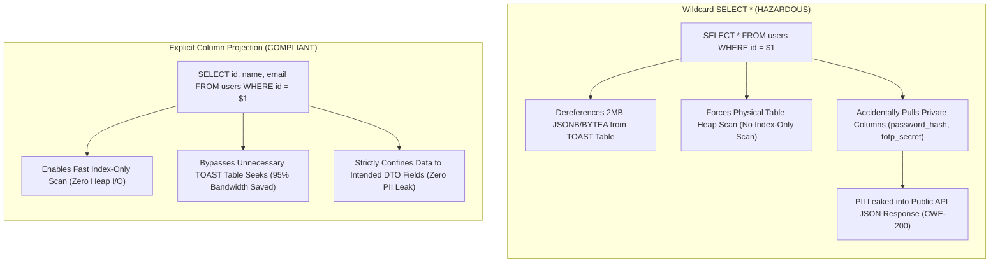
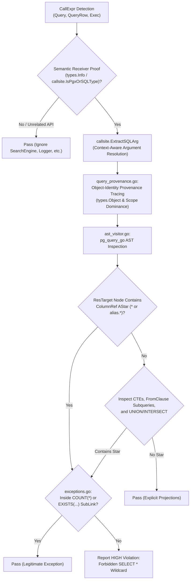

# ARGUS-A14: Forbidden Wildcard SELECT * Queries

> **Rule Code:** `ARGUS-A14`
> **Identifier:** `FORBIDDEN_SELECT_STAR`
> **Severity:** `HIGH` (TOAST Table Bloat, Buffer Cache Pollution & PII Leak)
> **Category:** `Performance, Memory Bounds & Security (Anti-Overfetching)`
> **Target Standards:** CWE-200 (Exposure of Sensitive Information to an Unauthorized Actor), OWASP ASVS v4.0.3/v5.0 §V8.3.2, PostgreSQL Performance Guidelines

---

## 1. Overview & Core Invariant

All SQL queries executed in production application code **must define explicit column projections**. The use of wildcard expressions (**`SELECT *`** or **`SELECT alias.*`**) is strictly forbidden.

Every data retrieval query must list required column identifiers specifically (`SELECT id, name, status, created_at`). Legitimate exemptions are limited to:

1. Row counting aggregate functions: **`COUNT(*)`** or **`COUNT(DISTINCT *)`**.
2. Boolean existence subqueries: **`EXISTS (SELECT 1 ... / SELECT * ...)`** where the PostgreSQL query planner ignores projection cost.

---

## 2. Technical Grounding & PostgreSQL Engine Realities

### 2.1. TOAST Attribute Dereferencing & Buffer Cache Pollution

PostgreSQL stores oversized attributes (`TEXT`, `JSONB`, `BYTEA`, arrays) out-of-line in separate TOAST tables.

- Executing `SELECT *` forces PostgreSQL to perform random disk I/O seeks to dereference each TOAST pointer, even if the application never reads those fields.
- TOAST data floods `shared_buffers`, evicting hot cache pages from RAM.

### 2.2. Nullification of Index-Only Scans

When a query requests only columns contained in an index (e.g. `SELECT id, status FROM users WHERE status = 'active'`), PostgreSQL executes an **Index-Only Scan** without touching table heap pages (_zero table disk I/O_). Wildcard `SELECT *` breaks Index-Only Scans completely, forcing physical heap lookups for every matching row.

### 2.3. Sensitive Information Exposure (CWE-200 & OWASP §V8.3.2)

When new private columns (e.g. `password_hash`, `totp_secret`, `ssn`) are added to database tables, API handlers querying via `SELECT *` automatically map and expose these fields into public JSON responses.



---

## 3. How Argus Detects Violations (Static Analysis Architecture)

Argus evaluates SQL queries across all database call sites using semantic type resolution and PostgreSQL AST inspection:



1. **Semantic Receiver Verification (`query_provenance.go`):** Proves receiver identity via `pass.TypesInfo.TypeOf` and `callsite.IsPgxOrSQLType`, rejecting method spoofing on unrelated APIs (e.g. `searchEngine.Query`).
2. **Context-Aware Argument Extraction (`shared/callsite`):** Extracts query arguments dynamically, distinguishing `context.Context` from query strings without fragile positional guessing.
3. **Object-Identity Variable Tracing (`query_provenance.go`):** Tracks SQL query string provenance using `types.Object` pointer equality (`pass.TypesInfo.Uses` / `Defs`), completely preventing variable shadowing corruptions where local variables mask outer declarations.
4. **Lexical Scope Dominance (Standalone AST Mode):** Scans block scopes from innermost to outermost, halting immediately when variable re-declaration (`:=`) is encountered to isolate local scopes.
5. **AST TargetList Inspection (`ast_visitor.go`):** Deterministically checks for `Node_AStar` within `ResTarget` and `ColumnRef` nodes.
6. **Subquery & CTE Traversal (`ast_visitor.go`):** Recursively inspects Common Table Expressions (`WithClause`), subselects (`FromClause`), and Set Operations (`Larg`/`Rarg`).
7. **Exemption Filtering (`exceptions.go`):** Safely permits `COUNT(*)` and boolean probe subqueries inside `EXISTS(...)`.

---

## 4. Vulnerability & Risk Taxonomy

| Failure Mode                     | Technical Impact                                                                             | Risk Severity |
| :------------------------------- | :------------------------------------------------------------------------------------------- | :------------ |
| **Accidental PII Exposure**      | Newly added sensitive columns are automatically mapped and exposed via API responses.        | **CRITICAL**  |
| **TOAST Table Flooding**         | Heavy JSONB/BYTEA attributes saturate memory buffers and increase query latency.             | **HIGH**      |
| **Index-Only Scan Invalidation** | Forces costly physical table heap access on queries that could run entirely in index memory. | **HIGH**      |
| **Positional Scan Panics**       | Application runtimes crash if migration alters column sequence order.                        | **HIGH**      |

---

## 5. Non-Compliant Code Patterns (Bad Examples)

### Example 1: Basic Wildcard Query

```go
// VIOLATION: Selects all columns including potential TOAST attributes and private fields
func GetUser(ctx context.Context, pool *pgxpool.Pool, userID int) (*User, error) {
    // Flagged: Forbidden 'SELECT *' or wildcard column selection
    const query = "SELECT * FROM users WHERE id = $1"
    var u User
    err := pool.QueryRow(ctx, query, userID).Scan(&u.ID, &u.Name, &u.Email)
    return &u, err
}
```

### Example 2: Table Alias Wildcard in JOIN

```go
// VIOLATION: Alias wildcard over-fetches entire table
func GetUserOrders(ctx context.Context, pool *pgxpool.Pool, userID int) ([]Order, error) {
    // Flagged: Forbidden 'SELECT *' or wildcard column selection
    const query = "SELECT u.*, o.id FROM users u JOIN orders o ON u.id = o.user_id"
    rows, err := pool.Query(ctx, query)
    return parseOrders(rows), err
}
```

### Example 3: Wildcard in Common Table Expression (CTE)

```go
// VIOLATION: CTE wildcard over-fetches into temp working memory
func GetActiveOrders(ctx context.Context, pool *pgxpool.Pool) error {
    // Flagged: Forbidden 'SELECT *' or wildcard column selection
    const query = `WITH active_users AS (
        SELECT * FROM users WHERE status = 'active'
    ) SELECT id FROM active_users`
    _, err := pool.Exec(ctx, query)
    return err
}
```

---

## 6. Compliant Implementation Patterns (Good Examples)

### Solution 1: Explicit Column Projection

```go
// COMPLIANT: Fetches only the required columns
func GetUser(ctx context.Context, pool *pgxpool.Pool, userID int) (*User, error) {
    const query = "SELECT id, name, email, status FROM users WHERE id = $1"
    var u User
    err := pool.QueryRow(ctx, query, userID).Scan(&u.ID, &u.Name, &u.Email, &u.Status)
    return &u, err
}
```

### Solution 2: Aggregate Function `COUNT(*)`

```go
// COMPLIANT: COUNT(*) aggregate row counting is explicitly permitted
func CountActiveUsers(ctx context.Context, pool *pgxpool.Pool) (int64, error) {
    const query = "SELECT COUNT(*) FROM users WHERE status = 'active'"
    var count int64
    err := pool.QueryRow(ctx, query).Scan(&count)
    return count, err
}
```

### Solution 3: Boolean `EXISTS` Subquery

```go
// COMPLIANT: EXISTS subquery projection is optimized by PostgreSQL planner
func UserHasOrders(ctx context.Context, pool *pgxpool.Pool, userID int) (bool, error) {
    const query = "SELECT EXISTS(SELECT 1 FROM orders WHERE user_id = $1)"
    var exists bool
    err := pool.QueryRow(ctx, query, userID).Scan(&exists)
    return exists, err
}
```

---

## 7. How to Suppress (Ignore Directives)

For low-level disaster recovery database dump utilities or administrative schema introspection tools:

```go
// argus:ignore ARGUS-A14 low-level database disaster recovery full row export
rows, err := pool.Query(ctx, "SELECT * FROM audit_archive")
```

Alternatively, use the canonical identifier alias:

```go
// argus:ignore FORBIDDEN_SELECT_STAR administrative schema exporter
rows, err := pool.Query(ctx, dumpQuery)
```

---

## 8. Configuration Reference (`.argus.yaml`)

Enable or configure this rule in `.argus.yaml`:

```yaml
rules:
  ARGUS-A14:
    enabled: true
```
