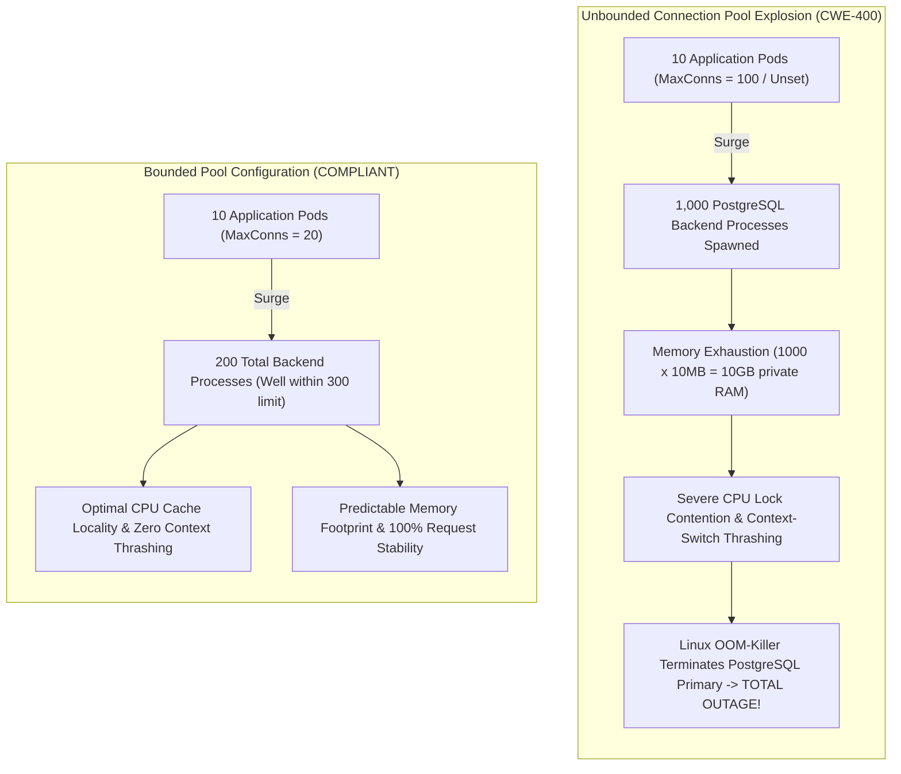
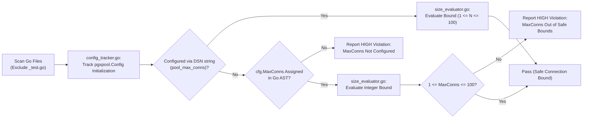

# ARGUS-A16: Missing or Unbounded Pool MaxConns Configuration

> **Rule Code:** `ARGUS-A16`
> **Identifier:** `MAX_CONNS_CONFIG`
> **Severity:** `HIGH` (Process Thrashing, OOM & Connection Rejection Outage)
> **Category:** `Resource & Connection Lifecycle Management`
> **Target Standards:** CWE-400 (Uncontrolled Resource Consumption), OWASP ASVS v4.0.3/v5.0 §V1.4.3, PostgreSQL Capacity Sizing Standards

---

## 1. Overview & Core Invariant

Every database connection pool initialization (`pgxpool.NewWithConfig` or `pgxpool.ParseConfig`) **must explicitly declare a safe upper bound on `MaxConns`**.

Unbounded pools, omitted `MaxConns` properties (which default implicitly or scale dangerously with core count), and excessively large limits ($> 100$ per application instance) are strictly prohibited. Production application instances must constrain pool sizes between **10 and 50** connections unless routed through a dedicated transaction pooler (such as PgBouncer).

---

## 2. Technical Grounding & PostgreSQL Engine Realities

### 2.1. Process-Per-Connection Memory Footprint

PostgreSQL allocates a dedicated OS process for every client connection (`postgres: user db host [idle]`). Each process consumes **5-10 MB** of RAM for session state, `work_mem`, and query execution buffers.

### 2.2. The Connection Saturation Catastrophe

In Kubernetes or horizontally scaled container environments:
$$\text{Total Active Connections} = \text{Replica Pod Count} \times \text{MaxConns Per Pod}$$

If 10 application pods run with `MaxConns = 100`, the PostgreSQL cluster can be subjected to 1,000 simultaneous backend processes. During traffic surges:

1. **CPU Context-Switching Thrashing:** The OS kernel spends more CPU cycles managing process context switches than executing SQL queries.
2. **Buffer Cache Contention:** Memory exhausts rapidly, triggering the Linux kernel Out-Of-Memory (OOM) killer.
3. **Connection Rejection:** Client connections are dropped with `FATAL: remaining connection slots are reserved for non-replication superuser connections`.



---

## 3. How Argus Detects Violations (Static Analysis Architecture)

Argus evaluates connection pool initialization and assignment flow:



1. **Configuration Tracker (`config_tracker.go`):** Tracks `pgxpool.Config` declarations, `ParseConfig` calls, and AST assignments.
2. **Size Evaluator (`size_evaluator.go`):** Asserts that configured `MaxConns` values reside within safe operational limits ($1 \le \text{MaxConns} \le 100$).

---

## 4. Vulnerability & Risk Taxonomy

| Failure Mode                    | Technical Impact                                                                    | Risk Severity |
| :------------------------------ | :---------------------------------------------------------------------------------- | :------------ |
| **Unset `MaxConns`**            | Pool inherits default settings, risking uncontrolled scaling during traffic bursts. | **HIGH**      |
| **Giant Pool Limit ($> 100$)**  | Squeezes database host memory and triggers CPU context-switching starvation.        | **HIGH**      |
| **Zero or Negative `MaxConns`** | Causes driver initialization errors or unbounded connection growth.                 | **HIGH**      |

---

## 5. Non-Compliant Code Patterns (Bad Examples)

### Example 1: Missing MaxConns Configuration

```go
// VIOLATION: Configured timeouts without bounding MaxConns
func NewPool(ctx context.Context, dsn string) (*pgxpool.Pool, error) {
    cfg, err := pgxpool.ParseConfig(dsn)
    if err != nil {
        return nil, err
    }
    // Flagged: Database connection pool does not configure safe MaxConns
    return pgxpool.NewWithConfig(ctx, cfg)
}
```

### Example 2: Excessively Large Pool Limit

```go
// VIOLATION: Pool size exceeds safe multi-instance limits
func NewPool(ctx context.Context, dsn string) (*pgxpool.Pool, error) {
    cfg, _ := pgxpool.ParseConfig(dsn)
    // Flagged: MaxConns (500) exceeds maximum safe limit (100)
    cfg.MaxConns = 500
    return pgxpool.NewWithConfig(ctx, cfg)
}
```

---

## 6. Compliant Implementation Patterns (Good Examples)

### Solution 1: Explicit Bounded Pool Assignment

```go
// COMPLIANT: Explicitly limits pool connections to a safe size
func NewPool(ctx context.Context, dsn string) (*pgxpool.Pool, error) {
    cfg, err := pgxpool.ParseConfig(dsn)
    if err != nil {
        return nil, err
    }
    cfg.MaxConns = 25
    return pgxpool.NewWithConfig(ctx, cfg)
}
```

### Solution 2: Environment-Based Pool Sizing with Clamping

```go
// COMPLIANT: Reads environment variable with fallback upper limit
func NewPool(ctx context.Context, dsn string) (*pgxpool.Pool, error) {
    cfg, err := pgxpool.ParseConfig(dsn)
    if err != nil {
        return nil, err
    }
    maxConns := int32(20)
    if val := os.Getenv("DB_MAX_CONNS"); val != "" {
        if parsed, err := strconv.Atoi(val); err == nil && parsed > 0 && parsed <= 50 {
            maxConns = int32(parsed)
        }
    }
    cfg.MaxConns = maxConns
    return pgxpool.NewWithConfig(ctx, cfg)
}
```

---

## 7. How to Suppress (Ignore Directives)

For applications communicating via dedicated PgBouncer transaction poolers:

```go
// argus:ignore-a16 routed via dedicated pgbouncer transaction pooler
cfg.MaxConns = 250
```

Alternatively, use the canonical identifier alias:

```go
// argus:ignore MAX_CONNS_CONFIG stress test harness dedicated benchmark
cfg.MaxConns = 500
```

---

## 8. Configuration Reference (`.argus.yaml`)

Configure maximum permissible pool connection limits in `.argus.yaml`:

```yaml
rules:
  ARGUS-A16:
    enabled: true
    max_allowed_conns: 100
```
