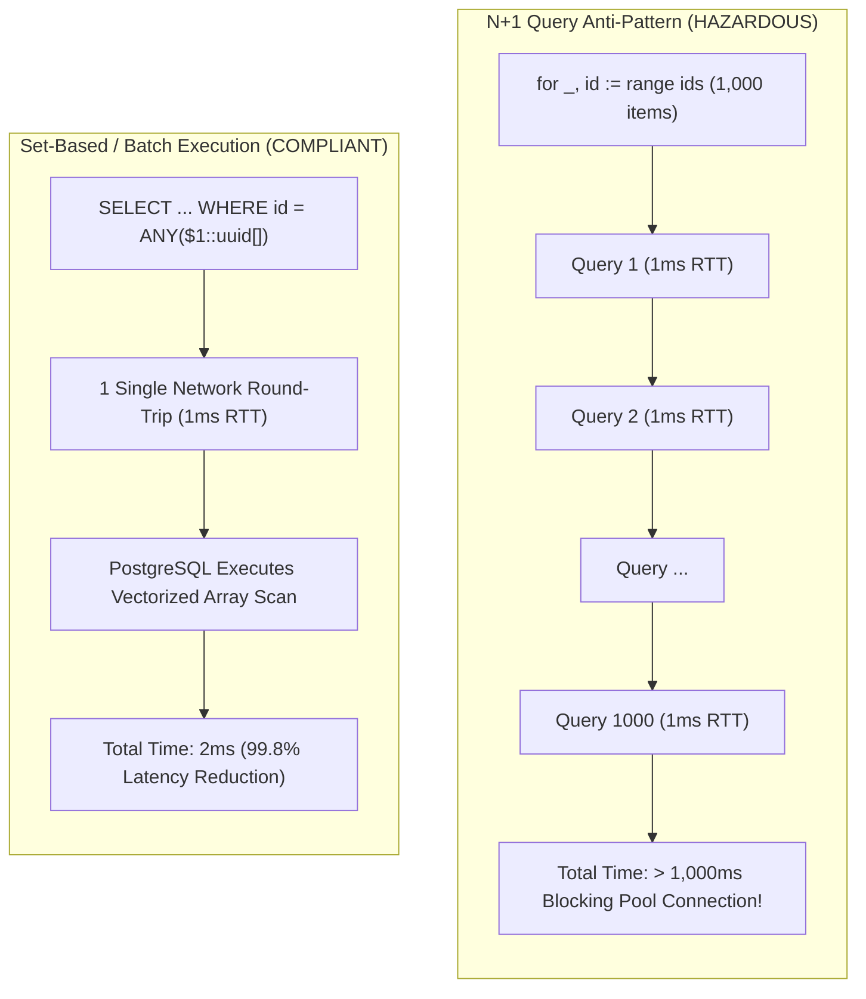
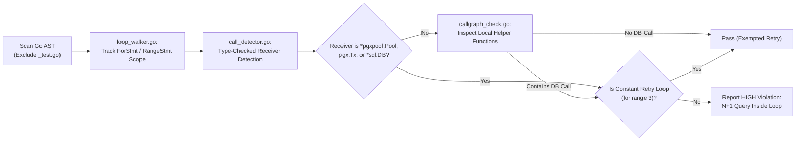

# ARGUS-A17: Forbidden Database Queries Inside Loops (N+1 Anti-Pattern)

> **Rule Code:** `ARGUS-A17`
> **Identifier:** `FORBIDDEN_QUERY_IN_LOOP` (Alias: `N_PLUS_ONE`)
> **Severity:** `HIGH` (N+1 Latency Collapse & Connection Saturation Blocker)
> **Category:** `Performance, Network I/O & Latency Scalability`
> **Target Standards:** CWE-400 (Uncontrolled Resource Consumption), OWASP ASVS v4.0.3/v5.0 §V1.4.3, §V11.1.4, Database Optimization Standards

---

## 1. Overview & Core Invariant

Individual database query executions (**`Query`**, **`QueryRow`**, **`Exec`**) **must never be called inside iterative application loops (`for`, `range`)** (the $N+1$ query anti-pattern).

Iterative round-trips over network sockets incur severe serialization latency and lock up pool connections for extended durations. All multi-record operations must be restructured into set-based batch operations (`WHERE id = ANY($1)` or `pgx.Batch`).

Legitimate exemptions are strictly limited to:

1. Small constant retry loops (`for range 3`).
2. Dedicated background event poller routines.

---

## 2. Technical Grounding & PostgreSQL Engine Realities

### 2.1. The Network Round-Trip Latency Multiplier ($N \times \text{RTT}$)

Executing queries in a loop multiplies network Round-Trip Time (RTT). In a typical 1ms latency network environment, fetching 1,000 records sequentially inside a loop blocks the thread for over **1 second** purely on TCP socket overhead, ignoring PostgreSQL's internal query execution capabilities.

### 2.2. Connection Pool Starvation

A single goroutine holding a database connection while performing hundreds of sequential round-trips monopolizes the connection pool. Under concurrent user traffic, this results in connection pool exhaustion and cascading HTTP timeout errors.



---

## 3. How Argus Detects Violations (Static Analysis Architecture)

Argus combines AST loop depth tracking with Go type-checking and local call graph traversal:



1. **Loop Walker (`loop_walker.go`):** Tracks nested loop depths and ignores constant small retry loops (`for range 3`).
2. **Call Detector (`call_detector.go`):** Validates receiver types using `pass.TypesInfo` to eliminate false positives on non-database `Exec()`/`Query()` methods.
3. **Call Graph Inspector (`callgraph_check.go`):** Detects internal helper function invocations inside loops that secretly trigger database queries.

---

## 4. Vulnerability & Risk Taxonomy

| Failure Mode                         | Technical Impact                                                           | Risk Severity |
| :----------------------------------- | :------------------------------------------------------------------------- | :------------ |
| **N+1 `QueryRow` in Range Loop**     | Multiplies network round-trips linearly, inflating API latency to seconds. | **HIGH**      |
| **N+1 `Exec` in Loop**               | Causes connection pool starvation and degrades database write throughput.  | **HIGH**      |
| **Hidden Helper DB Queries in Loop** | Obscures N+1 queries behind abstraction layers.                            | **HIGH**      |

---

## 5. Non-Compliant Code Patterns (Bad Examples)

### Example 1: QueryRow Inside Range Loop

```go
// VIOLATION: Executes 1 database query per item in slice
func GetUsers(ctx context.Context, pool *pgxpool.Pool, userIDs []int) ([]User, error) {
    var users []User
    for _, id := range userIDs {
        // Flagged: Database query executed inside loop (N+1 antipattern)
        var u User
        err := pool.QueryRow(ctx, "SELECT id, name FROM users WHERE id = $1", id).Scan(&u.ID, &u.Name)
        if err != nil {
            return nil, err
        }
        users = append(users, u)
    }
    return users, nil
}
```

### Example 2: Hidden Helper Method Invocation

```go
// VIOLATION: Loop calls helper that executes database queries
func (s *Service) ProcessOrders(ctx context.Context, orderIDs []int) error {
    for _, id := range orderIDs {
        // Flagged: Helper function executes DB query inside loop
        if err := s.updateOrderStatus(ctx, id); err != nil {
            return err
        }
    }
    return nil
}
```

---

## 6. Compliant Implementation Patterns (Good Examples)

### Solution 1: Set-Based Query with PostgreSQL Array `ANY($1)`

```go
// COMPLIANT: Single network round-trip fetching all records
func GetUsers(ctx context.Context, pool *pgxpool.Pool, userIDs []int) ([]User, error) {
    const query = "SELECT id, name FROM users WHERE id = ANY($1)"
    rows, err := pool.Query(ctx, query, userIDs)
    if err != nil {
        return nil, err
    }
    defer rows.Close()
    return scanUsers(rows)
}
```

### Solution 2: Batch Pipeline Execution (`pgx.Batch`)

```go
// COMPLIANT: Pipelined batch execution in a single round-trip
func UpdateBalances(ctx context.Context, pool *pgxpool.Pool, updates []BalanceUpdate) error {
    batch := &pgx.Batch{}
    for _, u := range updates {
        batch.Queue("UPDATE accounts SET balance = balance + $1 WHERE id = $2", u.Amount, u.AccountID)
    }
    br := pool.SendBatch(ctx, batch)
    defer br.Close()
    return br.Close()
}
```

---

## 7. How to Suppress (Ignore Directives)

For background poller daemons that poll database tables for work items:

```go
// argus:ignore-a17 background polling worker query in continuous loop
for {
    rows, err := pool.Query(ctx, "SELECT id FROM tasks WHERE status = 'pending' LIMIT 10")
    // ...
}
```

Alternatively, use the canonical identifier alias:

```go
// argus:ignore FORBIDDEN_QUERY_IN_LOOP event poller queue worker
rows, err := pool.Query(ctx, pollEventsQuery)
```

---

## 8. Configuration Reference (`.argus.yaml`)

Enable or configure this rule in `.argus.yaml`:

```yaml
rules:
  ARGUS-A17:
    enabled: true
```
