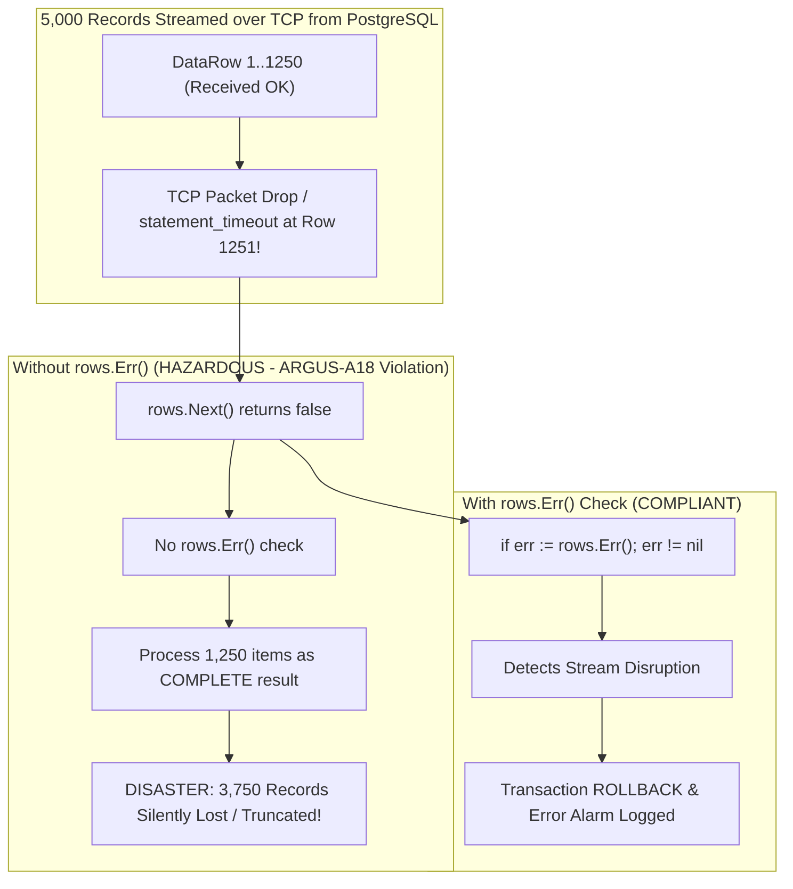
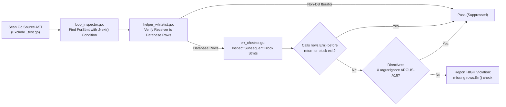

# ARGUS-A18: Mandatory rows.Err() Check After Cursor Iteration

> **Rule Code:** `ARGUS-A18`
> **Identifier:** `MISSING_ROWS_ERR_CHECK`
> **Severity:** `HIGH` (Silent Data Truncation & Partial Batch Execution)
> **Category:** `Data Integrity, Stream Reliability & Error Handling`
> **Target Standards:** CWE-391 (Unchecked Error Condition), CWE-662 (Improper Synchronization / Partial Processing), OWASP ASVS v4.0.3/v5.0 §V5.3.1, §V7.1.1

---

## 1. Overview & Core Invariant

Immediately after completing a database cursor loop (**`for rows.Next() { ... }`**), application code **must inspect `rows.Err()`** before returning, processing, or acting upon the collected dataset.

Ignoring `rows.Err()` or returning data directly after the loop under the assumption that `rows.Next()` only returns `false` upon reaching EOF is strictly forbidden.

Automatic exemption is granted when using official auto-closing collection helpers that handle stream errors internally:

- **`pgx.CollectRows(rows, ...)`**
- **`pgx.CollectOneRow(rows, ...)`**
- **`pgx.ForEachRow(rows, ...)`**

---

## 2. Technical Grounding & PostgreSQL Engine Realities

### 2.1. TCP Socket Streaming & Dual Exit Condition of `rows.Next()`

In PostgreSQL Extended Query Protocol v3.0, query results are streamed asynchronously over TCP sockets as individual `DataRow (D)` message frames.

The driver method `rows.Next()` returns boolean **`false`** under two fundamentally opposite conditions:

1. **Condition A (Clean EOF / Normal Completion):** All rows have been transmitted by PostgreSQL and received by the client, concluded by a `CommandComplete (C)` protocol message.
2. **Condition B (Abnormal Stream Disruption):** An unrecoverable error occurred mid-stream:
   - Network socket disconnect (_TCP RST_ / packet drop).
   - Context cancellation or deadline exceeded.
   - Column type decoding failure on a specific row.
   - Server-side `statement_timeout` triggered by PostgreSQL engine while streaming thousands of rows.

### 2.2. The Silent Dataset Truncation Disaster (CWE-391)

Without inspecting `rows.Err()`, Go applications cannot differentiate between Condition A and Condition B. The application treats truncated partial data as a complete dataset and proceeds with business logic.



---

## 3. How Argus Detects Violations (Static Analysis Architecture)

Argus inspects Go AST control flows across enclosing block statements:



1. **Loop Inspector (`loop_inspector.go`):** Identifies `*ast.ForStmt` where the condition invokes `.Next()` on a database rows receiver.
2. **Helper Whitelist & Type Guard (`helper_whitelist.go`):** Ensures only database row iterators (`pgx.Rows`, `sql.Rows`) are targeted, ignoring benchmark helpers (`pb.Next()`).
3. **Error Checker (`err_checker.go`):** Validates that subsequent statements in the enclosing block inspect `rows.Err()` before any unconditional `return` statement.

---

## 4. Vulnerability & Risk Taxonomy

| Failure Mode                           | Technical Impact                                                   | Risk Severity             |
| :------------------------------------- | :----------------------------------------------------------------- | :------------------------ |
| **Missing `rows.Err()` Check**         | Silent dataset truncation during network drop or statement timeout | `HIGH` (CWE-391, CWE-662) |
| **Early Return Before `rows.Err()`**   | Premature function exit with partial dataset                       | `HIGH`                    |
| **Premature Mutation on Partial Data** | Mutating secondary tables using incomplete query results           | `CRITICAL`                |

---

## 5. Non-Compliant Code Patterns (Bad Examples)

### Example 1: Missing `rows.Err()` Before Return

```go
// NON-COMPLIANT: rows.Err() omitted after loop
func ListActiveUsers(ctx context.Context, pool *pgxpool.Pool) ([]User, error) {
    rows, err := pool.Query(ctx, "SELECT id, email FROM users WHERE active = true")
    if err != nil {
        return nil, err
    }
    defer rows.Close()

    var users []User
    for rows.Next() {
        var u User
        if err := rows.Scan(&u.ID, &u.Email); err != nil {
            return nil, err
        }
        users = append(users, u)
    }

    // HAZARDOUS: If stream dropped at row 50, partial list is returned as complete!
    return users, nil
}
```

---

## 6. Compliant Implementation Patterns (Good Examples)

### Pattern 1: Immediate `rows.Err()` Check (Recommended Standard)

```go
// COMPLIANT: Explicit rows.Err() check immediately after loop
func ListActiveUsers(ctx context.Context, pool *pgxpool.Pool) ([]User, error) {
    rows, err := pool.Query(ctx, "SELECT id, email FROM users WHERE active = true")
    if err != nil {
        return nil, err
    }
    defer rows.Close()

    var users []User
    for rows.Next() {
        var u User
        if err := rows.Scan(&u.ID, &u.Email); err != nil {
            return nil, err
        }
        users = append(users, u)
    }

    if err := rows.Err(); err != nil {
        return nil, fmt.Errorf("user query stream interrupted: %w", err)
    }

    return users, nil
}
```

### Pattern 2: Modern `pgx.CollectRows` Helper

```go
// COMPLIANT: pgx.CollectRows handles rows.Err() and rows.Close() internally
func ListActiveUsers(ctx context.Context, pool *pgxpool.Pool) ([]User, error) {
    rows, err := pool.Query(ctx, "SELECT id, email FROM users WHERE active = true")
    if err != nil {
        return nil, err
    }
    defer rows.Close()

    return pgx.CollectRows(rows, pgx.RowToStructByName[User])
}
```

---

## 7. How to Suppress (Ignore Directives)

In specialized telemetry or best-effort partial stream consumption:

```go
// argus:ignore ARGUS-A18 telemetry sampler allows best-effort partial stream
for rows.Next() {
    // ...
}
```

Or using shortcode:

```go
// argus:ignore-a18 best effort log sampler
for rows.Next() {
    // ...
}
```

---

## 8. Configuration Reference (`.argus.yaml`)

```yaml
rules:
  ARGUS-A18:
    enabled: true
    severity: HIGH
```
