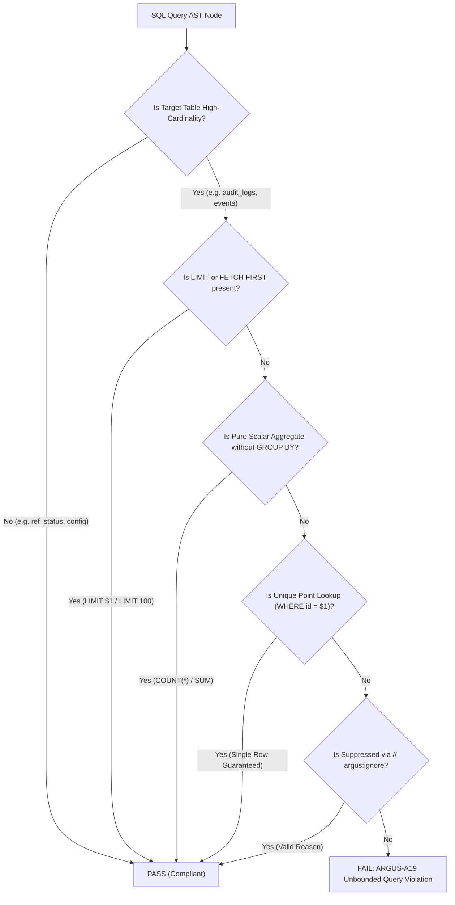

# ARGUS-A19: UNBOUNDED_QUERY_LIMIT

| Meta Field            | Specification                                                                                 |
| :-------------------- | :-------------------------------------------------------------------------------------------- |
| **Rule Code**         | `ARGUS-A19`                                                                                   |
| **Identifier**        | `UNBOUNDED_QUERY_LIMIT`                                                                       |
| **Severity**          | **HIGH**                                                                                      |
| **Category**          | Memory Bounds, Denial of Service & Query Hygiene                                              |
| **Analysis Layer**    | Layer 3 - Contextual & Pure SQL-AST Analysis                                                  |
| **CWE Mapping**       | [CWE-400: Uncontrolled Resource Consumption](https://cwe.mitre.org/data/definitions/400.html) |
| **OWASP ASVS**        | OWASP ASVS v4.0.3/v5.0 §V1.4.3, §V12 (Denial of Service Prevention)                           |
| **PostgreSQL Target** | PostgreSQL 18.x (Buffer Pool Cache Retention & Index Scan Standards)                          |
| **Default Status**    | `enabled`                                                                                     |

---

## 1. Executive Summary & Architectural Invariant

Database tables characterized by high tuple cardinality or continuous chronological growth (**`high-cardinality / high-growth tables`**, such as `audit_logs`, `events`, `transactions`, `users`, `orders`) must never be queried using open-ended multi-row `SELECT` projections.

```
┌─────────────────────────────────────────────────────────────────────────────┐
│                            ARCHITECTURAL INVARIANT                          │
│                                                                             │
│  Every multi-row query against high-cardinality or unbounded growth         │
│  tables MUST declare an explicit row boundary clause (LIMIT or FETCH FIRST) │
│  or implement keyset/cursor pagination.                                     │
│                                                                             │
│  Exemptions:                                                                │
│  1. Pure scalar aggregates (COUNT(*), SUM, AVG, MIN, MAX) without GROUP BY  │
│  2. Unique Point Lookups on Primary/Candidate Keys (WHERE id = $1)          │
│  3. Small reference tables (ref_*, metadata, static dictionaries)           │
└─────────────────────────────────────────────────────────────────────────────┘
```

---

## 2. PostgreSQL 18 Engine Internals & Threat Mechanics

Why do open-ended queries on large tables cause catastrophic cascading system outages?

```
┌─────────────────────────────────────────────────────────────────────────────┐
│                    THE UNBOUNDED QUERY OOM KILLER CHAIN                     │
│                                                                             │
│  Table `audit_logs` contains 15,000,000 tuples                              │
│                                                                             │
│  Developer executes:                                                        │
│  SELECT id, action, payload FROM audit_logs WHERE tenant_id = $1            │
│  (No LIMIT clause!)                                                         │
│                                                                             │
│  Cascading Infrastructure Impact:                                           │
│  1. PostgreSQL executes sequential scan across 15,000,000 rows              │
│  2. Active shared_buffers (8GB) get evicted (Buffer Cache Thrashing)        │
│  3. 15,000,000 rows streamed across TCP to Go Backend Pod                   │
│  4. Backend allocates ~24GB RAM in heap memory for slice structs            │
│  5. Extreme GC Pause spikes -> Linux Kernel OOM Killer sends SIGKILL (9)    │
│  6. POD CRASHES & CONTAINER RESTARTS UNEXPECTEDLY!                          │
│                                                                             │
│  Remediated Query:                                                          │
│  SELECT id, action, payload FROM audit_logs                                 │
│  WHERE tenant_id = $1 AND id < $last_id                                     │
│  ORDER BY id DESC LIMIT 100; (Retrieves 100 rows -> 2ms & 50KB RAM)         │
└─────────────────────────────────────────────────────────────────────────────┘
```

### 2.1. Buffer Pool Thrashing (`shared_buffers` Eviction)

Executing an unconstrained `SELECT` forces PostgreSQL to scan extensive heap pages from disk or cache. This bulk ingestion evicts hot OLTP rows and B-tree index nodes out of `shared_buffers`, degrading query latency cluster-wide.

### 2.2. Client-Side Out-Of-Memory (OOM) Termination (CWE-400)

In Go backend applications using `pgx.CollectRows` or `rows.Scan`, scanning unconstrained result sets allocates continuous memory blocks proportional to the incoming row count. Allocating hundreds of thousands of heap objects triggers memory exhaustion, triggering the Linux Kernel Out-Of-Memory killer (`SIGKILL 9`).

### 2.3. Keyset Pagination vs Offset Pagination

While `LIMIT 100 OFFSET 1000000` syntactically satisfies row limits, PostgreSQL still reads and discards 1,000,000 tuples. `ARGUS-A19` promotes **Keyset Pagination** (`WHERE id < $last_id ORDER BY id DESC LIMIT 100`), achieving logarithmic $O(\log N)$ index lookups.

---

## 3. Architecture & Execution Flow



---

## 4. Detection Logic & Rule Anatomy

Argus AST visitor analyzes database calls (`pgxpool.Pool.Query`, `sql.DB.Query`, `db.QueryRow`):

1. **Table Identification:** Parses SQL statements via `github.com/pganalyze/pg_query_go/v6` to extract target table relations from `SelectStmt.FromClause`.
2. **Cardinality Verification:** Checks target tables against configured `high_cardinality_tables` / `high_growth_tables` defined in `.argus.yaml`.
3. **Limit Analysis:** Inspects `SelectStmt.LimitCount` and `SelectStmt.LimitOffset`.
4. **Exemption Handling:**
   - Detects single-row scalar aggregate functions (`COUNT`, `SUM`, `AVG`, `MIN`, `MAX`) when `len(SelectStmt.GroupClause) == 0`.
   - Identifies equality predicates on primary keys (`WHERE id = $1`, `WHERE uuid = $1`).
   - Resolves dynamic query builders appending `LIMIT` in enclosing function scope.

---

## 5. Code Examples Matrix

### Non-Compliant (Unbounded Queries)

```go
// VIOLATION: Unbounded SELECT across multi-million row table
func FetchAuditHistory(ctx context.Context, pool *pgxpool.Pool, orgID string) ([]AuditEntry, error) {
    const query = `
        SELECT id, actor_id, action, created_at
        FROM audit_logs
        WHERE org_id = $1
        ORDER BY created_at DESC
    `
    rows, err := pool.Query(ctx, query, orgID)
    // ...
}
```

```go
// VIOLATION: Aggregation with GROUP BY without LIMIT produces unbounded groups
const query = "SELECT action, COUNT(*) FROM audit_logs GROUP BY action"
rows, err := pool.Query(ctx, query)
```

---

### Compliant (Bounded Queries)

```go
// COMPLIANT: Explicit LIMIT clause bounds memory consumption
func FetchAuditHistory(ctx context.Context, pool *pgxpool.Pool, orgID string) ([]AuditEntry, error) {
    const query = `
        SELECT id, actor_id, action, created_at
        FROM audit_logs
        WHERE org_id = $1
        ORDER BY created_at DESC
        LIMIT 50
    `
    rows, err := pool.Query(ctx, query, orgID)
    if err != nil {
        return nil, err
    }
    defer rows.Close()

    return pgx.CollectRows(rows, pgx.RowToStructByName[AuditEntry])
}
```

```go
// COMPLIANT: Keyset pagination with LIMIT for high-performance navigation
func FetchNextPage(ctx context.Context, pool *pgxpool.Pool, orgID string, lastID int64) ([]AuditEntry, error) {
    const query = `
        SELECT id, actor_id, action, created_at
        FROM audit_logs
        WHERE org_id = $1 AND id < $2
        ORDER BY id DESC
        LIMIT 100
    `
    rows, err := pool.Query(ctx, query, orgID, lastID)
    // ...
}
```

```go
// COMPLIANT: Pure scalar aggregate without GROUP BY returns exactly 1 row
func CountTotalEvents(ctx context.Context, pool *pgxpool.Pool, orgID string) (int64, error) {
    var count int64
    err := pool.QueryRow(ctx, "SELECT COUNT(*) FROM audit_logs WHERE org_id = $1", orgID).Scan(&count)
    return count, err
}
```

```go
// COMPLIANT: Point lookup by Primary Key equality returns at most 1 row
func FindUserByID(ctx context.Context, pool *pgxpool.Pool, id string) (*User, error) {
    const query = "SELECT id, email, full_name FROM users WHERE id = $1"
    row, err := pgx.CollectOneRow(pool.QueryRow(ctx, query, id), pgx.RowToAddrOfStructByName[User])
    return row, err
}
```

---

## 6. Mitigation & Remediation Guide

1. **Add Explicit `LIMIT` Clause:** For list/inbox APIs, declare explicit limits (e.g. `LIMIT 50` or parameterized `LIMIT $limit`).
2. **Implement Keyset Pagination:** Replace unbounded scans with index-friendly cursor pagination (`WHERE id < $last_id ORDER BY id DESC LIMIT 100`).
3. **Use Point Lookups:** Ensure single-entity retrieval queries filter on Primary Key (`WHERE id = $1`).

---

## 7. Configuration & Suppression Directives

### Configuration in `.argus.yaml`

```yaml
rules:
  ARGUS-A19:
    enabled: true
    default_max_limit: 1000
    high_growth_tables:
      - "audit_logs"
      - "transactions"
      - "events"
      - "users"
      - "orders"
      - "notifications"
```

### Inline Ignore Directives

For analytical background workers or bulk export pipelines that legitimately require full table ingestion:

```go
// argus:ignore ARGUS-A19 offline analytical export worker dumps full table
rows, err := pool.Query(ctx, "SELECT * FROM audit_logs WHERE created_at < $1", cutoffDate)

// argus:ignore UNBOUNDED_QUERY_LIMIT monthly cold archive migration
rows, err := pool.Query(ctx, archiveQuery)
```
