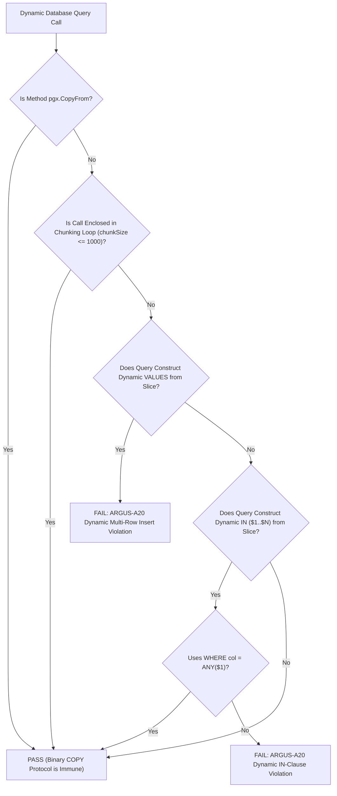

# ARGUS-A20: PARAM_LIMIT_65535

| Meta Field            | Specification                                                                                 |
| :-------------------- | :-------------------------------------------------------------------------------------------- |
| **Rule Code**         | `ARGUS-A20`                                                                                   |
| **Identifier**        | `PARAM_LIMIT_65535`                                                                           |
| **Severity**          | **HIGH**                                                                                      |
| **Category**          | Protocol Limits, Bulk Ingestion & Batch Architecture                                          |
| **Analysis Layer**    | Layer 3 - Contextual & Dynamic Query Construction Analysis                                    |
| **CWE Mapping**       | [CWE-400: Uncontrolled Resource Consumption](https://cwe.mitre.org/data/definitions/400.html) |
| **OWASP ASVS**        | OWASP ASVS v4.0.3/v5.0 §V1.4.3, §V12 (Denial of Service Prevention)                           |
| **PostgreSQL Target** | PostgreSQL 18.x (Extended Query Protocol Wire Format §54.7 Standards)                         |
| **Default Status**    | `enabled`                                                                                     |

---

## 1. Executive Summary & Architectural Invariant

Dynamic statements generating multi-row parameter placeholders (**`INSERT INTO ... VALUES (...)`** or dynamic **`IN ($1, $2, ... $N)`**) must never exceed PostgreSQL's physical wire protocol parameter threshold of **65,535 parameters** $(\text{rows} \times \text{columns})$.

```
┌─────────────────────────────────────────────────────────────────────────────┐
│                            ARCHITECTURAL INVARIANT                          │
│                                                                             │
│  Dynamic multi-row SQL statements MUST NOT exceed the PostgreSQL int16      │
│  protocol limit (65,535 bind parameters).                                   │
│                                                                             │
│  Standard Solutions:                                                        │
│  1. Bulk Inserts: Use PostgreSQL Binary COPY protocol (`pgx.CopyFrom`)      │
│  2. Batch Processing: Implement chunking loops (chunkSize <= 1000 items)    │
│  3. Multi-ID Inquiries: Use array parameter equality (`WHERE id = ANY($1)`)  │
└─────────────────────────────────────────────────────────────────────────────┘
```

---

## 2. PostgreSQL 18 Engine Internals & Threat Mechanics

Why is exceeding 65,535 parameters a fatal failure in PostgreSQL 18.x?

```
┌─────────────────────────────────────────────────────────────────────────────┐
│                 THE 65.535 PARAMETER WIRE PROTOCOL CEILING                  │
│                                                                             │
│  Bulk Insert: 10,000 Users x 8 Columns = 80,000 Bind Parameters ($1..$80000)│
│                                                                             │
│  Case A: Multi-row VALUES without Chunking (VIOLATION):                     │
│  dbpool.Exec(ctx, queryWith80000Placeholders, args...)                      │
│  ├─► Extended Query Protocol Bind Message (Int16 Overflow!)                 │
│  ├─► PostgreSQL Engine: FATAL: number of parameters must be 0..65535        │
│  └─► CRASH RUNTIME! Transaction aborts and entire batch fails!              │
│                                                                             │
│  Case B: Migrating to Binary Protocol pgx.CopyFrom (COMPLIANT):             │
│  dbpool.CopyFrom(ctx, pgx.Identifier{"users"}, columns, rows)               │
│  ├─► Bypasses SQL Parser & Binder (Zero Text Parsing Overhead)              │
│  ├─► Direct binary streaming to table storage engine (Immune to limits)     │
│  └─► 10,000 rows committed in 120ms (10x faster & minimal RAM)              │
└─────────────────────────────────────────────────────────────────────────────┘
```

### 2.1. Int16 Signed Integer Wire Ceiling (§54.7)

In the PostgreSQL Extended Query Protocol (v3.0), the `Bind (B)` message specifies the parameter count as a 16-bit signed integer (`int16`).

- The theoretical maximum parameter representation is $2^{16} - 1 = 65,535$.
- Passing $\ge 65,536$ parameters causes integer overflow on the wire, resulting in:
  ```
  FATAL: number of parameters must be between 0 and 65535 (SQLSTATE 54000: program_limit_exceeded)
  ```

### 2.2. AST Parsing Bloat vs Binary `pgx.CopyFrom`

Constructing huge query strings with thousands of placeholders (`$1, $2, ..., $50000`) forces PostgreSQL's `parse_analyze` engine to allocate complex syntax trees in RAM, burning CPU cycles. `pgx.CopyFrom` streams raw binary tuples directly into table storage, skipping SQL parsing and parameter binding altogether.

---

## 3. Architecture & Execution Flow



---

## 4. Detection Logic & Rule Anatomy

Argus AST visitor identifies:

1. **Dynamic Multi-row `VALUES`:** Identifies loops over slices that dynamically append `($1, $2, ...)` placeholders and append variadic arguments without enclosing chunking loop guardrails (`for i := 0; i < len(data); i += chunkSize`).
2. **Dynamic `IN (...)` Placeholders:** Detects dynamic `IN (%s)` placeholder formatting (`strings.Join`, `strings.Repeat`, `fmt.Sprintf`) built from slices instead of PostgreSQL single array bind parameter `ANY($1)`.
3. **Exemptions:**
   - Calls to `pgx.CopyFrom`.
   - Queries using `WHERE id = ANY($1)`.
   - Iterations bounded by chunking loops (`chunkSize <= 1000`).

---

## 5. Code Examples Matrix

### Non-Compliant (Unbounded Dynamic Batching)

```go
// VIOLATION: Unbounded multi-row VALUES insert risks exceeding 65,535 parameters
func InsertUserBatch(ctx context.Context, pool *pgxpool.Pool, users []User) error {
    var placeholders []string
    var args []any

    for i, u := range users {
        placeholders = append(placeholders, fmt.Sprintf("($%d, $%d, $%d)", i*3+1, i*3+2, i*3+3))
        args = append(args, u.ID, u.Name, u.Email)
    }

    query := "INSERT INTO users (id, name, email) VALUES " + strings.Join(placeholders, ",")
    _, err := pool.Exec(ctx, query, args...)
    return err
}
```

```go
// VIOLATION: Dynamic IN clause with arbitrary slice length
func GetUsersByIDs(ctx context.Context, pool *pgxpool.Pool, ids []string) ([]User, error) {
    query := fmt.Sprintf("SELECT id, name FROM users WHERE id IN (%s)", generatePlaceholders(len(ids)))
    rows, err := pool.Query(ctx, query, toAnySlice(ids)...)
    // ...
}
```

---

### Compliant (Binary Protocol, Chunking & Array Operators)

```go
// COMPLIANT: Binary COPY protocol is immune to parameter limits and 10x faster
func InsertUserBatch(ctx context.Context, pool *pgxpool.Pool, users []User) error {
    rows := make([][]any, len(users))
    for i, u := range users {
        rows[i] = []any{u.ID, u.Name, u.Email}
    }

    columns := []string{"id", "name", "email"}
    _, err := pool.CopyFrom(
        ctx,
        pgx.Identifier{"users"},
        columns,
        pgx.CopyFromRows(rows),
    )
    return err
}
```

```go
// COMPLIANT: Guarded by chunking loop (e.g. 500 items per statement)
func InsertUserChunked(ctx context.Context, pool *pgxpool.Pool, users []User) error {
    const chunkSize = 500

    for i := 0; i < len(users); i += chunkSize {
        end := min(i+chunkSize, len(users))
        chunk := users[i:end]

        query, args := buildValuesInsert("users", chunk)
        if _, err := pool.Exec(ctx, query, args...); err != nil {
            return err
        }
    }
    return nil
}
```

```go
// COMPLIANT: PostgreSQL array operator ANY($1) uses exactly 1 bind parameter
func GetUsersByIDs(ctx context.Context, pool *pgxpool.Pool, ids []string) ([]User, error) {
    const query = "SELECT id, name FROM users WHERE id = ANY($1)"
    rows, err := pool.Query(ctx, query, ids)
    if err != nil {
        return nil, err
    }
    defer rows.Close()

    return pgx.CollectRows(rows, pgx.RowToStructByName[User])
}
```

---

## 6. Mitigation & Remediation Guide

1. **Use `pgx.CopyFrom`:** For multi-row bulk insertions, replace dynamic `INSERT INTO ... VALUES` with `pgx.CopyFrom`.
2. **Use `ANY($1)` for IN Queries:** Replace `WHERE id IN ($1, $2, ... $N)` with `WHERE id = ANY($1)`.
3. **Chunk Batch Operations:** If multi-row SQL syntax is mandatory (e.g. `ON CONFLICT DO UPDATE`), partition the input into bounded slices ($\le 1,000$ rows per batch).

---

## 7. Configuration & Suppression Directives

### Configuration in `.argus.yaml`

```yaml
rules:
  ARGUS-A20:
    enabled: true
    max_batch_size: 1000
```

### Inline Ignore Directives

```go
// argus:ignore ARGUS-A20 bounded test fixture seeder guaranteed under 500 parameters
_, err := pool.Exec(ctx, query, args...)

// argus:ignore PARAM_LIMIT_65535 legacy static migration script
_, err := pool.Exec(ctx, migrationQuery, migrationArgs...)
```
