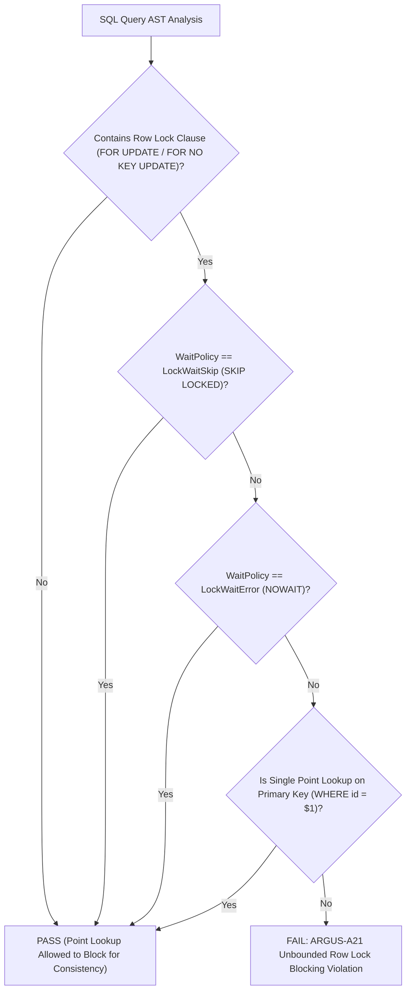

# ARGUS-A21: UNBOUNDED_ROW_LOCK_BLOCKING

| Meta Field            | Specification                                                                                                                                              |
| :-------------------- | :--------------------------------------------------------------------------------------------------------------------------------------------------------- |
| **Rule Code**         | `ARGUS-A21`                                                                                                                                                |
| **Identifier**        | `UNBOUNDED_ROW_LOCK_BLOCKING`                                                                                                                              |
| **Severity**          | **HIGH**                                                                                                                                                   |
| **Category**          | Concurrency Control, Deadlock Prevention & Queue Scalability                                                                                               |
| **Analysis Layer**    | Layer 3 - Contextual & Pure SQL-AST Analysis                                                                                                               |
| **CWE Mapping**       | [CWE-662: Improper Synchronization](https://cwe.mitre.org/data/definitions/662.html), [CWE-833: Deadlock](https://cwe.mitre.org/data/definitions/833.html) |
| **OWASP ASVS**        | OWASP ASVS v4.0.3/v5.0 §V5.3.1, §V11.1.4 (Concurrency & Race Condition Defenses)                                                                           |
| **PostgreSQL Target** | PostgreSQL 18.x (Row Lock Conflict Matrix §13.3 & `SKIP LOCKED` Protocols)                                                                                 |
| **Default Status**    | `enabled`                                                                                                                                                  |

---

## 1. Executive Summary & Architectural Invariant

Pessimistic row-locking queries (**`SELECT ... FOR UPDATE`** or **`FOR NO KEY UPDATE`**) executed against task queues, job pollers, or multi-row status scans **must specify non-blocking directives (`SKIP LOCKED` or `NOWAIT`)** to prevent lock convoys and serial execution bottlenecks across concurrent workers.

```
┌─────────────────────────────────────────────────────────────────────────────┐
│                            ARCHITECTURAL INVARIANT                          │
│                                                                             │
│  Multi-row or queue-polling row locks MUST specify `SKIP LOCKED` or         │
│  `NOWAIT` to prevent concurrent worker serialization (CWE-662, CWE-833).    │
│                                                                             │
│  Exemptions:                                                                │
│  - Single-entity point lookups on primary key (`WHERE id = $1 FOR UPDATE`) │
│  - Normal non-locking `SELECT` statements                                   │
└─────────────────────────────────────────────────────────────────────────────┘
```

---

## 2. PostgreSQL 18 Engine Internals & Threat Mechanics

```
┌─────────────────────────────────────────────────────────────────────────────┐
│                 THE WORKER QUEUE LOCK CONVOY DISASTER                       │
│                                                                             │
│  Table task_queue contains 1,000 tasks. 4 Parallel Workers Running.         │
│                                                                             │
│  Case A: Blocking FOR UPDATE Without SKIP LOCKED (VIOLATION):               │
│  Worker 1 ──► Locks Task 1 (Processing for 200ms)                           │
│  Worker 2 ──► Requests next task ──► BLOCKED WAITING FOR WORKER 1 (HANG!)   │
│  Worker 3 ──► Requests next task ──► BLOCKED WAITING FOR WORKER 2 (HANG!)   │
│  Worker 4 ──► Requests next task ──► BLOCKED WAITING FOR WORKER 3 (HANG!)   │
│  RESULT: 3 Idle Workers, Throughput Collapses by 95%! (Lock Convoy)         │
│                                                                             │
│  Case B: Using FOR UPDATE SKIP LOCKED (COMPLIANT):                          │
│  Worker 1 ──► Locks Task 1 & Processes Immediately                          │
│  Worker 2 ──► Skips Task 1 ──► Locks Task 2 & Processes Immediately         │
│  Worker 3 ──► Skips Task 1, 2 ──► Locks Task 3 & Processes Immediately      │
│  Worker 4 ──► Skips Task 1, 2, 3 ──► Locks Task 4 & Processes Immediately   │
│  RESULT: 4 Workers Run 100% PARALLEL with ZERO LOCK WAIT! (Deadlock-Free)   │
└─────────────────────────────────────────────────────────────────────────────┘
```

### 2.1. Row Lock Conflict Matrix (§13.3) & Head-of-Line Blocking

In PostgreSQL, `FOR UPDATE` exclusively conflicts with other `FOR UPDATE` transactions on the same tuples. When multiple workers dequeue tasks with `SELECT ... FOR UPDATE LIMIT 1` without `SKIP LOCKED`, all workers contend for the first available tuple in the index/heap scan.

### 2.2. The Lock Convoy Collapse (CWE-662)

Even with 20 parallel worker pods allocated, absence of `SKIP LOCKED` forces the entire fleet into sequential lock serialization. If one worker experiences a network delay, all subsequent workers stall indefinitely.

### 2.3. The Solution: `SKIP LOCKED` vs `NOWAIT`

- **`SKIP LOCKED`:** PostgreSQL executor automatically skips tuples currently locked by other active transactions and locks the next available tuple matching the filter.
- **`NOWAIT`:** Immediately raises an error (`55P03: could_not_obtain_lock`) if a lock cannot be acquired, enabling deterministic fail-fast behavior.

---

## 3. Architecture & Execution Flow



---

## 4. Detection Logic & Rule Anatomy

Argus AST visitor inspects:

1. **`SelectStmt.LockingClause` Parsing:** Examines PostgreSQL AST using `pg_query_go` for `LCS_FORUPDATE` and `LCS_FORNOKEYUPDATE`.
2. **Lock Wait Policy Verification:** Flags statements where `LockWaitPolicy == LockWaitBlock` (default blocking).
3. **Point Lookup Exemption:** Exempts single-entity point lookups on primary key columns (`WHERE id = $1`, `WHERE uuid = $1`, `WHERE pk = $1` or configured `point_lookup_columns` in `.argus.yaml`).
4. **Exemptions:**
   - Statements with `SKIP LOCKED`.
   - Statements with `NOWAIT`.
   - Single point lookups on unique primary keys.

---

## 5. Code Examples Matrix

### Non-Compliant (Blocking Multi-Row Queue Polling)

```go
// VIOLATION: Queue polling without SKIP LOCKED causes worker lock convoys
func DequeueNextJob(ctx context.Context, tx pgx.Tx) (*Job, error) {
    const query = `
        SELECT id, payload
        FROM task_queue
        WHERE status = 'PENDING'
        ORDER BY created_at ASC
        LIMIT 1
        FOR UPDATE
    `
    row := tx.QueryRow(ctx, query)
    // ...
}
```

```go
// VIOLATION: Batch status scan with blocking FOR NO KEY UPDATE
const query = `
    SELECT id, amount
    FROM pending_payments
    WHERE tenant_id = $1
    LIMIT 10
    FOR NO KEY UPDATE
`
rows, err := tx.Query(ctx, query, tenantID)
```

---

### Compliant (Non-blocking Directives & Point Lookups)

```go
// COMPLIANT: SKIP LOCKED allows seamless concurrent worker processing
func DequeueNextJob(ctx context.Context, tx pgx.Tx) (*Job, error) {
    const query = `
        SELECT id, payload
        FROM task_queue
        WHERE status = 'PENDING'
        ORDER BY id ASC
        LIMIT 1
        FOR UPDATE SKIP LOCKED
    `
    var job Job
    err := tx.QueryRow(ctx, query).Scan(&job.ID, &job.Payload)
    if err != nil {
        if errors.Is(err, pgx.ErrNoRows) {
            return nil, nil // No pending jobs currently available
        }
        return nil, err
    }
    return &job, nil
}
```

```go
// COMPLIANT: Fail-fast with NOWAIT
const query = `
    SELECT id, status
    FROM session_tokens
    WHERE token_hash = $1
    FOR UPDATE NOWAIT
`
```

```go
// COMPLIANT: Single-entity point lookup on primary key is allowed to block
func LockWalletForTransfer(ctx context.Context, tx pgx.Tx, walletID string) (*Wallet, error) {
    const query = "SELECT id, balance FROM wallets WHERE id = $1 FOR UPDATE"
    var w Wallet
    err := tx.QueryRow(ctx, query, walletID).Scan(&w.ID, &w.Balance)
    return &w, err
}
```

---

## 6. Mitigation & Remediation Guide

1. **Queue Polling:** Append `SKIP LOCKED` to all worker queries selecting jobs (`FOR UPDATE SKIP LOCKED`).
2. **Deterministic Ordering:** Ensure queue polling queries specify deterministic `ORDER BY id ASC` to prevent index deadlocks.
3. **Session / Resource Locks:** Use `NOWAIT` if the business logic requires fail-fast semantics when a resource is contended.

---

## 7. Configuration & Suppression Directives

### Configuration in `.argus.yaml`

```yaml
rules:
  ARGUS-A21:
    enabled: true
    point_lookup_columns:
      - "id"
      - "uuid"
      - "pk"
      - "task_id"
      - "wallet_id"
```

### Inline Ignore Directives

```go
// argus:ignore ARGUS-A21 offline single worker exclusive batch processor
row := tx.QueryRow(ctx, exclusiveQueueQuery)

// argus:ignore UNBOUNDED_ROW_LOCK_BLOCKING sequential maintenance lock
rows, err := tx.Query(ctx, maintenanceQuery)
```
