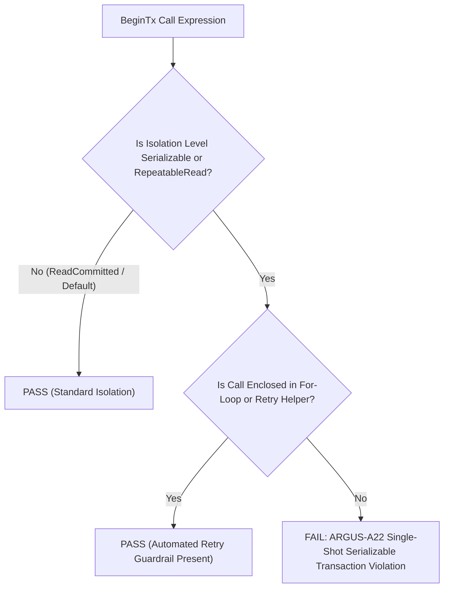

# ARGUS-A22: SERIALIZATION_FAILURE_RETRY

| Meta Field            | Specification                                                                                                  |
| :-------------------- | :------------------------------------------------------------------------------------------------------------- |
| **Rule Code**         | `ARGUS-A22`                                                                                                    |
| **Identifier**        | `SERIALIZATION_FAILURE_RETRY`                                                                                  |
| **Severity**          | **HIGH**                                                                                                       |
| **Category**          | Concurrency Resilience, SSI Fault Tolerance & Error Recovery                                                   |
| **Analysis Layer**    | Layer 2 - Go-AST Structural & Control Flow Analysis                                                            |
| **CWE Mapping**       | [CWE-362: Concurrent Execution with Improper Synchronization](https://cwe.mitre.org/data/definitions/362.html) |
| **OWASP ASVS**        | OWASP ASVS v4.0.3/v5.0 §V5.3.1, §V11.1.4 (Transaction Concurrency & Race Condition Recovery)                   |
| **PostgreSQL Target** | PostgreSQL 18.x (Serializable Snapshot Isolation & SQLSTATE 40001/40P01 Contract)                              |
| **Default Status**    | `enabled`                                                                                                      |

---

## 1. Executive Summary & Architectural Invariant

Database transactions initialized with strict isolation levels (**`pgx.Serializable`** or **`pgx.RepeatableRead`**) **must be wrapped in an automated retry loop** with exponential backoff and randomized jitter to handle normal engine aborts (**`SQLSTATE 40001: serialization_failure`** and **`SQLSTATE 40P01: deadlock_detected`**).

```
┌─────────────────────────────────────────────────────────────────────────────┐
│                            ARCHITECTURAL INVARIANT                          │
│                                                                             │
│  Transactions using `pgx.Serializable` or `pgx.RepeatableRead` MUST NOT     │
│  be executed as single-shot operations. They MUST be enclosed in automated  │
│  retry loops or official transaction retry helpers (CWE-362).               │
│                                                                             │
│  Standard Solutions:                                                        │
│  1. Wrapped in `for attempt := 1; attempt <= maxRetries; attempt++` loop    │
│  2. Handled via helper functions (`WithRetrySerializable`, `WithRetry`)     │
│  3. Catches and retries on SQLSTATE `40001` and `40P01`                      │
└─────────────────────────────────────────────────────────────────────────────┘
```

---

## 2. PostgreSQL 18 Engine Internals & Threat Mechanics

```
┌─────────────────────────────────────────────────────────────────────────────┐
│                 POSTGRESQL SSI SERIALIZATION RETRY CONTRACT                 │
│                                                                             │
│  Two Concurrent Transactions Mutate Balance (IsoLevel: pgx.Serializable)    │
│  [ Transaction A ]                   [ Transaction B ]                      │
│         │                                   │                               │
│         ▼                                   ▼                               │
│  PostgreSQL SSI Engine detects rw-antidependency cycle (SIREAD lock)        │
│  ├─► Transaction A: Successfully COMMITS                                    │
│  └─► Transaction B: INTENTIONALLY ABORTED (SQLSTATE 40001)                  │
│                                                                             │
│  Case A: Without Retry Loop (VIOLATION):                                    │
│  └─► Handler immediately throws error -> HTTP 500 Outage to Client! (FAIL)  │
│                                                                             │
│  Case B: Wrapped in Automated Retry Loop + Jitter (COMPLIANT):              │
│  ├─► Catch SQLSTATE 40001 -> Sleep 25ms + random jitter                     │
│  ├─► Re-run transaction from clean state with new snapshot                  │
│  └─► Attempt 2: Successfully COMMITS! (Zero Downtime / Seamless Success)    │
└─────────────────────────────────────────────────────────────────────────────┘
```

### 2.1. Mathematical Foundations of SSI (Cahill et al., VLDB 2012)

PostgreSQL Serializable Snapshot Isolation (SSI) does not lock rows for reading; instead, it tracks lock anti-dependencies in virtual memory (`SIREAD` locks) to detect dangerous structures that could lead to anomalies (like write-skew). When a cycle is detected, PostgreSQL **intentionally aborts one of the transactions** with:

```
ERROR: could not serialize access due to read/write dependencies among transactions (SQLSTATE 40001)
```

### 2.2. Aborts are Normal Engine Behavior, Not Bugs

In SSI, transaction aborts are an integral part of the consistency contract. Without a retry loop, an application under moderate concurrent load will bubble up 500 Internal Server Errors to users, leading to perceived system instability.

---

## 3. Architecture & Execution Flow



---

## 4. Detection Logic & Rule Anatomy

Argus AST visitor inspects:

1. **`BeginTx` Call Evaluation:** Scans AST for `BeginTx` invocations.
2. **`TxOptions.IsoLevel` Resolution:** Evaluates composite literals and variable declarations for `pgx.Serializable` or `pgx.RepeatableRead`.
3. **Control Flow & Enclosing Context:** Traverses the AST upwards to verify that the `BeginTx` call is contained within:
   - A retry loop (`*ast.ForStmt` or `*ast.RangeStmt`), OR
   - A helper closure function (e.g. `WithRetrySerializable`, `WithRetry`).
4. **Exemptions:**
   - Default `Begin(ctx)` calls.
   - `BeginTx` with `ReadCommitted` or `ReadUncommitted`.
   - Functions decorated with `// argus:ignore ARGUS-A22`.

---

## 5. Code Examples Matrix

### Non-Compliant (Single-Shot Serializable Transaction)

```go
// VIOLATION: Serialization aborts (40001) immediately fail the request with 500
func TransferFunds(ctx context.Context, pool *pgxpool.Pool, req TransferReq) error {
    opts := pgx.TxOptions{IsoLevel: pgx.Serializable}
    tx, err := pool.BeginTx(ctx, opts)
    if err != nil {
        return err
    }
    defer tx.Rollback(ctx)

    // ... Balance Mutation ...

    return tx.Commit(ctx) // Incurring 40001 here causes unhandled failure
}
```

---

### Compliant (Automated Retry Loop with Exponential Backoff & Jitter)

```go
// COMPLIANT: Automatic retry loop catching SQLSTATE 40001 and 40P01
func TransferFunds(ctx context.Context, pool *pgxpool.Pool, req TransferReq) error {
    const maxRetries = 3
    opts := pgx.TxOptions{IsoLevel: pgx.Serializable}

    for attempt := 1; attempt <= maxRetries; attempt++ {
        err := func() error {
            tx, err := pool.BeginTx(ctx, opts)
            if err != nil {
                return err
            }
            defer tx.Rollback(ctx)

            // ... Idempotent Balance Mutation ...

            return tx.Commit(ctx)
        }()

        if err == nil {
            return nil
        }

        var pgErr *pgconn.PgError
        if errors.As(err, &pgErr) && (pgErr.Code == "40001" || pgErr.Code == "40P01") {
            if attempt == maxRetries {
                return fmt.Errorf("transaction aborted after %d retries: %w", maxRetries, err)
            }
            backoff := time.Duration(attempt*25)*time.Millisecond + time.Duration(rand.Intn(20))*time.Millisecond
            select {
            case <-time.After(backoff):
                continue
            case <-ctx.Done():
                return ctx.Err()
            }
        }

        return err // Non-retryable error
    }

    return nil
}
```

```go
// COMPLIANT: Using standard repository retry helper
func TransferFunds(ctx context.Context, pool *pgxpool.Pool, req TransferReq) error {
    return WithRetrySerializable(ctx, pool, func(tx pgx.Tx) error {
        // Idempotent balance mutation logic
        return nil
    })
}
```

---

## 6. Mitigation & Remediation Guide

1. **Wrap in Retry Loop:** Encapsulate `Serializable` transaction blocks in a loop with at least 3 attempts.
2. **Check Error Codes:** Specifically catch `pgconn.PgError` codes `40001` (serialization failure) and `40P01` (deadlock detected).
3. **Idempotence:** Ensure all operations inside the retryable transaction closure are strictly idempotent.
4. **Jittered Backoff:** Introduce exponential backoff with random jitter before retrying to prevent thundering herd collisions.

---

## 7. Configuration & Suppression Directives

### Configuration in `.argus.yaml`

```yaml
rules:
  ARGUS-A22:
    enabled: true
    max_retries: 5
```

### Inline Ignore Directives

```go
// argus:ignore ARGUS-A22 intentional single-shot abort test assertion
tx, err := pool.BeginTx(ctx, pgx.TxOptions{IsoLevel: pgx.Serializable})

// argus:ignore SERIALIZATION_FAILURE_RETRY offline batch task
tx, err := conn.BeginTx(ctx, opts)
```
