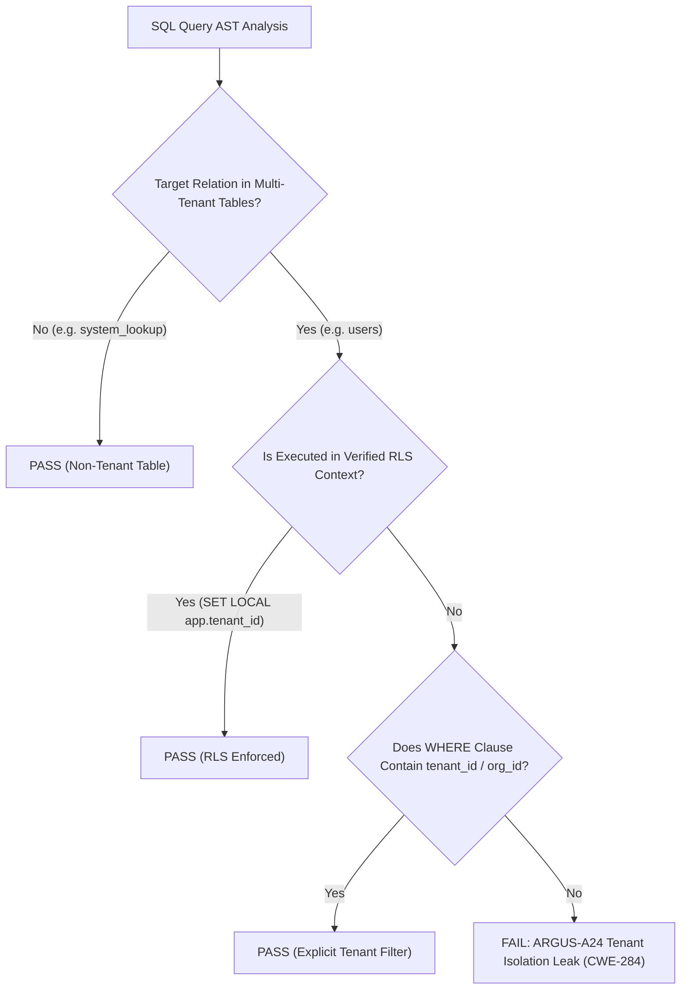

# ARGUS-A24: TENANT_ISOLATION_LEAK

| Meta Field            | Specification                                                                                                                                                            |
| :-------------------- | :----------------------------------------------------------------------------------------------------------------------------------------------------------------------- |
| **Rule Code**         | `ARGUS-A24`                                                                                                                                                              |
| **Identifier**        | `TENANT_ISOLATION_LEAK`                                                                                                                                                  |
| **Severity**          | **CRITICAL**                                                                                                                                                             |
| **Category**          | Multi-Tenancy Security, Data Isolation & Broken Object Level Authorization (BOLA)                                                                                        |
| **Analysis Layer**    | Layer 3 - Contextual & Pure SQL-AST Analysis                                                                                                                             |
| **CWE Mapping**       | [CWE-284: Improper Access Control](https://cwe.mitre.org/data/definitions/284.html), [CWE-863: Incorrect Authorization](https://cwe.mitre.org/data/definitions/863.html) |
| **OWASP ASVS / API**  | OWASP API Security Top 10 API1:2023 (BOLA), OWASP ASVS v4.0.3/v5.0 §V4.1.3                                                                                               |
| **PostgreSQL Target** | Multi-Tenant Partition Pruning & Dual Defense-in-Depth RLS Enforcement                                                                                                   |
| **Default Status**    | `enabled`                                                                                                                                                                |

---

## 1. Executive Summary & Architectural Invariant

All SQL statements (`SELECT`, `UPDATE`, `DELETE`) executing against registered **multi-tenant domain tables** (`users`, `accounts`, `invoices`, `orders`, `transactions`) **must explicitly contain a tenant isolation predicate (`WHERE tenant_id = $1`)**, or execute within a verified transaction setting the session tenant parameter (`SET LOCAL app.tenant_id = $1`).

```
┌─────────────────────────────────────────────────────────────────────────────┐
│                            ARCHITECTURAL INVARIANT                          │
│                                                                             │
│  Queries on multi-tenant tables MUST be filtered by tenant identity:        │
│                                                                             │
│  1. Explicit SQL Predicate: `WHERE tenant_id = $1`                          │
│  2. Explicit RLS Context: `SET LOCAL app.tenant_id = $1`                    │
│                                                                             │
│  Unfiltered queries across shared multi-tenant tables are STRICTLY BLOCKED. │
└─────────────────────────────────────────────────────────────────────────────┘
```

---

## 2. Threat Mechanics & Engine Reality (PostgreSQL 18)

```
┌─────────────────────────────────────────────────────────────────────────────┐
│                 CROSS-TENANT DATA BREACH DISASTER (BOLA)                    │
│                                                                             │
│  Developer writes:                                                          │
│  SELECT id, name, email FROM users WHERE status = 'ACTIVE';                 │
│  (Missing: WHERE tenant_id = $1)                                            │
│                                                                             │
│  Impact:                                                                    │
│  1. Declarative Partition Pruning FAILS (scans all physical tenant tables)  │
│  2. Tenant A operator receives records belonging to Tenant B, C, D          │
│  3. Catastrophic Data Privacy Breach & BOLA Vulnerability                   │
└─────────────────────────────────────────────────────────────────────────────┘
```

### 2.1. Broken Object Level Authorization (BOLA - OWASP API1:2023)

Without tenant-level filtering, an authenticated operator in Tenant A can fetch, modify, or delete records belonging to Tenant B by querying entity IDs or filtering only on business status (`status = 'ACTIVE'`).

### 2.2. Declarative Partition Pruning in PostgreSQL 18

When tables are physically partitioned by `LIST (tenant_id)`, providing `WHERE tenant_id = $1` allows the query planner to immediately prune non-matching physical partitions, speeding up query execution by up to 100x and eliminating memory buffer contention.

### 2.3. Dual Defense-in-Depth Model

Database Row-Level Security (RLS) policies provide critical perimeter enforcement, but relying solely on RLS is fragile if session parameters are inadvertently omitted by developers. Enforcing explicit tenant filters in Go code alongside database RLS guarantees end-to-end zero-trust data isolation.

---

## 3. Architecture & Execution Flow



---

## 4. Detection Logic & Rule Anatomy

1. **Relation Extraction:** Parses SQL statements using `pg_query_go` and inspects `SelectStmt.FromClause`, `UpdateStmt.Relation`, and `DeleteStmt.Relation`.
2. **Multi-Tenant Table Matching:** Matches relations against `tenant_tables` declared in `.argus.yaml` (or fallback defaults).
3. **WhereClause Inspection:** Traverses the expression AST to ensure `ColumnRef` matches `tenant_column` (e.g. `tenant_id` or `org_id`).
4. **RLS Context Check:** Verifies if the enclosing function scope establishes transaction-level RLS context (`SET LOCAL app.tenant_id = $1`).

---

## 5. Code Examples Matrix

### Non-Compliant (Missing Tenant Isolation)

```go
// VIOLATION: SELECT on multi-tenant table 'users' without tenant_id filter
const query = "SELECT id, email, name FROM users WHERE status = 'ACTIVE'"
rows, err := db.Query(ctx, query)
```

```go
// VIOLATION: UPDATE on multi-tenant table 'orders' without tenant_id
const query = "UPDATE orders SET status = 'EXPIRED' WHERE created_at < $1"
_, err := db.Exec(ctx, query, cutoff)
```

---

### Compliant (Explicit Tenant Isolation)

```go
// COMPLIANT: Explicit tenant_id predicate in query
const query = `
    SELECT id, email, name
    FROM users
    WHERE tenant_id = $1 AND status = 'ACTIVE'
`
rows, err := db.Query(ctx, query, tenantID)
```

```go
// COMPLIANT: Verified RLS session setup within transaction
func ExportUsers(ctx context.Context, tx pgx.Tx, tenantID string) ([]User, error) {
    if _, err := tx.Exec(ctx, "SET LOCAL app.tenant_id = $1", tenantID); err != nil {
        return nil, err
    }
    return pgx.CollectRows(tx.Query(ctx, "SELECT id, email, name FROM users"))
}
```

---

## 6. Mitigation & Remediation Guide

1. **Add Explicit Predicates:** Always pass `tenant_id` as the leading `$1` parameter in repository queries.
2. **Apply Row-Level Security:** Pair explicit queries with `ENABLE ROW LEVEL SECURITY` on PostgreSQL tables.
3. **Index Tenant Columns:** Ensure composite indexes start with `(tenant_id, ...)` to maximize index scan efficiency and partition pruning.

---

## 7. Configuration & Suppression Directives

### Configuration in `.argus.yaml`

```yaml
rules:
  ARGUS-A24:
    enabled: true
    tenant_column: "tenant_id"
    tenant_tables:
      - "users"
      - "accounts"
      - "orders"
      - "invoices"
      - "transactions"
```

### Inline Ignore Directives

```go
// argus:ignore ARGUS-A24 platform-wide cross-tenant global analytics rollup
rows, err := db.Query(ctx, "SELECT COUNT(*) FROM users GROUP BY region")
```
