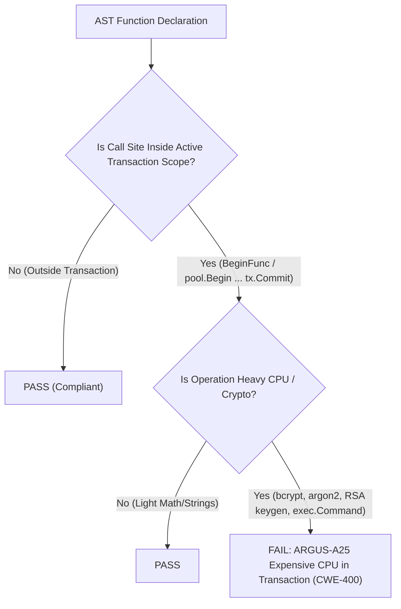

# ARGUS-A25: EXPENSIVE_CPU_IN_TRANSACTION

| Meta Field            | Specification                                                                                                                                                                       |
| :-------------------- | :---------------------------------------------------------------------------------------------------------------------------------------------------------------------------------- |
| **Rule Code**         | `ARGUS-A25`                                                                                                                                                                         |
| **Identifier**        | `EXPENSIVE_CPU_IN_TRANSACTION`                                                                                                                                                      |
| **Severity**          | **HIGH**                                                                                                                                                                            |
| **Category**          | Transaction Hygiene, Concurrency Scalability & Resource Starvation Prevention                                                                                                       |
| **Analysis Layer**    | Layer 3 - Contextual & Interprocedural Call Graph Analysis                                                                                                                          |
| **CWE Mapping**       | [CWE-400: Uncontrolled Resource Consumption](https://cwe.mitre.org/data/definitions/400.html), [CWE-662: Improper Synchronization](https://cwe.mitre.org/data/definitions/662.html) |
| **OWASP ASVS**        | OWASP ASVS v4.0.3/v5.0 §V7.1.1, §V11.1.4 (Resource Governance & Lock Contention Avoidance)                                                                                          |
| **PostgreSQL Target** | Transaction Lock Duration Inflation & Connection Pool Starvation Prevention                                                                                                         |
| **Default Status**    | `enabled`                                                                                                                                                                           |

---

## 1. Executive Summary & Architectural Invariant

CPU-intensive computations-such as cryptographic password hashing (**`bcrypt`**, **`argon2`**, **`scrypt`**), asymmetric key generation (**`RSA`**, **`ECDSA`**, **`Ed25519`**), or document/media subprocess execution (**`exec.Command`**)-**are strictly prohibited inside active database transactions (`pgx.Tx`, `BeginFunc`, `ExecuteTx`)**.

```
┌─────────────────────────────────────────────────────────────────────────────┐
│                            ARCHITECTURAL INVARIANT                          │
│                                                                             │
│  Heavy CPU computations MUST execute in Go memory BEFORE opening a database │
│  transaction, or asynchronously AFTER `COMMIT`.                             │
│                                                                             │
│  Transactions must be ultra-lean (< 5 milliseconds duration) to prevent     │
│  database connection pool starvation and lock convoys.                      │
└─────────────────────────────────────────────────────────────────────────────┘
```

---

## 2. Threat Mechanics & Engine Reality (PostgreSQL 18)

```
┌─────────────────────────────────────────────────────────────────────────────┐
│                 EXPENSIVE CPU IN TRANSACTION DISASTER                       │
│                                                                             │
│  [ BEGIN Transaction ]                                                      │
│    │                                                                        │
│    ├─► INSERT INTO users (pending_status) ──► Acquired Row Lock (1ms)       │
│    │                                                                        │
│    ├─► bcrypt.GenerateFromPassword(cost: 12) ◄── 300ms HEAVY CPU BURDEN!    │
│    │   (DB connection idle on wire; Row Lock held for 300ms!)               │
│    │                                                                        │
│    ├─► INSERT INTO auth_credentials (hashed) (1ms)                          │
│    │                                                                        │
│  [ COMMIT Transaction ]                                                     │
│                                                                             │
│  Impact: 100 concurrent requests = 100 connections held for 300ms           │
│          = POOL EXHAUSTION & SYSTEM-WIDE REQUEST TIMEOUTS (CWE-400)         │
└─────────────────────────────────────────────────────────────────────────────┘
```

### 2.1. Lock Duration Inflation & Lock Convoys

When an application performs heavy hashing or key generation inside a transaction:

- The database backend sits idle on the TCP socket waiting for application bytes.
- It continues holding exclusive row-level and table-level locks for hundreds of milliseconds.
- Any concurrent transaction touching the same tables is forced into a lock wait convoy.

### 2.2. Connection Pool Starvation (CWE-400)

- With a pool size of 50 connections, 50 simultaneous user registrations executing `bcrypt` (300ms) will exhaust the entire connection pool instantly.
- Unrelated, high-speed queries (e.g. login checks, public portal reads) fail with connection acquisition timeouts, making the service appear down even when server CPU usage is low.

---

## 3. Architecture & Execution Flow



---

## 4. Detection Logic & Rule Anatomy

1. **Transaction Scope Walker:** Detects both closure-based transactions (`BeginFunc`, `ExecuteTx`, `ExecuteLockedTx`, `WithTx`) and explicit lexical blocks (`pool.Begin` ... `tx.Commit`).
2. **Expensive Call Matcher:** Identifies calls to:
   - `golang.org/x/crypto/bcrypt` (`GenerateFromPassword`, `CompareHashAndPassword`)
   - `golang.org/x/crypto/argon2` (`IDKey`, `Key`)
   - `golang.org/x/crypto/scrypt` (`Key`)
   - `crypto/rsa`, `crypto/ecdsa`, `crypto/ed25519` (`GenerateKey`)
   - `os/exec` (`Command`, `CommandContext`)
3. **Intra-Package Helper Traversal:** Recursively inspects helper functions called from within the transaction scope.
4. **Exemptions:** Statements pre-annotated with `// argus:ignore ARGUS-A25 <reason>`.

---

## 5. Code Examples Matrix

### Non-Compliant (CPU-Expensive Call Inside Transaction)

```go
// VIOLATION: Hashing password inside BeginFunc holds connection for 300ms
err := pool.BeginFunc(ctx, func(tx pgx.Tx) error {
    hashed, err := bcrypt.GenerateFromPassword([]byte(password), 12)
    if err != nil {
        return err
    }
    _, err = tx.Exec(ctx, "INSERT INTO users (hash) VALUES ($1)", hashed)
    return err
})
```

```go
// VIOLATION: RSA key generation inside explicit transaction
tx, err := pool.Begin(ctx)
if err != nil {
    return err
}
defer tx.Rollback(ctx)

key, err := rsa.GenerateKey(rand.Reader, 4096) // 1-2 seconds CPU delay!
if err != nil {
    return err
}

_, err = tx.Exec(ctx, "INSERT INTO keys (pub) VALUES ($1)", key.PublicKey)
return tx.Commit(ctx)
```

---

### Compliant (Compute First, Store Lean)

```go
// COMPLIANT: Compute hash in memory before opening transaction
hashed, err := bcrypt.GenerateFromPassword([]byte(password), 12)
if err != nil {
    return err
}

// Transaction duration is ultra-lean (< 2ms)
err = pool.BeginFunc(ctx, func(tx pgx.Tx) error {
    _, err := tx.Exec(ctx, "INSERT INTO users (hash) VALUES ($1)", hashed)
    return err
})
```

```go
// COMPLIANT: Keypair generated prior to database interaction
key, err := rsa.GenerateKey(rand.Reader, 2048)
if err != nil {
    return err
}

return saveKey(ctx, pool, key)
```

---

## 6. Mitigation & Remediation Guide

1. **Pre-compute Hashes:** Run password hashing and key derivation in Go memory before acquiring a pooled database connection.
2. **Post-Commit Asynchronous Tasks:** Offload document compiling (Typst), media encoding, or image resizing to background workers after the transaction commits.
3. **Tune Cost Parameters:** In unit tests or development environments, use minimal work factors (`bcrypt.MinCost`) to maintain fast test execution.

---

## 7. Configuration & Suppression Directives

### Configuration in `.argus.yaml`

```yaml
rules:
  ARGUS-A25:
    enabled: true
```

### Inline Ignore Directives

```go
// argus:ignore ARGUS-A25 mock test harness isolated benchmark execution
hashed, err := bcrypt.GenerateFromPassword([]byte(password), 4)
```
