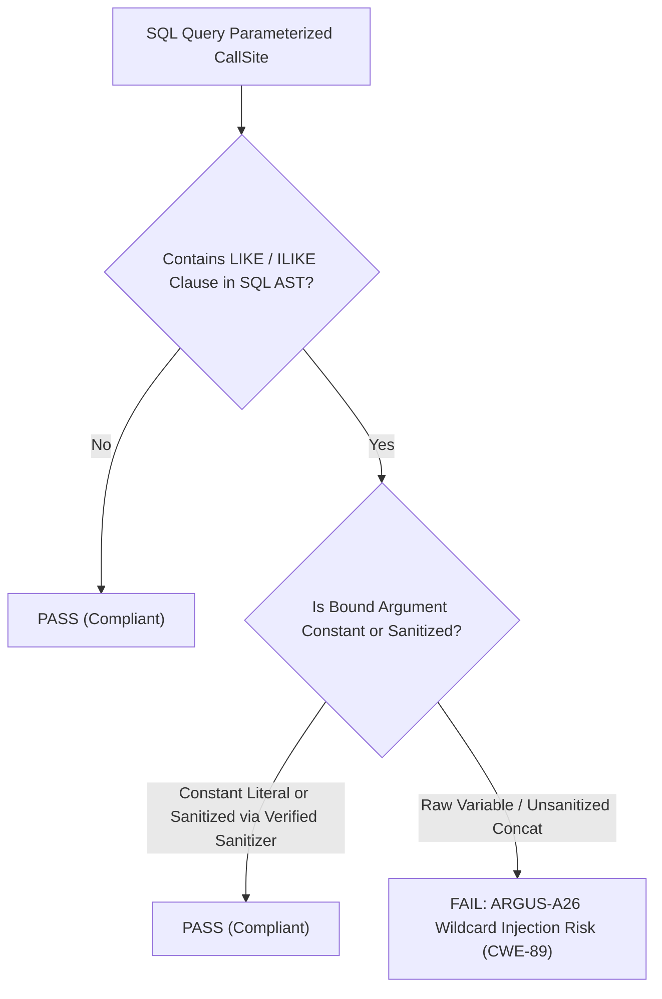

# ARGUS-A26: LIKE_WILDCARD_INJECTION

| Meta Field            | Specification                                                                                                                                                                                     |
| :-------------------- | :------------------------------------------------------------------------------------------------------------------------------------------------------------------------------------------------ |
| **Rule Code**         | `ARGUS-A26`                                                                                                                                                                                       |
| **Identifier**        | `LIKE_WILDCARD_INJECTION`                                                                                                                                                                         |
| **Severity**          | **HIGH**                                                                                                                                                                                          |
| **Category**          | SQL Injection Prevention, Pattern Hygiene & DoS Prevention                                                                                                                                        |
| **Analysis Layer**    | Layer 4 - Interprocedural Taint & Pattern Analysis                                                                                                                                                |
| **CWE Mapping**       | [CWE-89: SQL Injection (Pattern Language Variant)](https://cwe.mitre.org/data/definitions/89.html), [CWE-400: Uncontrolled Resource Consumption](https://cwe.mitre.org/data/definitions/400.html) |
| **OWASP ASVS**        | OWASP ASVS v4.0.3/v5.0 §V5.3.1 (Input Validation & Output Encoding)                                                                                                                               |
| **PostgreSQL Target** | Pattern Matching Engine §9.7.1, Prefix Index B-tree Invalidation & Sequential Scan DoS Prevention                                                                                                 |
| **Default Status**    | `enabled`                                                                                                                                                                                         |

---

## 1. Executive Summary & Architectural Invariant

User-derived input strings bound to SQL **`LIKE`** or **`ILIKE`** pattern matching clauses **must be explicitly sanitized to escape SQL wildcard characters (`\`, `%`, and `_`)** prior to pattern assembly (e.g. `FormatLikeContains(userInput)`).

```
┌─────────────────────────────────────────────────────────────────────────────┐
│                            ARCHITECTURAL INVARIANT                          │
│                                                                             │
│  Binding unsanitized user inputs to `LIKE`/`ILIKE` parameter placeholders   │
│  is strictly prohibited.                                                    │
│                                                                             │
│  Standard parameterized queries (`$1`) protect against SQL syntax injection │
│  but DO NOT protect against Pattern Language Hijacking (§9.7.1).             │
│                                                                             │
│  Mandatory escaping order: (1) `\` -> `\\`, (2) `%` -> `\%`, (3) `_` -> `\_`│
└─────────────────────────────────────────────────────────────────────────────┘
```

---

## 2. Threat Mechanics & Engine Reality (PostgreSQL 18)

```
┌─────────────────────────────────────────────────────────────────────────────┐
│                    THE LIKE WILDCARD INJECTION EXPLOIT                      │
│                                                                             │
│  Search Endpoint:                                                           │
│  db.Query(ctx, "SELECT id, name FROM citizens WHERE name ILIKE $1", p)      │
│                                                                             │
│  Case A: Raw Unsanitized User Input (VULNERABLE):                           │
│  Attacker submits: "%"                                                      │
│  ├─► Assembled Pattern: "%" + "%" + "%" = "%%%"                             │
│  ├─► Engine matches EVERY RECORD in table (100,000 PII records leaked!)     │
│  ├─► B-tree prefix index INVALIDATED -> Full Table Scan & CPU 100% DoS      │
│  └─► PII EXPOSURE & DENIAL OF SERVICE (CWE-89, CWE-400)                     │
│                                                                             │
│  Case B: Sanitized via SanitizeLikePattern(input) (COMPLIANT):               │
│  Attacker submits: "%"                                                      │
│  ├─► SanitizeLikePattern transforms "%" into "\%"                           │
│  ├─► Assembled Pattern: "%\%%" ESCAPE '\'                                   │
│  ├─► Engine strictly searches for names literally containing "%"!           │
│  └─► Result: 0 matched rows. Zero CPU spike, zero data leakage!             │
└─────────────────────────────────────────────────────────────────────────────┘
```

### 2.1. Pattern Language Hijacking (§9.7.1)

While parameter binding (`$1`) prevents command injection like `' OR 1=1 --`, PostgreSQL's pattern matching engine evaluates `%` (match any sequence) and `_` (match any character) semantically within the bound string value. A single `%` input defeats intentional query filtering and exposes unauthorized records across the dataset.

### 2.2. Index Invalidation & DoS (CWE-400)

When tables use `text_pattern_ops` indexes for efficient prefix searches, leading wildcards force PostgreSQL to abandon index lookups and execute full sequential scans across millions of records.

---

## 3. Architecture & Execution Flow



---

## 4. Detection Logic & Rule Anatomy

1. **SQL AST Parser (`pg_query_go/v6`):** Identifies `LIKE`, `ILIKE`, `~~`, `~~*` expressions in `SELECT`, `UPDATE`, `DELETE`, and `JOIN` statements and extracts the 1-based parameter placeholder indices ($1, $2, ...).
2. **Semantic Sanitizer Registry (Multi-Layer Trust):**
   - **AST Escaping Verification:** Analyzes local function bodies to statically verify that wildcard characters (`%` and `_`) are explicitly escaped via `strings.ReplaceAll` / `strings.Replace`.
   - **Explicit Directive:** Functions annotated with `// argus:trusted-sanitizer <reason>` (at least 2 words reason) are marked as trusted sanitizers.
   - **Configuration Whitelist:** Functions/methods configured in `.argus.yaml` under `rules.ARGUS-A26.sanitizers`.
   - **Untrusted Method Rejection:** Calls to unknown or unverified receivers (e.g. `evil.SanitizeLikePattern(...)`) are strictly rejected regardless of method name.
3. **Literal Duality (SQL Injection vs Pathological DoS):**
   - **Selective Compile-Time Constants (Safe):** Prefix constants such as `"PENDING_%"` or `"ORDER-2024-%"` leverage PostgreSQL B-tree prefix indexes (`text_pattern_ops`) and are immune to dynamic pattern tampering.
   - **Pathological Wildcard Literals (CWE-400 Violation):** Standalone pure wildcards (`"%"`, `"%%"`) and runaway wildcards (`"%%%%%..."`) force table-wide sequential scans and catastrophic pattern matching complexity.
4. **Exemptions:** Suppressed via `// argus:ignore ARGUS-A26 <reason>`.

---

## 5. Code Examples Matrix

### Non-Compliant (Unsanitized User Input & Pathological Literals)

```go
// VIOLATION: Raw parameter concatenated directly with wildcards
func SearchUsers(ctx context.Context, db DB, keyword string) ([]User, error) {
    pattern := "%" + keyword + "%"
    const query = "SELECT id, name FROM users WHERE name ILIKE $1"
    return db.Query(ctx, query, pattern) // [ARGUS-A26] unsanitized wildcard parameter
}
```

```go
// VIOLATION: Fake sanitizer without verified AST wildcard escaping
type EvilSanitizer struct{}
func (EvilSanitizer) SanitizeLikePattern(s string) string { return s }

func SearchEvil(ctx context.Context, db DB, keyword string) ([]User, error) {
    evil := EvilSanitizer{}
    pattern := evil.SanitizeLikePattern(keyword)
    const query = "SELECT id, name FROM users WHERE name ILIKE $1"
    return db.Query(ctx, query, pattern) // [ARGUS-A26] unsanitized wildcard parameter
}
```

```go
// VIOLATION: Pathological literal causing full table scan DoS
func SearchAll(ctx context.Context, db DB) ([]User, error) {
    const query = "SELECT id FROM users WHERE name LIKE $1"
    return db.Query(ctx, query, "%") // [ARGUS-A26] pathological wildcard pattern (CWE-400)
}
```

---

### Compliant (Sanitized User Input with ESCAPE)

```go
// COMPLIANT: Verified sanitizer escaping both % and _
func SanitizeLike(s string) string {
    s = strings.ReplaceAll(s, `\`, `\\`)
    s = strings.ReplaceAll(s, `%`, `\%`)
    s = strings.ReplaceAll(s, `_`, `\_`)
    return s
}

func SearchUsers(ctx context.Context, db DB, keyword string) ([]User, error) {
    pattern := "%" + SanitizeLike(keyword) + "%"
    const query = "SELECT id, name FROM users WHERE name ILIKE $1 ESCAPE '\\'"
    return db.Query(ctx, query, pattern)
}
```

```go
// COMPLIANT: Selective compile-time prefix literal leveraging B-tree index
func SearchPending(ctx context.Context, db DB) ([]Order, error) {
    const query = "SELECT id FROM orders WHERE status LIKE $1"
    return db.Query(ctx, query, "PENDING_%")
}
```

```go
// COMPLIANT: Trusted custom sanitizer directive
// argus:trusted-sanitizer custom assembly SIMD escape engine
func FastSanitize(s string) string {
    return simdescape.Like(s)
}
```

---

## 6. Mitigation & Remediation Guide

1. **Use Sanitized Wildcard Escaper:**
   ```go
   // Escape user input before concatenating into LIKE query pattern
   func EscapeLikePattern(s string) string {
       s = strings.ReplaceAll(s, `\`, `\\`)
       s = strings.ReplaceAll(s, `%`, `\%`)
       s = strings.ReplaceAll(s, `_`, `\_`)
       return "%" + s + "%"
   }
   ```
2. **Explicit Escape Clause:**
   Always include `ESCAPE '\\'` in SQL statements when using wildcards to establish unambiguous delimiter semantics across PostgreSQL versions.

---

## 7. Configuration & Suppression Directives

### Configuration in `.argus.yaml`

```yaml
rules:
  ARGUS-A26:
    enabled: true
    sanitizers:
      - "github.com/myorg/security.SanitizeLikePattern"
      - "myapp/pkg/sanitize.Like"
```

### Inline Trusted Sanitizer Directive

Annotate custom/assembly/third-party escaping routines:

```go
// argus:trusted-sanitizer verified custom SIMD wildcard escaper
func NativeSanitize(s string) string {
    ...
}
```

### Inline Ignore Directives

```go
// argus:ignore ARGUS-A26 internal administrative regex-style pattern search
rows, err := db.Query(ctx, adminQuery, rawWildcardPattern)
```
