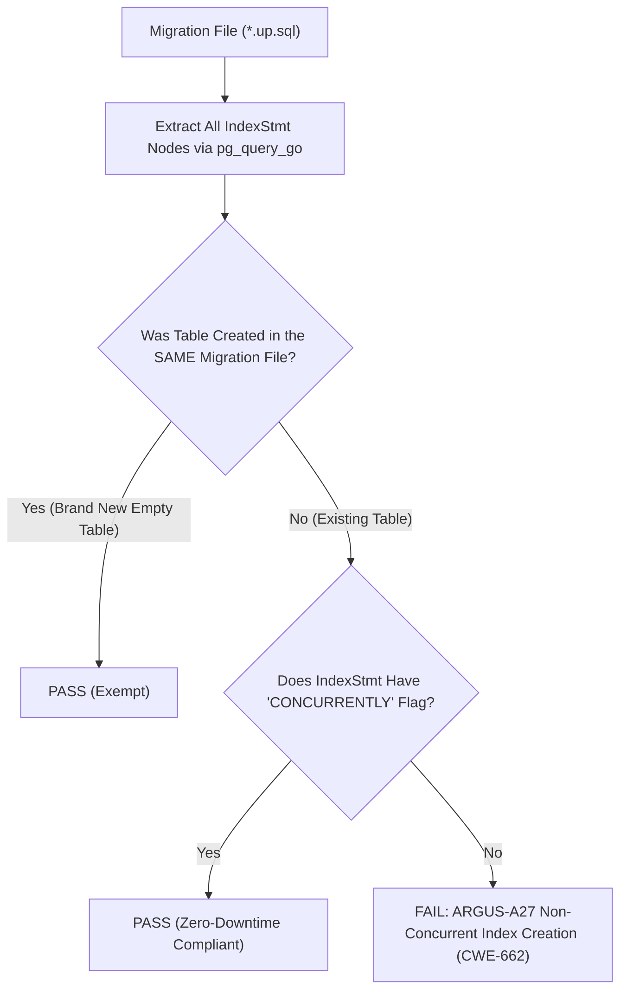

# ARGUS-A27: NON_CONCURRENT_INDEX_CREATION

| Meta Field            | Specification                                                                                                                                                                       |
| :-------------------- | :---------------------------------------------------------------------------------------------------------------------------------------------------------------------------------- |
| **Rule Code**         | `ARGUS-A27`                                                                                                                                                                         |
| **Identifier**        | `NON_CONCURRENT_INDEX_CREATION`                                                                                                                                                     |
| **Severity**          | **CRITICAL**                                                                                                                                                                        |
| **Category**          | Database Schema Migration, Zero-Downtime DDL & Concurrency Availability                                                                                                             |
| **Analysis Layer**    | Layer 1 - Pure SQL-AST Migration Analysis                                                                                                                                           |
| **CWE Mapping**       | [CWE-662: Improper Synchronization](https://cwe.mitre.org/data/definitions/662.html), [CWE-400: Uncontrolled Resource Consumption](https://cwe.mitre.org/data/definitions/400.html) |
| **OWASP ASVS**        | OWASP ASVS v4.0.3/v5.0 §V1.4.3 (Architecture & Zero-Downtime Upgrades)                                                                                                              |
| **PostgreSQL Target** | PostgreSQL Concurrent Indexing Architecture §13.3, `SHARE` Table Lockout & Production Write Outage Prevention                                                                       |
| **Default Status**    | `enabled`                                                                                                                                                                           |

---

## 1. Executive Summary & Architectural Invariant

Creating secondary indexes on existing database tables in migration files (`db/migrations/`) **must use the `CREATE INDEX CONCURRENTLY` clause** and must not execute within an active transaction block.

```
┌─────────────────────────────────────────────────────────────────────────────┐
│                            ARCHITECTURAL INVARIANT                          │
│                                                                             │
│  Adding indexes to existing production tables MUST use `CONCURRENTLY`.      │
│                                                                             │
│  Standard `CREATE INDEX` acquires an exclusive `SHARE` table lock that      │
│  blocks all concurrent `INSERT`, `UPDATE`, and `DELETE` queries, causing    │
│  severe production outages during large table re-indexing.                  │
│                                                                             │
│  Exception: Tables newly created within the SAME migration file are exempt  │
│  because the new table is empty and has zero production traffic.            │
└─────────────────────────────────────────────────────────────────────────────┘
```

---

## 2. Threat Mechanics & Engine Reality (PostgreSQL 18)

```
┌─────────────────────────────────────────────────────────────────────────────┐
│                 THE PRODUCTION WRITE OUTAGE LOCK DISASTER                   │
│                                                                             │
│  Table `audit_logs` has 10,000,000 rows. Live production traffic.          │
│                                                                             │
│  Case A: Standard CREATE INDEX without CONCURRENTLY (VIOLATION):            │
│  CREATE INDEX idx_logs_created ON audit_logs (created_at);                  │
│  ├─► Acquires `SHARE` lock on table `audit_logs`                            │
│  ├─► `INSERT INTO audit_logs` blocked waiting for index build (15 min hang!)│
│  ├─► Connection pool exhausted within 3 seconds                             │
│  └─► SEV-1 OUTAGE: All write operations fail across entire platform!        │
│                                                                             │
│  Case B: Using CREATE INDEX CONCURRENTLY (COMPLIANT):                       │
│  CREATE INDEX CONCURRENTLY idx_logs_created ON audit_logs (created_at);     │
│  ├─► Acquires `SHARE UPDATE EXCLUSIVE` lock only                            │
│  ├─► Does NOT conflict with `ROW EXCLUSIVE` (`INSERT`, `UPDATE`, `DELETE`)  │
│  └─► Zero-Downtime: App continues writing normally while index builds!      │
└─────────────────────────────────────────────────────────────────────────────┘
```

### 2.1. The `SHARE` Lock Conflict Matrix

According to PostgreSQL table locking rules (§13.3):

- `CREATE INDEX` (without `CONCURRENTLY`) acquires a **`SHARE` lock**.
- `SHARE` locks conflict directly with **`ROW EXCLUSIVE`** locks (required for all `INSERT`, `UPDATE`, `DELETE`).
- While PostgreSQL builds the index B-tree (which may take minutes on multi-gigabyte tables), all application writes queue up and time out.

### 2.2. Zero-Downtime Indexing with `CONCURRENTLY`

- `CREATE INDEX CONCURRENTLY` only acquires a **`SHARE UPDATE EXCLUSIVE`** lock.
- `SHARE UPDATE EXCLUSIVE` does not conflict with `ROW EXCLUSIVE`.
- PostgreSQL runs a two-pass table scan in the background, allowing uninterrupted application read and write operations.

---

## 3. Architecture & Execution Flow



---

## 4. Detection Logic & Rule Anatomy

1. **Table Creation Inventory:** Scans all `CreateStmt` nodes in the migration file to register newly created tables.
2. **IndexStmt Verification:** Inspects each `IndexStmt` node:
   - If the target table is listed in the current file's new table inventory $\rightarrow$ **Exempt**.
   - If the target table is an existing table and `indexStmt.Concurrent == false` $\rightarrow$ **Report Critical Violation**.
3. **Exemptions:** Suppressed via `-- argus:ignore ARGUS-A27 <reason>`.

---

## 5. Code Examples Matrix

### Non-Compliant (Locking Existing Production Table)

```sql
-- VIOLATION: Non-concurrent index on existing populated table
CREATE INDEX idx_users_email ON users (email);
```

```sql
-- VIOLATION: Non-concurrent composite index
CREATE INDEX idx_orders_created_status ON orders (created_at, status);
```

---

### Compliant (Zero-Downtime Indexing)

```sql
-- COMPLIANT: Concurrent index creation on existing table
CREATE INDEX CONCURRENTLY idx_users_email ON users (email);
```

```sql
-- COMPLIANT: Standard index on newly created table in same migration
CREATE TABLE IF NOT EXISTS notification_templates (
    id UUID PRIMARY KEY DEFAULT gen_random_uuid(),
    code VARCHAR(50) NOT NULL UNIQUE,
    title VARCHAR(150) NOT NULL
);

-- Permitted without CONCURRENTLY because table is empty and not live
CREATE INDEX idx_notification_templates_code ON notification_templates (code);
```

---

## 6. Mitigation & Remediation Guide

1. **Add `CONCURRENTLY`:**
   ```sql
   CREATE INDEX CONCURRENTLY idx_name ON table_name (column_name);
   ```
2. **Handle Transactional Migrations:**
   PostgreSQL forbids `CREATE INDEX CONCURRENTLY` inside transaction blocks. Ensure migration runners (e.g. `golang-migrate`) run index creation scripts outside transaction blocks (`-- argus:notransaction`).

---

## 7. Configuration & Suppression Directives

### Configuration in `.argus.yaml`

```yaml
rules:
  ARGUS-A27:
    enabled: true
```

### Inline Ignore Directives

```sql
-- argus:ignore ARGUS-A27 isolated offline maintenance migration
CREATE INDEX idx_legacy_archive ON archive_data (archive_date);
```
