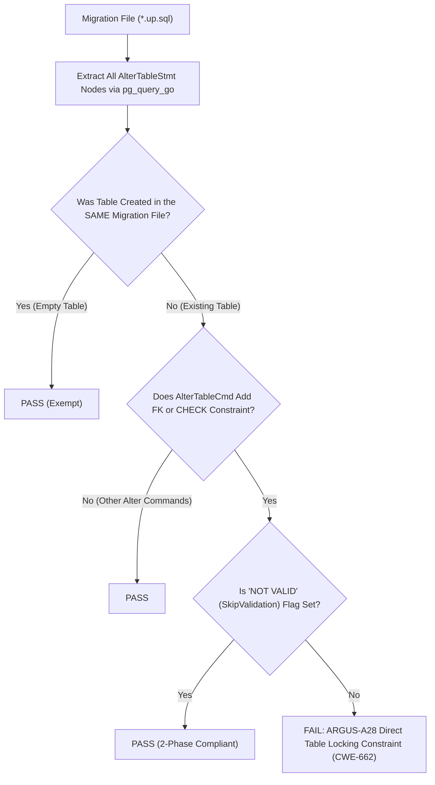

# ARGUS-A28: TABLE_LOCKING_CONSTRAINT_ADDITION

| Meta Field            | Specification                                                                                                                                                                       |
| :-------------------- | :---------------------------------------------------------------------------------------------------------------------------------------------------------------------------------- |
| **Rule Code**         | `ARGUS-A28`                                                                                                                                                                         |
| **Identifier**        | `TABLE_LOCKING_CONSTRAINT_ADDITION`                                                                                                                                                 |
| **Severity**          | **CRITICAL**                                                                                                                                                                        |
| **Category**          | Database Schema Migration, Zero-Downtime DDL & Concurrency Availability                                                                                                             |
| **Analysis Layer**    | Layer 1 - Pure SQL-AST Migration Analysis                                                                                                                                           |
| **CWE Mapping**       | [CWE-662: Improper Synchronization](https://cwe.mitre.org/data/definitions/662.html), [CWE-400: Uncontrolled Resource Consumption](https://cwe.mitre.org/data/definitions/400.html) |
| **OWASP ASVS**        | OWASP ASVS v4.0.3/v5.0 §V1.4.3 (Zero-Downtime Schema Evolution & Table Lock Prevention)                                                                                             |
| **PostgreSQL Target** | `ACCESS EXCLUSIVE` Lockout, Sequential Table Validation Lock Duration & Multi-Table Deadlock Prevention                                                                             |
| **Default Status**    | `enabled`                                                                                                                                                                           |

---

## 1. Executive Summary & Architectural Invariant

Adding `FOREIGN KEY` or `CHECK` constraints to existing database tables in migration files (`db/migrations/`) **must use the 2-phase zero-downtime addition pattern (`NOT VALID` followed by a separate `VALIDATE CONSTRAINT`)**.

```
┌─────────────────────────────────────────────────────────────────────────────┐
│                            ARCHITECTURAL INVARIANT                          │
│                                                                             │
│  Adding constraints directly without `NOT VALID` on populated production   │
│  tables is strictly prohibited.                                             │
│                                                                             │
│  A standard `ADD CONSTRAINT` acquires an `ACCESS EXCLUSIVE` table lock and  │
│  holds it while scanning the entire table to validate existing rows,        │
│  causing prolonged platform-wide read/write outages.                        │
│                                                                             │
│  Exception: Tables newly created in the SAME migration file are exempt.     │
└─────────────────────────────────────────────────────────────────────────────┘
```

---

## 2. Threat Mechanics & Engine Reality (PostgreSQL 18)

```
┌─────────────────────────────────────────────────────────────────────────────┐
│                 THE PRODUCTION CONSTRAINT LOCKING DISASTER                  │
│                                                                             │
│  Table `orders` has 20,000,000 rows. Table `users` has 5,000,000 rows.      │
│                                                                             │
│  Case A: Direct ADD CONSTRAINT (VIOLATION):                                 │
│  ALTER TABLE orders ADD CONSTRAINT fk_user FOREIGN KEY (u_id) REFERENCES... │
│  ├─► Acquires `ACCESS EXCLUSIVE` lock on `orders` (blocks ALL reads/writes) │
│  ├─► Acquires `SHARE ROW EXCLUSIVE` lock on `users`                         │
│  ├─► Sequentially scans 20M rows while holding exclusive locks (10+ min!)   │
│  └─► SEV-1 OUTAGE: Multi-table lock freeze, connection pool crash!          │
│                                                                             │
│  Case B: 2-Phase Zero-Downtime Constraint Addition (COMPLIANT):             │
│  Phase 1: ALTER TABLE orders ADD CONSTRAINT fk_user ... NOT VALID;          │
│  ├─► Acquires `ACCESS EXCLUSIVE` for < 2ms (enforces on new writes only)    │
│  Phase 2: ALTER TABLE orders VALIDATE CONSTRAINT fk_user;                   │
│  ├─► Acquires `SHARE UPDATE EXCLUSIVE` lock only (Zero-Downtime scan)       │
│  └─► Live reads & writes proceed uninterrupted!                             │
└─────────────────────────────────────────────────────────────────────────────┘
```

### 2.1. The `ACCESS EXCLUSIVE` Lockout Problem

Adding a `FOREIGN KEY` or `CHECK` constraint via standard `ALTER TABLE`:

1. Acquires an **`ACCESS EXCLUSIVE`** lock on the target table (blocking all `SELECT`, `INSERT`, `UPDATE`, and `DELETE`).
2. For foreign keys, it also acquires a **`SHARE ROW EXCLUSIVE`** lock on the referenced parent table.
3. It performs a full sequential scan across all existing rows to verify data integrity before releasing the lock. On large tables, this scan takes several minutes, freezing the entire application.

### 2.2. The 2-Phase Zero-Downtime Solution

1. **Phase 1 (`NOT VALID`):**
   ```sql
   ALTER TABLE orders ADD CONSTRAINT fk_user FOREIGN KEY (user_id) REFERENCES users(id) NOT VALID;
   ```
   PostgreSQL acquires the lock for less than 2 milliseconds, checks catalog metadata, and begins enforcing the constraint on all _future_ writes immediately.
2. **Phase 2 (`VALIDATE CONSTRAINT`):**
   ```sql
   ALTER TABLE orders VALIDATE CONSTRAINT fk_user;
   ```
   PostgreSQL validates existing data in the background with only a **`SHARE UPDATE EXCLUSIVE`** lock, allowing live concurrent read and write operations without downtime.

---

## 3. Architecture & Execution Flow



---

## 4. Detection Logic & Rule Anatomy

1. **Table Inventory:** Collects all `CreateStmt` table definitions created in the current migration file.
2. **Alter Table Walker:** Inspects `AlterTableStmt` nodes and filters for `AT_AddConstraint`.
3. **Constraint Validation:** For `CONSTR_FOREIGN` and `CONSTR_CHECK`:
   - Checks `c.SkipValidation == true` (representing `NOT VALID`).
   - If `c.SkipValidation == false` on an existing table $\rightarrow$ **Flags Critical Violation**.
4. **Exemptions:** Suppressed via `-- argus:ignore ARGUS-A28 <reason>`.

---

## 5. Code Examples Matrix

### Non-Compliant (Direct Constraint Addition on Populated Table)

```sql
-- VIOLATION: Direct FK addition blocks reads and writes on both tables
ALTER TABLE orders
ADD CONSTRAINT fk_orders_customer
FOREIGN KEY (customer_id) REFERENCES customers(id);
```

```sql
-- VIOLATION: Direct CHECK constraint forces synchronous table validation
ALTER TABLE users
ADD CONSTRAINT chk_users_phone_len
CHECK (length(phone) >= 10);
```

---

### Compliant (2-Phase Zero-Downtime Pattern)

```sql
-- COMPLIANT (Phase 1): Instant constraint registration without table lock
ALTER TABLE orders
ADD CONSTRAINT fk_orders_customer
FOREIGN KEY (customer_id) REFERENCES customers(id) NOT VALID;

-- COMPLIANT (Phase 2): Background non-blocking validation
ALTER TABLE orders VALIDATE CONSTRAINT fk_orders_customer;
```

```sql
-- COMPLIANT: Direct constraint on newly created table in same migration
CREATE TABLE IF NOT EXISTS order_items (
    id UUID PRIMARY KEY DEFAULT gen_random_uuid(),
    product_id UUID NOT NULL
);

ALTER TABLE order_items
ADD CONSTRAINT fk_order_items_product
FOREIGN KEY (product_id) REFERENCES products(id);
```

---

## 6. Mitigation & Remediation Guide

1. **Split Constraint Addition into 2 Phases:**
   - In your schema migration, always append `NOT VALID` to `ADD CONSTRAINT`.
   - In a subsequent migration step or file, execute `VALIDATE CONSTRAINT`.
2. **Validate Outside Transactions if Needed:**
   `VALIDATE CONSTRAINT` can run concurrently while your application handles regular user traffic.

---

## 7. Configuration & Suppression Directives

### Configuration in `.argus.yaml`

```yaml
rules:
  ARGUS-A28:
    enabled: true
```

### Inline Ignore Directives

```sql
-- argus:ignore ARGUS-A28 maintenance window isolated constraint addition
ALTER TABLE users ADD CONSTRAINT chk_users_legacy CHECK (legacy_id > 0);
```
