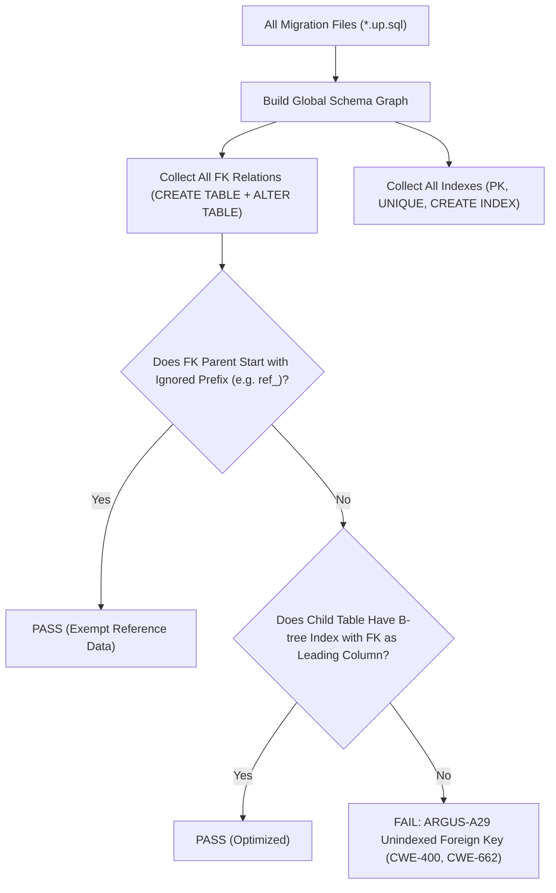

# ARGUS-A29: UNINDEXED_FOREIGN_KEY

| Meta Field            | Specification                                                                                                                                                                       |
| :-------------------- | :---------------------------------------------------------------------------------------------------------------------------------------------------------------------------------- |
| **Rule Code**         | `ARGUS-A29`                                                                                                                                                                         |
| **Identifier**        | `UNINDEXED_FOREIGN_KEY`                                                                                                                                                             |
| **Severity**          | **HIGH**                                                                                                                                                                            |
| **Category**          | Database Schema Migration, Query Performance & Lock Contention                                                                                                                      |
| **Analysis Layer**    | Layer 1 - Cross-Migration Schema Graph SQL Analysis                                                                                                                                 |
| **CWE Mapping**       | [CWE-400: Uncontrolled Resource Consumption](https://cwe.mitre.org/data/definitions/400.html), [CWE-662: Improper Synchronization](https://cwe.mitre.org/data/definitions/662.html) |
| **OWASP ASVS**        | OWASP ASVS v4.0.3/v5.0 §V1.4.3 (Database Performance & Locking Denial of Service)                                                                                                   |
| **PostgreSQL Target** | Foreign Key Cascading Full Table Scans, Sequential Lockouts on Parent `DELETE` / `UPDATE`, and Deadlocks                                                                            |
| **Default Status**    | `enabled`                                                                                                                                                                           |

---

## 1. Executive Summary & Architectural Invariant

Foreign key columns on child tables in migration files (`db/migrations/`) **must have a supporting B-tree index where the foreign key column is the leading (first) column of the index**.

```
┌─────────────────────────────────────────────────────────────────────────────┐
│                            ARCHITECTURAL INVARIANT                          │
│                                                                             │
│  Unlike primary keys or unique constraints, PostgreSQL DOES NOT             │
│  automatically create an index on foreign key columns.                      │
│                                                                             │
│  Every `FOREIGN KEY (child_col) REFERENCES parent_table(id)` requires an   │
│  explicit supporting index (`CREATE INDEX ... ON child_table (child_col)`), │
│  or a multi-column primary/unique key where `child_col` is leading.         │
│                                                                             │
│  Exception: Tables referencing read-only static reference tables            │
│  (configurable via `ignore_parent_prefixes`, default `ref_`) are exempt.   │
└─────────────────────────────────────────────────────────────────────────────┘
```

---

## 2. Threat Mechanics & Engine Reality (PostgreSQL 18)

```
┌─────────────────────────────────────────────────────────────────────────────┐
│                   THE UNINDEXED FOREIGN KEY TABLE LOCK CATASTROPHE          │
│                                                                             │
│  Parent Table: `users` (5,000,000 rows)                                     │
│  Child Table:  `orders` (50,000,000 rows) with FK on `orders.user_id`       │
│                                                                             │
│  Case A: Unindexed Foreign Key (VIOLATION):                                 │
│  DELETE FROM users WHERE id = '...';                                        │
│  ├─► PostgreSQL checks if any row in `orders` references this user          │
│  ├─► No index on `orders.user_id`! Forced Sequential Scan of 50M rows!      │
│  ├─► Acquires table-level shared lock on `orders` for the entire scan       │
│  ├─► All concurrent `INSERT` / `UPDATE` on `orders` are blocked             │
│  └─► SEV-1 OUTAGE: Cascade lock contention, connection exhaustion!          │
│                                                                             │
│  Case B: Supporting B-Tree Index on FK (COMPLIANT):                         │
│  CREATE INDEX idx_orders_user_id ON orders (user_id);                       │
│  ├─► PostgreSQL performs instant Index Scan on `orders.user_id` (< 1ms)     │
│  └─► Zero-Downtime parent delete/update execution!                          │
└─────────────────────────────────────────────────────────────────────────────┘
```

### 2.1. Why PostgreSQL Leaves FKs Unindexed by Default

PostgreSQL creates indexes automatically for `PRIMARY KEY` and `UNIQUE` constraints to enforce uniqueness. However, it does not do so for `FOREIGN KEY` constraints because:

- Indexes incur write overhead on `INSERT`/`UPDATE` operations.
- The SQL standard does not mandate automatic indexing for foreign keys.

### 2.2. The Cascading Table Lock & Scan Penalty

When a row is deleted or updated in the parent table (`DELETE FROM parent WHERE id = $1`), PostgreSQL must ensure referential integrity. Without an index on `child.parent_id`:

- PostgreSQL executes a **full sequential scan** of the child table for every deleted parent row.
- On high-traffic systems with millions of rows, this causes long-running transactions, massive I/O spikes, connection pool starvation, and deadlocks.

---

## 3. Architecture & Cross-Migration Schema Graph



---

## 4. Detection Logic & Rule Anatomy

1. **Global Schema Graph:** Gathers all schema definitions across migration files chronologically.
2. **FK Identification:** Identifies foreign keys defined inline in `CREATE TABLE` (`col REFERENCES parent(id)` or `CONSTRAINT ... FOREIGN KEY`) and `ALTER TABLE ADD CONSTRAINT`.
3. **Index Coverage Validation:**
   - Validates if an explicit `CREATE INDEX` exists with the FK column as the first (leading) indexed column.
   - Validates if a `PRIMARY KEY` or `UNIQUE` constraint covers the FK column in the leading position (`(fk_col, other_col)` is safe; `(other_col, fk_col)` is NOT safe).
4. **Prefix Suppression:** Skips parent tables matching configured ignore prefixes (e.g., `ref_`).

---

## 5. Code Examples Matrix

### Non-Compliant (Unindexed Foreign Key)

```sql
-- VIOLATION: order_id has an index, but product_id does NOT!
CREATE TABLE order_items (
    id UUID PRIMARY KEY DEFAULT gen_random_uuid(),
    order_id UUID NOT NULL REFERENCES orders(id),
    product_id UUID NOT NULL REFERENCES products(id)
);

CREATE INDEX idx_order_items_order_id ON order_items (order_id);
-- Missing: CREATE INDEX idx_order_items_product_id ON order_items (product_id);
```

---

### Compliant (Supporting Leading Index)

```sql
-- COMPLIANT: Explicit B-tree index supporting the foreign key
CREATE TABLE orders (
    id UUID PRIMARY KEY DEFAULT gen_random_uuid(),
    user_id UUID NOT NULL REFERENCES users(id)
);

CREATE INDEX idx_orders_user_id ON orders (user_id);
```

```sql
-- COMPLIANT: Foreign key is the leading column of a compound primary key
CREATE TABLE user_roles (
    user_id UUID NOT NULL REFERENCES users(id),
    role_id UUID NOT NULL REFERENCES roles(id),
    PRIMARY KEY (user_id, role_id)
);

-- Note: role_id still needs its own index if roles are frequently deleted!
CREATE INDEX idx_user_roles_role_id ON user_roles (role_id);
```

---

## 6. Mitigation & Remediation Guide

1. **Add Index Concurrently in Schema Migration:**
   For existing tables, add the missing index using `CREATE INDEX CONCURRENTLY` (conforming to `ARGUS-A27`):
   ```sql
   CREATE INDEX CONCURRENTLY idx_child_parent_id ON child_table (parent_id);
   ```
2. **Compound Index Ordering:**
   Ensure the foreign key is in the **leading position** (`idx_name ON tbl (fk_col, status)`), so B-tree range queries on `fk_col` can directly utilize the index.

---

## 7. Configuration & Suppression Directives

### Configuration in `.argus.yaml`

```yaml
rules:
  ARGUS-A29:
    enabled: true
    ignore_parent_prefixes:
      - "ref_"
      - "lookup_"
```

### Inline Ignore Directives

```sql
CREATE TABLE audit_records (
    id UUID PRIMARY KEY,
    -- argus:ignore ARGUS-A29 append-only audit trail without parent deletion
    device_id UUID NOT NULL REFERENCES devices(id)
);
```
