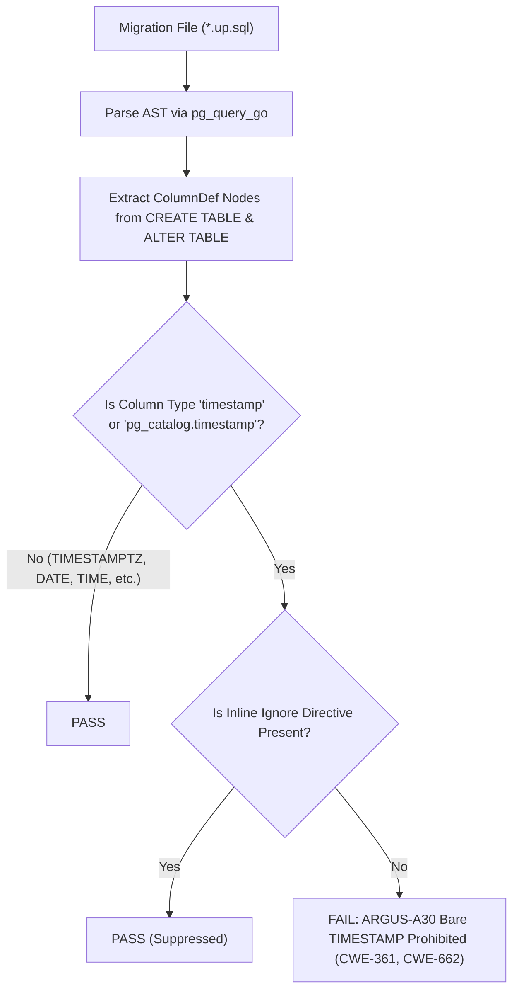

# ARGUS-A30: TIMESTAMP_WITHOUT_TIMEZONE

| Meta Field            | Specification                                                                                                                                                                                       |
| :-------------------- | :-------------------------------------------------------------------------------------------------------------------------------------------------------------------------------------------------- |
| **Rule Code**         | `ARGUS-A30`                                                                                                                                                                                         |
| **Identifier**        | `TIMESTAMP_WITHOUT_TIMEZONE`                                                                                                                                                                        |
| **Severity**          | **CRITICAL**                                                                                                                                                                                        |
| **Category**          | Database Schema Migration, Temporal Data Integrity & Audit Determinism                                                                                                                              |
| **Analysis Layer**    | Layer 1 - Pure SQL-AST Migration Analysis                                                                                                                                                           |
| **CWE Mapping**       | [CWE-361: Time-of-check Time-of-use (TOCTOU) Race Condition](https://cwe.mitre.org/data/definitions/361.html), [CWE-662: Improper Synchronization](https://cwe.mitre.org/data/definitions/662.html) |
| **OWASP ASVS**        | OWASP ASVS v4.0.3/v5.0 §V10.3.2 (Clock Synchronization, Timestamp Determinism & Cryptographic Audit Trails)                                                                                         |
| **PostgreSQL Target** | Session TimeZone Drift, Non-Deterministic Daylight Saving / Offset Shifts, and Audit Integrity Corruption                                                                                           |
| **Default Status**    | `enabled`                                                                                                                                                                                           |

---

## 1. Executive Summary & Architectural Invariant

Temporal column definitions in database migration files (`db/migrations/`) **must explicitly use `TIMESTAMPTZ` (`timestamp with time zone`) instead of bare `TIMESTAMP` (`timestamp without time zone`)**.

```
┌─────────────────────────────────────────────────────────────────────────────┐
│                            ARCHITECTURAL INVARIANT                          │
│                                                                             │
│  Bare `TIMESTAMP` (without time zone) is strictly prohibited.               │
│                                                                             │
│  A bare `TIMESTAMP` column stores wall-clock date and time without any      │
│  timezone offset or epoch anchor, making timestamps ambiguous and dependent  │
│  on whatever `TimeZone` GUC setting is active during insertion or query.    │
│                                                                             │
│  All temporal points in time must use `TIMESTAMPTZ` (internally stored as   │
│  UTC epoch microseconds) to preserve immutable chronological order.         │
└─────────────────────────────────────────────────────────────────────────────┘
```

---

## 2. Threat Mechanics & Engine Reality (PostgreSQL 18)

```
┌─────────────────────────────────────────────────────────────────────────────┐
│                      THE BARE TIMESTAMP TIME-TRAVEL DISASTER                 │
│                                                                             │
│  Case A: Bare TIMESTAMP (VIOLATION):                                        │
│  Column: `created_at TIMESTAMP`                                             │
│  ├─► App Server A (WIB / UTC+7) inserts `2026-08-29 10:00:00`               │
│  ├─► App Server B (UTC) inserts `2026-08-29 04:00:00` (1 hour later!)       │
│  ├─► DB stores raw strings without timezone metadata                        │
│  ├─► Audit Query: Server A's record appears 6 hours IN THE FUTURE!          │
│  └─► SEV-1: Cryptographic audit log corruption & TOCTOU sequence failures! │
│                                                                             │
│  Case B: Explicit TIMESTAMPTZ (COMPLIANT):                                  │
│  Column: `created_at TIMESTAMPTZ`                                           │
│  ├─► Server A inserts `10:00:00+07` -> Normalized to UTC: `03:00:00Z`       │
│  ├─► Server B inserts `04:00:00Z`   -> Normalized to UTC: `04:00:00Z`       │
│  ├─► Chronological ordering is mathematically guaranteed (< 1 microsecond)  │
│  └─► Deterministic audit logs across all distributed services!              │
└─────────────────────────────────────────────────────────────────────────────┘
```

### 2.1. Why Bare `TIMESTAMP` is Catastrophic for Distributed Systems

1. **Ambiguous Local Time:** Bare `TIMESTAMP` does not preserve the offset of the client. `2026-08-29 12:00:00` could be noon in London, Tokyo, or Jakarta.
2. **Daylight Saving Time (DST) Overlaps:** During autumn clock fallbacks (e.g. 2:00 AM $\rightarrow$ 1:00 AM), events occurring in the overlapping hour cannot be ordered chronologically.
3. **Audit Log Invalidation:** In security-critical multi-tenant systems, non-deterministic timestamps invalidate signature chains and proof-of-authenticity audit logs.

### 2.2. How `TIMESTAMPTZ` Works in PostgreSQL

- PostgreSQL internally converts all incoming `TIMESTAMPTZ` values to **UTC epoch microseconds (8-byte integer)** before storage on disk.
- When queried, it converts UTC to the client's current session timezone for display, guaranteeing absolute universal time integrity regardless of where the query originated.

---

## 3. Architecture & Execution Flow



---

## 4. Detection Logic & Rule Anatomy

1. **Table Column Parser:** Walks all `ColumnDef` nodes inside `CreateStmt` (in `CREATE TABLE`) and `AlterTableCmd` (in `ALTER TABLE ... ADD COLUMN` and `ALTER TABLE ... ALTER COLUMN TYPE`).
2. **Type Inspection:** Inspects `TypeName.Names`. If `names == ["timestamp"]` or `["pg_catalog", "timestamp"]`, it is a bare timestamp without time zone.
3. **Exemptions:** pure `DATE` and `TIME` (without date) types are allowed where timezone is irrelevant (e.g., recurring daily business hours).

---

## 5. Code Examples Matrix

### Non-Compliant (Bare TIMESTAMP)

```sql
-- VIOLATION: Bare timestamp lacks UTC anchor
CREATE TABLE events (
    id UUID PRIMARY KEY DEFAULT gen_random_uuid(),
    created_at TIMESTAMP NOT NULL DEFAULT NOW()
);
```

```sql
-- VIOLATION: Alter column type to bare timestamp
ALTER TABLE audit_logs ADD COLUMN archived_at TIMESTAMP;
```

---

### Compliant (TIMESTAMPTZ for Universal UTC Integrity)

```sql
-- COMPLIANT: Explicit TIMESTAMPTZ
CREATE TABLE events (
    id UUID PRIMARY KEY DEFAULT gen_random_uuid(),
    created_at TIMESTAMPTZ NOT NULL DEFAULT clock_timestamp(),
    updated_at TIMESTAMP WITH TIME ZONE DEFAULT CURRENT_TIMESTAMP
);
```

```sql
-- COMPLIANT: Pure DATE or TIME for calendar/schedule concepts
CREATE TABLE shift_schedules (
    id UUID PRIMARY KEY DEFAULT gen_random_uuid(),
    shift_date DATE NOT NULL,
    start_time TIME NOT NULL
);
```

---

## 6. Mitigation & Remediation Guide

1. **In Migration Files:**
   Always replace `TIMESTAMP` with `TIMESTAMPTZ`:
   ```sql
   ALTER TABLE users ADD COLUMN verified_at TIMESTAMPTZ;
   ```
2. **Migrating Existing Columns:**
   Convert existing columns cleanly:
   ```sql
   ALTER TABLE users ALTER COLUMN created_at TYPE TIMESTAMPTZ USING created_at AT TIME ZONE 'UTC';
   ```

---

## 7. Configuration & Suppression Directives

### Configuration in `.argus.yaml`

```yaml
rules:
  ARGUS-A30:
    enabled: true
```

### Inline Ignore Directives

```sql
CREATE TABLE legacy_raw_ticks (
    id UUID PRIMARY KEY,
    -- argus:ignore ARGUS-A30 legacy wall-clock duration ticks without timezone
    tick_time TIMESTAMP NOT NULL
);
```
