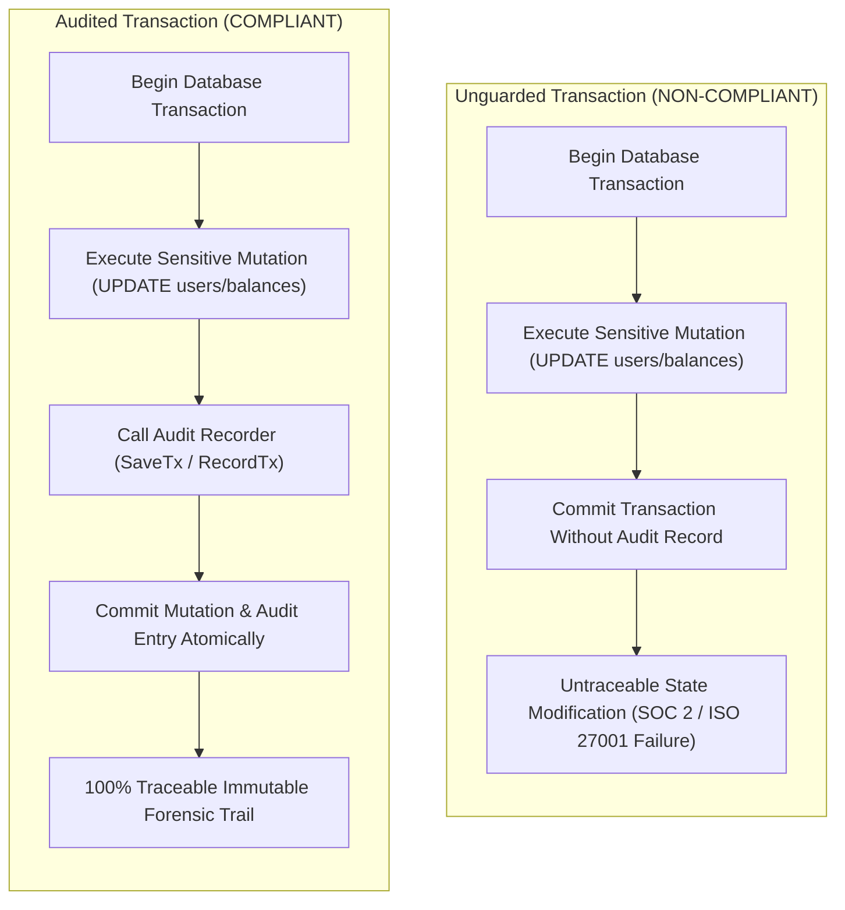

# ARGUS-A31: Unguarded Database Mutation Without Audit Trail

> **Rule Code:** `ARGUS-A31`
> **Identifier:** `UNGUARDED_MUTATION_WITHOUT_AUDIT`
> **Severity:** `HIGH` (Compliance & Regulatory Governance Blocker)
> **Category:** `Security, Governance & Audit Trail Compliance`
> **Target Standards:** SOC 2 Type II (Trust Services Criteria CC6.1, CC6.8), ISO/IEC 27001:2022 Control A.8.15 (Logging) & A.8.24 (Use of Cryptography / Transaction Integrity), PCI-DSS v4.0 Requirement 10.2.1, CWE-778 (Insufficient Logging)

---

## 1. Overview & Core Invariant

State-altering database modifications (`INSERT`, `UPDATE`, `DELETE`, `MERGE`) executed within database transactions **must be accompanied by verified audit logging** (`SaveTx`, `RecordTx`, `LogAuditEvent`, `Save`) within the same transaction scope.

In regulated enterprise applications, transactional mutations without audit trails lead to unaccountable state drift, untraceable insider manipulation, and audit non-compliance.



---

## 2. Technical Grounding & Regulatory Rationale

### 2.1. Atomic Audit Consistency
Writing audit events outside the transaction risks divergence:
- If the mutation commits but the external logging call fails, the database change occurs without a record.
- If the audit event is logged but the database transaction rolls back, phantom logs are created.

ARGUS-A31 enforces that mutations inside a transaction boundary are paired with audit recording calls executed in the same transactional context, guaranteeing atomic consistency.

### 2.2. Exemption Boundary
Not all database mutations represent business-sensitive state changes. High-throughput operational tables (such as session stores, ephemeral cache entries, and temporary verification tokens) do not require long-term audit retention. Argus supports explicit `exempt_tables` in `.argus.yaml` to prevent audit log bloat and false positives.

---

## 3. Non-Compliant Anti-Patterns

### Example 1: Direct State Mutation Without Audit Call

```go
// VIOLATION: Sensitive mutation inside transaction closure lacks audit trail
func UpdateUserStatus(ctx context.Context, db DB, userID int, status string) error {
    return db.ExecuteTx(ctx, func(tx DB) error {
        _, err := tx.Exec(ctx, "UPDATE users SET status = $1 WHERE id = $2", status, userID)
        return err
    })
}
```

### Example 2: Interprocedural Mutation Without Audit Trail

```go
// VIOLATION: Mutation hidden inside helper subroutine without audit logging
func DeductBalance(ctx context.Context, db DB, accID int, amount int64) error {
    return db.ExecuteTx(ctx, func(tx DB) error {
        return applyDeduction(ctx, tx, accID, amount)
    })
}

func applyDeduction(ctx context.Context, tx DB, accID int, amount int64) error {
    _, err := tx.Exec(ctx, "UPDATE accounts SET balance = balance - $1 WHERE id = $2", amount, accID)
    return err
}
```

---

## 4. Compliant Remediation

### Remediation 1: Pair Mutation with Authorized Audit Method

```go
// COMPLIANT: Mutation paired with SaveTx audit call within the same transaction
func UpdateUserStatus(ctx context.Context, db DB, auditor AuditLogger, userID int, status string) error {
    return db.ExecuteTx(ctx, func(tx DB) error {
        _, err := tx.Exec(ctx, "UPDATE users SET status = $1 WHERE id = $2", status, userID)
        if err != nil {
            return err
        }
        return auditor.SaveTx(ctx, tx, "USER_STATUS_UPDATED")
    })
}
```

### Remediation 2: Exemption for Ephemeral / Cache Tables

```go
// COMPLIANT: 'sessions' is configured under exempt_tables in .argus.yaml
func RefreshSession(ctx context.Context, db DB, token string) error {
    return db.ExecuteTx(ctx, func(tx DB) error {
        _, err := tx.Exec(ctx, "UPDATE sessions SET last_seen = NOW() WHERE token = $1", token)
        return err
    })
}
```

---

## 5. Configuration Reference

In `.argus.yaml`:

```yaml
rules:
  ARGUS-A31:
    enabled: true # Opt-in rule
    # Authorized audit logging method names
    audit_methods:
      - "SaveTx"
      - "RecordTx"
      - "LogAuditEvent"
      - "Save"
    # Tables exempted from mandatory audit logging
    exempt_tables:
      - "sessions"
      - "cache"
      - "temporary_tokens"
```

---

## 6. Directive Suppression

To suppress false alarms for verified non-sensitive batch operations, use:

```go
// argus:ignore ARGUS-A31 maintenance data migration routine
_, err := tx.Exec(ctx, "DELETE FROM dead_orders WHERE created_at < $1", cutoff)
```
