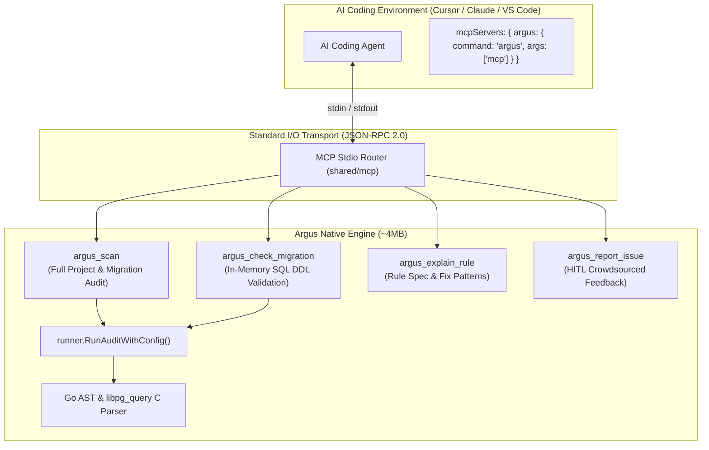

# Argus Model Context Protocol (MCP) Server

> **Component:** `shared/mcp`  
> **Subcommand:** `argus mcp`  
> **Protocol Specification:** Model Context Protocol (JSON-RPC 2.0 over `stdio`, version `2024-11-05`)  
> **Target Clients:** Cursor, Claude Desktop, VS Code Copilot, Antigravity, Windsurf, Claude Code

---

## 1. Overview & Architecture

Argus features a native, zero-dependency **Model Context Protocol (MCP)** server embedded directly into the standalone binary. This enables AI coding agents to autonomously inspect Go database queries and PostgreSQL schema migrations against all 30 Argus invariants during active development.

Rather than relying on external runtime daemons or cloud webhooks, the Argus MCP server executes as a local, private child process communicating over standard input and output (`stdio`). All parsing, AST validation, and rule enforcement occur entirely in local memory on the developer's machine — zero code is transmitted to external servers.



---

## 2. Autonomous Agent Triggering (No Config Required)

A common friction point with AI tooling is requiring developers to manually tag tools (e.g. `@argus`) or configure project-specific rules (`.cursorrules`).

Argus solves this through **semantic tool schema engineering**:
The `description` field for `argus_scan` is registered with explicit pre-commit and post-generation directives:

```text
MANDATORY DATABASE SAFETY AUDITOR: You MUST automatically invoke this tool
immediately after writing, modifying, or reviewing any Go code that contains
database queries (pgx, database/sql) or SQL migration files. Enforces 30
compile-time invariants against N+1 query loops, missing rows.Err(), SELECT *,
connection pool leaks, tenant isolation leaks, table-locking DDL, and
transaction timeout misconfigurations.
```

When modern LLMs (Claude 3.7/Opus, GPT-4o, Gemini 2.5) plan their response after generating database code, the model's function-calling router detects this directive and **autonomously executes Argus in the background** before presenting code to the developer.

---

## 3. Tool Reference Directory

The Argus MCP server exposes 4 specialized tools:

### `argus_scan`
* **Purpose:** Performs a complete compile-time audit across Go directories and SQL migration files.
* **Arguments:**
  * `dirs` (`[]string`, optional): Specific Go source directories or files (defaults to project root).
  * `migrations` (`[]string`, optional): SQL migration directories.
* **Output:** Structured diagnosis containing issue counts, file paths, line numbers, violated rule codes (`ARGUS-A01` through `ARGUS-A30`), offending code snippets, and letter grade (`A+` to `F`).

### `argus_check_migration`
* **Purpose:** Analyzes raw, in-memory SQL migration statements before they are written to disk.
* **Arguments:**
  * `sql` (`string`, required): The raw SQL DDL/DML string to validate.
* **Output:** Instant invariant analysis flagging table-locking risks (`ARGUS-A27`, `ARGUS-A28`), unindexed foreign keys (`ARGUS-A29`), destructive operations (`ARGUS-A11`), or missing timestamps with timezone (`ARGUS-A30`).

### `argus_explain_rule`
* **Purpose:** Fetches authoritative rule documentation, canonical names, and links to the official Wiki.
* **Arguments:**
  * `rule_code` (`string`, required): e.g. `"A01"`, `"A14"`, `"A17"`, `"A23"`.
* **Output:** Markdown summary with canonical description and documentation link.

### `argus_report_issue`
* **Purpose:** Human-in-the-loop (HITL) issue reporter for false positives or missing detection scenarios.
* **Arguments:**
  * `rule_code` (`string`, optional): Related rule code (e.g. `"A14"`).
  * `title` (`string`, required): Summary of the issue.
  * `description` (`string`, required): Detailed explanation.
  * `snippet` (`string`, optional): Offending Go or SQL code snippet.
  * `category` (`string`, optional): `"false-positive"`, `"missing-scenario"`, or `"rule-improvement"`.
  * `confirm` (`boolean`, optional): Approval flag. Default `false` (preview mode).

---

## 4. Human-In-The-Loop (HITL) Protocol

To ensure security and user consent, `argus_report_issue` enforces a strict **Two-Phase Confirmation Contract**:

```
┌─────────────────────────────────────────────────────────────┐
│ Phase 1: Preview Mode (confirm = false, default)            │
│ The tool returns a formatted Markdown draft preview.        │
│ NO network calls are made. NO issues are filed.             │
│ Agent MUST display the preview and ask for user consent.    │
└──────────────────────────────┬──────────────────────────────┘
                               │
               [User Explicitly Says "Yes" / "Approve"]
                               │
                               v
┌─────────────────────────────────────────────────────────────┐
│ Phase 2: Submission Mode (confirm = true)                   │
│ The issue is submitted via the local `gh` CLI (if auth'd)   │
│ or outputs a pre-filled GitHub issue creation URL.          │
└─────────────────────────────────────────────────────────────┘
```

---

## 5. Critical Warning: Autonomous & Trust Modes

> [!WARNING]
> ### ⚠️ Critical Notice on AI Agent Auto-Approve / Trust Modes
> Many modern AI development workflows utilize **Auto-Approve**, **YOLO Mode**, `--dangerously-skip-permissions`, or interactive pre-authorization alignment (such as `/grill-me`).
> 
> Under these configurations:
> 1. The developer grants the AI agent broad pre-authorized autonomy to execute terminal and MCP commands without presenting per-action interactive confirmation dialogues.
> 2. An AI agent possessing pre-authorized autonomy **has the technical capability to invoke `argus_report_issue` directly with `"confirm": true`**, using the developer's local authenticated GitHub CLI (`gh`) credentials to open a public issue on GitHub.
> 3. While this provides a seamless, zero-friction feedback loop for open-source contributors, **it may violate strict data-handling policies in enterprise, banking, or healthcare environments** where repository code snippets must never leave the internal perimeter.

---

## 6. Corporate Air-Gap & Telemetry Kill-Switch

For corporate or privacy-sensitive projects where outbound issue reporting must be unconditionally forbidden, Argus provides a **hard telemetry kill-switch**.

When telemetry is disabled, `argus_report_issue` is **permanently rendered inert**:
* It immediately aborts with a policy-blocked error response.
* It will **never** invoke the `gh` CLI.
* It will **never** generate external URLs.
* It cannot be overridden by the AI agent, even if `"confirm": true` is passed.

### Option A: Configuration via `.argus.yaml` (Recommended for Repositories)

Add the `telemetry: false` option to your project's `.argus.yaml`:

```yaml
version: "1"

options:
  telemetry: false # Disables all outbound issue reporting and telemetry
  fail_on: "HIGH"
  scan_dirs:
    - "."
  migration_dirs:
    - "migrations"
```

### Option B: Environment Variable (Recommended for CI/CD & Shell Profiles)

Set `ARGUS_TELEMETRY=false` in your system environment, shell configuration, or CI pipeline:

```bash
# In ~/.bashrc, ~/.zshrc, or corporate Docker environment:
export ARGUS_TELEMETRY=false
```

Accepted disable values: `false`, `0`, `off`, `no` (case-insensitive).

---

## 7. Client Configuration Recipes

### Cursor (`.cursor/mcp.json`)

Add the following to `.cursor/mcp.json` (or global Cursor Settings > MCP):

```json
{
  "mcpServers": {
    "argus": {
      "command": "argus",
      "args": ["mcp"]
    }
  }
}
```

### Claude Desktop (`claude_desktop_config.json`)

* **macOS:** `~/Library/Application Support/Claude/claude_desktop_config.json`
* **Linux:** `~/.config/Claude/claude_desktop_config.json`
* **Windows:** `%APPDATA%\Claude\claude_desktop_config.json`

```json
{
  "mcpServers": {
    "argus": {
      "command": "argus",
      "args": ["mcp"]
    }
  }
}
```

### VS Code / Copilot (`.vscode/settings.json`)

```json
{
  "mcp.servers": {
    "argus": {
      "command": "argus",
      "args": ["mcp"]
    }
  }
}
```
