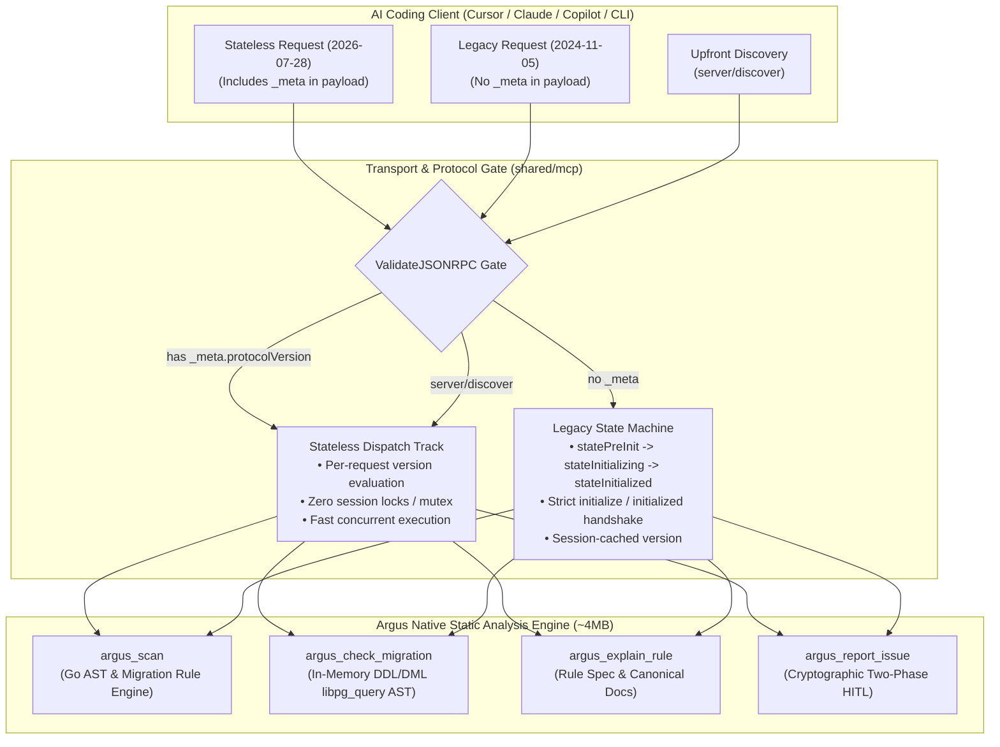

# Argus Model Context Protocol (MCP) Server

> **Component:** `shared/mcp`  
> **Subcommand:** `argus mcp`  
> **Protocol Specification:** Model Context Protocol (JSON-RPC 2.0 over `stdio`, versions `2026-07-28` [Stateless Core] & `2024-11-05`–`2025-11-25` [Dual-Track Legacy])  
> **Target Clients:** Cursor, Claude Desktop, VS Code Copilot, Antigravity, Windsurf, Claude Code, Goose, OpenCode

---

## 1. Overview & Dual-Track Architecture

Argus features a native, zero-dependency **Model Context Protocol (MCP)** server embedded directly into the standalone binary. This enables AI coding agents to autonomously inspect Go database queries and PostgreSQL schema migrations against all 30 Argus invariants during active development.

Argus implements the modern **MCP `2026-07-28` Stateless Specification** while maintaining seamless **Dual-Track backwards compatibility** for legacy stateful clients. All parsing, AST validation, and rule enforcement occur locally in process memory over standard input/output (`stdio`) — zero proprietary source code is ever transmitted outside your workstation.



---

## 2. MCP 2026-07-28 Specification Conformance

The `2026-07-28` revision removes the concept of session state in favor of self-describing, independent requests. Argus fully supports the following core invariants:

### 2.1 Upfront Discovery RPC (`server/discover`)
Clients query server capabilities and supported versions idempotently without triggering state machine transitions or requiring handshake initialization:

```json
// Request:
{"jsonrpc":"2.0","id":1,"method":"server/discover"}

// Response:
{
  "jsonrpc": "2.0",
  "id": 1,
  "result": {
    "resultType": "complete",
    "protocolVersions": ["2024-11-05", "2025-03-26", "2025-06-18", "2025-11-25", "2026-07-28"],
    "supportedVersions": ["2024-11-05", "2025-03-26", "2025-06-18", "2025-11-25", "2026-07-28"],
    "capabilities": {
      "tools": {},
      "extensions": {}
    },
    "serverInfo": {
      "name": "argus",
      "version": "1.0.0"
    },
    "_meta": {
      "io.modelcontextprotocol/serverInfo": {
        "name": "argus",
        "version": "1.0.0"
      }
    }
  }
}
```

### 2.2 Self-Describing Requests & Metadata (`_meta`)
Every stateless tool call carries protocol parameters inside `params._meta`:

* **Canonical Key:** `io.modelcontextprotocol/protocolVersion` (e.g. `"2026-07-28"`).
* **Permissive Fallback:** `protocolVersion` without namespace is automatically tolerated for early/draft client compatibility.
* **Server Identification:** Every tool result returns `_meta.io.modelcontextprotocol/serverInfo`.
* **Result Typings:** All success and error results carry required `resultType: "complete"`.
* **Caching Directives:** `tools/list` returns caching metadata (`ttlMs: 300000`, `cacheScope: "private"`) under SEP-2549.
* **Version Mismatch Handling:** Unsupported versions in `_meta` yield per-request error code `-32022` (`CodeUnsupportedProtocolVersion`) without terminating the `stdio` connection stream.

---

## 3. Autonomous Agent Triggering (Zero-Config Routing)

Modern AI models (Claude 3.7/Opus, GPT-4o, Gemini 2.5) route tool invocations based on semantic prompt steering. Argus embeds explicit pre-commit directives into the tool definitions so coding agents trigger Argus autonomously without requiring manual user tags (`@argus`) or custom prompt files:

```text
MANDATORY DATABASE SAFETY AUDITOR: You MUST automatically invoke this tool
immediately after writing, modifying, or reviewing any Go code that contains
database queries (pgx, database/sql) or SQL migration files. Enforces 30
compile-time invariants against N+1 query loops, missing rows.Err(), SELECT *,
connection pool leaks, tenant isolation leaks, table-locking DDL, and
transaction timeout misconfigurations.
```

---

## 4. Tool Reference Directory

The Argus MCP server exposes 4 high-precision static analysis tools:

### `argus_scan`
* **Purpose:** Performs a compile-time static audit across Go files and SQL migrations.
* **Input Schema:**
  * `dirs` (`string[]`, optional): Specific Go source directories or files to inspect (defaults to project root).
  * `migrations` (`string[]`, optional): SQL migration directories to validate for destructive changes.
* **Output:** Structured diagnosis detailing violated rule codes (`ARGUS-A01` through `ARGUS-A30`), file paths, line numbers, offending code snippets, and remediation steps.

### `argus_check_migration`
* **Purpose:** Parses and audits raw SQL migration DDL/DML statements entirely in-memory before they are committed or applied.
* **Input Schema:**
  * `sql` (`string`, required): Raw SQL migration statements.
* **Output:** Instant evaluation detecting table lockouts (`ARGUS-A27`, `ARGUS-A28`), missing foreign key indexes (`ARGUS-A29`), unsafe `DROP`/`RENAME` operations (`ARGUS-A11`), and bare `TIMESTAMP` without timezone (`ARGUS-A30`).

### `argus_explain_rule`
* **Purpose:** Retrieves authoritative documentation, PostgreSQL engine internals, and compliant remediation patterns for any Argus rule.
* **Input Schema:**
  * `rule_code` (`string`, required): e.g. `"A01"`, `"A14"`, `"A17"`, `"A23"`, `"A30"`.
* **Output:** Markdown documentation with PostgreSQL storage/locking mechanics and compliant code examples.

### `argus_report_issue`
* **Purpose:** Human-in-the-Loop (HITL) issue reporter for false positives, missing scenarios, or rule improvements.
* **Input Schema:**
  * `title` (`string`, required): Summary of the reported behavior.
  * `description` (`string`, required): Detailed technical explanation.
  * `rule_code` (`string`, optional): Related Argus rule code (e.g. `"A14"`).
  * `snippet` (`string`, optional): Offending Go or SQL code snippet.
  * `category` (`string`, optional): `"false-positive"`, `"missing-scenario"`, or `"rule-improvement"`.
  * `approval_token` (`string`, optional): Cryptographic single-use token obtained from Phase 1 preview. **REQUIRED** to execute outbound submission.
  * `confirm` (`boolean`, optional): Legacy confirmation flag.

---

## 5. Cryptographic Human-In-The-Loop (HITL) Protocol

Outbound issue submission enforces a **Cryptographically Bound Two-Phase Contract** to prevent unauthorized AI telemetry submissions or hallucinated parameter mutation:

```
┌────────────────────────────────────────────────────────────────────────┐
│ Phase 1: Preview Request (approval_token is omitted)                   │
│ • Validates character and byte payload quotas.                         │
│ • Computes SHA-256 digest of {rule_code, title, description, category}│
│ • Generates single-use memory token: appr_<random_hex> (10m TTL)       │
│ • Returns formatted markdown draft with Approval Token.                │
│ • NO external network calls or commands are made.                      │
└───────────────────────────────────┬────────────────────────────────────┘
                                    │
                    [Human User Explicitly Approves]
                                    │
                                    v
┌────────────────────────────────────────────────────────────────────────┐
│ Phase 2: Submission Request (approval_token = "appr_...")              │
│ • Re-computes SHA-256 payload digest.                                  │
│ • Cryptographic Anti-Tampering Check: Rejects if hash != token binding │
│ • Consumes token atomically (single-use replay protection).            │
│ • Creates GitHub issue via local authenticated gh CLI (if available)   │
│   or falls back to a pre-filled browser URL.                           │
└────────────────────────────────────────────────────────────────────────┘
```

### Cryptographic Invariants
1. **Zero Silent Submission:** An issue cannot be created without a valid approval token generated by a preceding preview call.
2. **Payload Anti-Mutation:** If an AI agent or intermediary modifies title, description, snippet, or category by even 1 character between Phase 1 and Phase 2, the submission is rejected with:
   `🔒 HUMAN APPROVAL AUTHORIZATION REJECTED: payload mutation detected`
3. **Single-Use Replay Defense:** Once an approval token is verified, it is deleted from process memory immediately. Replaying the same token will fail.

---

## 6. Corporate Air-Gap & Telemetry Kill-Switch

For enterprise, banking, or air-gapped environments where outbound network reporting must be completely blocked, Argus provides a **hard telemetry kill-switch**.

When telemetry is disabled, `argus_report_issue` fails closed on the very first instruction:
* Rejects execution immediately with `isError: true`:
  `🔒 Issue reporting is disabled by policy (telemetry: false / ARGUS_TELEMETRY=false). Outbound submission blocked.`
* No draft preview or cryptographic token is ever minted.
* No `gh` CLI command or subprocess is executed.
* No external network socket, HTTP call, or URL is generated.

### Method 1: Local Configuration (`.argus.yaml`)
```yaml
version: "1"

options:
  telemetry: false # Completely disables outbound issue reporting
  fail_on: "HIGH"
  scan_dirs:
    - "."
  migration_dirs:
    - "migrations"
```

### Method 2: Environment Variable
```bash
# In ~/.bashrc, ~/.zshrc, or CI/CD container configuration:
export ARGUS_TELEMETRY=false
```
*Accepted disable values:* `false`, `0`, `off`, `no` (case-insensitive).

---

## 7. Client Configuration Recipes

Configure Argus as a stdio MCP server in your development environment:

### Cursor (`.cursor/mcp.json`)
```json
{
  "mcpServers": {
    "argus": {
      "command": "argus",
      "args": ["mcp"]
    }
  }
}
```

### Claude Desktop (`claude_desktop_config.json`)
* **macOS:** `~/Library/Application Support/Claude/claude_desktop_config.json`
* **Linux:** `~/.config/Claude/claude_desktop_config.json`
* **Windows:** `%APPDATA%\Claude\claude_desktop_config.json`

```json
{
  "mcpServers": {
    "argus": {
      "command": "argus",
      "args": ["mcp"]
    }
  }
}
```

### VS Code / Copilot (`.vscode/settings.json`)
```json
{
  "mcp.servers": {
    "argus": {
      "command": "argus",
      "args": ["mcp"]
    }
  }
}
```

### Windsurf / Codeium (`~/.codeium/windsurf/mcp_config.json`)
```json
{
  "mcpServers": {
    "argus": {
      "command": "argus",
      "args": ["mcp"]
    }
  }
}
```

### Goose CLI (`~/.config/goose/config.yaml`)
```yaml
extensions:
  argus:
    name: argus
    cmd: argus
    args:
      - mcp
    type: stdio
```

---

## 8. JSON-RPC Protocol & Error Codes

Argus conforms to JSON-RPC 2.0 and MCP specification error standards:

| Error Code | Identifier | Description |
| :--- | :--- | :--- |
| `-32700` | `CodeParseError` | Invalid JSON was received by the server. |
| `-32600` | `CodeInvalidRequest` | JSON sent is not a valid Request object. |
| `-32601` | `CodeMethodNotFound` | The method does not exist / is not recognized. |
| `-32602` | `CodeInvalidParams` | Invalid method parameter(s). |
| `-32002` | `CodeServerNotInitialized` | Legacy request received before `initialize` handshake. |
| `-32022` | `CodeUnsupportedProtocolVersion` | Unsupported version declared in `_meta.protocolVersion`. |
| `-32800` | `CodeCancelled` | Client explicitly cancelled the request via notification. |

---

## 9. Security & Sandboxing Guarantee

* **Single Process Boundary:** Runs as a child process under the developer's user permissions.
* **Zero Cloud Dependence:** AST parsing and SQL validation run 100% locally via embedded `libpg_query` C bindings.
* **Filesystem Containment:** Scanner operations are strictly restricted to configured project roots (`allowed_roots`) to prevent path traversal outside workspace perimeters.
* **Cryptographic Authorization:** Outbound issue submissions require human-in-the-loop explicit consent with cryptographic anti-tamper verification.
