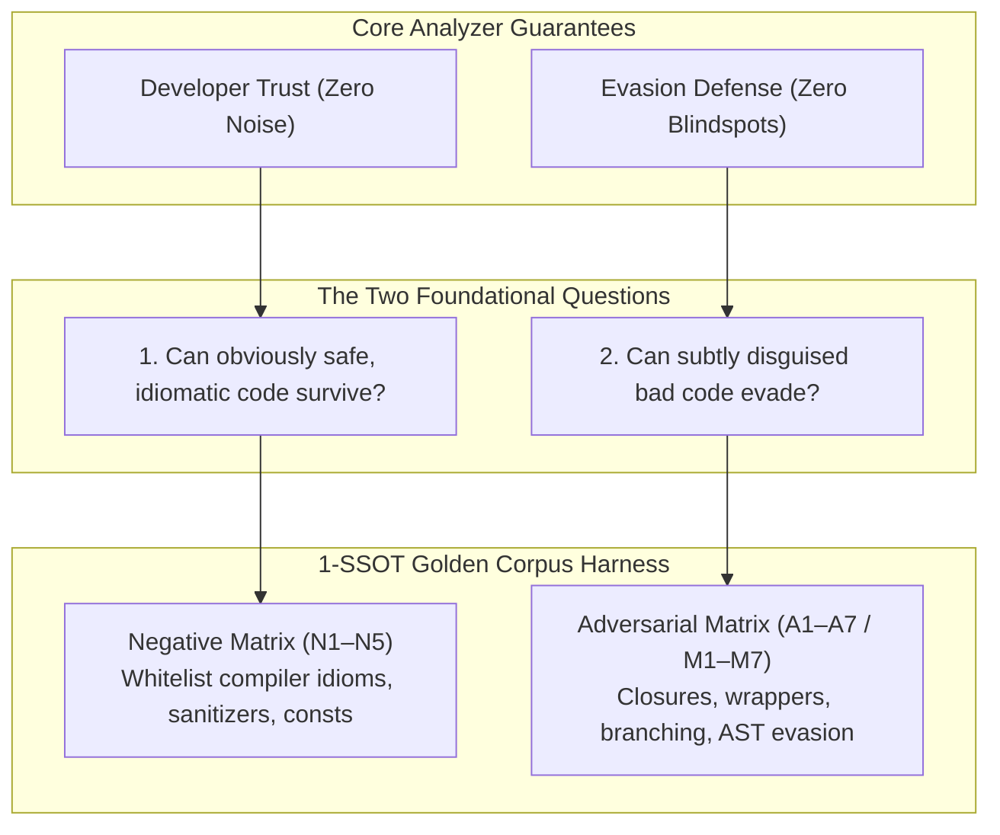
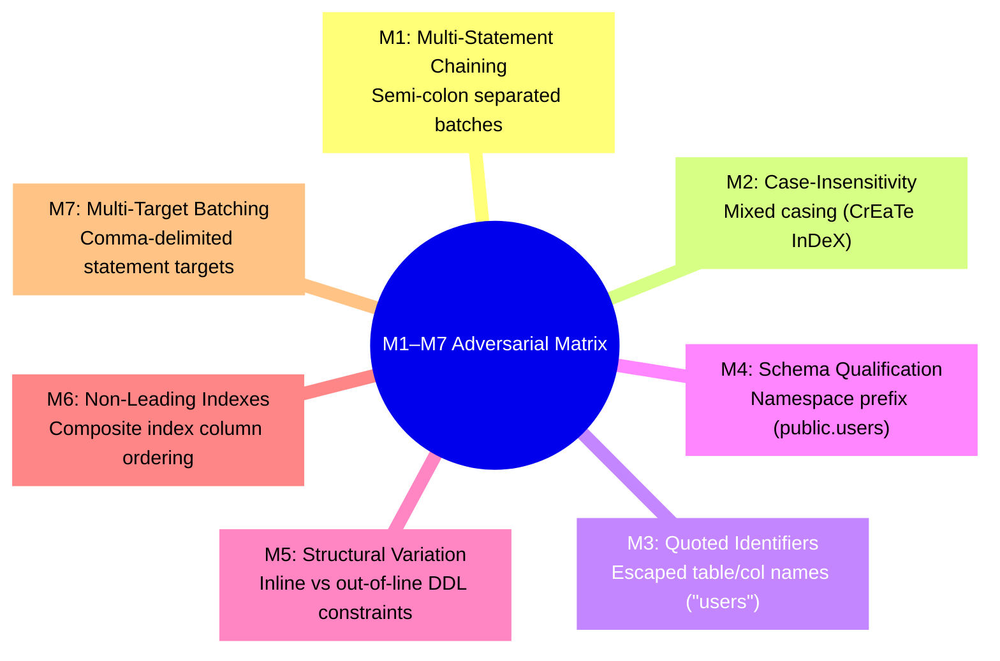

# Argus 1-SSOT Golden Corpus & Adversarial Testing Methodology

> _"A static analyzer that only tests whether obvious violations trigger suffers from a dangerous illusion of security. Real-world integrity requires proving that safe idioms survive without noise, and subtle obfuscations cannot evade."_

The **Argus 1-SSOT Golden Corpus** is the testing methodology and architectural harness powering the reliability of the Argus static analyzer. It enforces compile-time static analysis guarantees across Go code and PostgreSQL 18.x migrations with a **Zero False-Positive Target** and **Zero-Divergence Parity**.

---

## 1. The Core Philosophy

Testing static analysis tools is fundamentally harder than testing standard application logic. A typical unit test asserts `f(x) == y`. However, static analyzers operate on abstract syntax trees (AST) across arbitrary developer expressions, dialects, and architectural wrappers. 

Argus divides analyzer verification into **two distinct pillars**:



1. **Zero False-Positive Target:** If a linter emits warnings on valid, standard idioms (such as `COUNT(*)` in dynamic query checks or `pgx.CollectRows` in cursor checks), developers lose trust and disable the tool with `--no-verify`. Compliant code **must survive with zero diagnostics**.
2. **Zero False-Negative Target (Adversarial Defense):** Unsafe queries rarely appear as naive string concatenations in enterprise codebases. They hide inside helper functions, closures, conditional branches, repository wrappers, or aliased types. Analyzers must be resilient against structural obfuscation.

---

## 2. 1-SSOT Architecture (Single Source of Truth)

In traditional static analysis setups, developers often maintain disparate test directories for the analysis driver (`analysistest`) and integration tests for the CLI runner. This duplication frequently leads to **silent divergence**—where an analyzer passes unit tests but fails when executed via the CLI binary.

Argus permanently resolves this through the **1-SSOT (Single Source of Truth) architecture**:

```text
tests/
├── golden_corpus_status_test.go     # Automated 30-Rule Adoption Matrix Enforcement
├── correctness/                     # 24 Go AST Rules (A01–A10, A12, A14, A16–A26)
│   ├── a01/                         # Rule ARGUS-A01
│   │   ├── positive/                # P1–P5 Violations (annotated with // want)
│   │   │   └── positive.go
│   │   ├── negative/                # N1–N5 Compliant & Suppressed Code (0 diagnostics)
│   │   │   └── negative.go
│   │   ├── adversarial/             # A1–A7 Structural Obfuscation & Evasion Matrix
│   │   │   └── adversarial.go
│   │   └── a01_corpus_test.go       # Dual-Path Parity Harness & Direct Engine Tests
│   └── a02/ ... a26/
│
└── migration/                       # 6 SQL Migration Rules (A11, A13, A15, A27–A30)
    ├── a11/                         # Rule ARGUS-A11
    │   ├── positive/                # Violating migration DDLs (DROP TABLE, DROP COLUMN)
    │   │   ├── positive.go          # Go test runner harness
    │   │   └── migrations/          # Raw SQL migration fixtures (*.up.sql)
    │   ├── negative/                # Safe migration DDLs (expand-contract, -- argus:ignore)
    │   │   ├── negative.go
    │   │   └── migrations/
    │   ├── adversarial/             # M1–M7 SQL AST Evasion Vectors (casing, quotes, chains)
    │   │   ├── adversarial.go
    │   │   └── migrations/
    │   └── a11_corpus_test.go       # Migration Engine & Standalone Parity Harness
    └── a13, a15, a27, a28, a29, a30
```

### Key Architectural Invariants:
- **100% Structural Symmetry:** Both Go AST rules and SQL migration rules share the exact same tripartite hierarchy (`positive/`, `negative/`, `adversarial/`).
- **Module Root Driver Wiring:** `rules/aXX/analyzer_test.go` leverages Go's module root resolution to execute `analysistest.Run` directly against `./tests/correctness/aXX/positive` and `./tests/correctness/aXX/negative`.
- **Zero Fixture Duplication:** The standalone CLI runner (`runner.RunAuditWithConfig`) targets the exact same files evaluated by `analysistest.Run`.

---

## 3. The 17-Pattern Corpus Taxonomy (Go AST Rules)

Every Go source code analyzer is evaluated against a canonical **17-Pattern Matrix**:

| Category | Code | Pattern Name | Test Objective & Description |
| :--- | :--- | :--- | :--- |
| **Positive** | `P1` | **Obvious Violation** | Direct raw function call or straightforward illegal AST expression. |
| | `P2` | **Indirect Violation** | Multi-step assignment, intermediate variables, or reassigned values. |
| | `P3` | **Helper Violation** | Violation embedded inside private helper functions or secondary methods. |
| | `P4` | **Nested Violation** | Violation nested deeply inside conditional blocks, loops, or select statements. |
| | `P5` | **Alias Violation** | Package imported with an alias or receiver referenced through a type alias. |
| **Negative** | `N1` | **Obvious Safe** | Idiomatic, compliant implementation using standard parameter bindings. |
| | `N2` | **Legitimate Idiom** | Compiler-recognized safe idioms (e.g. `COUNT(*)`, `EXISTS (SELECT 1)`). |
| | `N3` | **Unrelated API** | Non-database structs sharing identical method names (e.g. custom `Logger.Query`). |
| | `N4` | **Sanitized Input** | Input verified through static allowlists or approved sanitization routines. |
| | `N5` | **Static / Constant** | Untainted compile-time string constants, typed numeric constants, or math literals. |
| **Adversarial** | `A1` | **Branching** | Conditional branches (`if/else`, `switch/case`) where one path is tainted. |
| | `A2` | **Reassignment** | Clean variables reassigned with dirty values, or dirty variables overwritten cleanly. |
| | `A3` | **Aliasing** | Struct embedding, pointer indirection, and local interface references. |
| | `A4` | **Wrapper** | Custom database repositories, transaction managers, or logging decorators. |
| | `A5` | **Nested Closure** | Violations dispatched inside anonymous closures, `defer` statements, or goroutines. |
| | `A6` | **Generics** | Generic repository abstractions (`[T any]`) parameterized with database models. |
| | `A7` | **Interface Dispatch** | Dynamic method dispatch through `any.(Querier)` or untyped interface parameters. |

---

## 4. The M1–M7 Adversarial Matrix (SQL Migration Rules)

PostgreSQL DDL migrations are analyzed using native `libpg_query` C-AST parser trees. To ensure SQL migrations cannot bypass checks through lexical or grammatical variations, migration rules are stress-tested against the **M1–M7 Adversarial Matrix**:



1. **M1: Multi-Statement Chaining:** Semicolon-delimited queries within a single `.up.sql` file to ensure the parser traverses all statement nodes in the parse tree without truncating on the first node.
2. **M2: Case-Insensitivity:** Arbitrary casing (`cReAtE iNdEx`, `tImEsTaMp`, `dRoP tAbLe`) to verify AST node inspection rather than fragile string-matching.
3. **M3: Quoted Identifiers:** SQL identifiers wrapped in double quotes (`"orders"`, `"created_at"`), preserving exact PostgreSQL identifier semantics.
4. **M4: Schema Qualification:** Explicit namespace prefixes (`public.accounts`, `billing.invoices`) ensuring table names are matched regardless of schema scoping.
5. **M5: Structural Variation:** Table constraints declared inline during `CREATE TABLE` versus added later via `ALTER TABLE ADD CONSTRAINT`.
6. **M6: Precision & Non-Leading Index Variants:** Testing subtle SQL variations, such as `TIMESTAMP(6)` precision specifiers or composite indexes where the inspected column is not the leading key.
7. **M7: Multi-Target Batching:** Statements operating on multiple targets in a single clause (e.g. `DROP TABLE users, orders CASCADE`).

---

## 5. Dual-Path Parity Invariant

Argus can be run in two distinct environments:
- **Path 1 (Driver Mode):** Run via the official Go analysis driver (`go vet -vettool=$(which argus) ./...`).
- **Path 2 (Standalone CLI Mode):** Run directly in terminal or CI pipelines (`argus --dirs=. --migrations=migrations`).

A known pitfall in static analysis tooling is **dual-path divergence** (where the standalone runner reimplements inspection logic with regex or disparate walkers, creating dead code and missed detections).

Argus enforces the **Dual-Path Parity Invariant**:

> **The Parity Rule:** Standalone runners (`runner/scan_go.go` and `runner/scan_migrations.go`) MUST invoke the exact same exported AST inspection engine as the analysis driver package (`rules/aXX/`). Reimplementing rule heuristics using regular expressions is strictly prohibited.

Every rule package includes an automated dual-path parity harness:

```go
func TestDualPathParity(t *testing.T) {
    // 1. Verify Path 1: Official Analysis Driver (analysistest)
    analysistest.Run(t, rootDir, Analyzer, "./tests/correctness/aXX/positive")

    // 2. Verify Path 2: Standalone CLI Runner (runner.RunAuditWithConfig)
    result, err := runner.RunAuditWithConfig(runner.AuditConfig{
        RootDir:  fixtureDir,
        ScanDirs: []string{fixtureDir},
    })
    if len(result.Issues) == 0 {
        t.Fatalf("PARITY FAILURE: Standalone runner reported 0 violations for identical fixture!")
    }
}
```

---

## 6. Adoption Matrix & Continuous Quality Gates

All 30 Argus rules (A01 through A30) have achieved **100% adoption** under the 1-SSOT Golden Corpus architecture.

The adoption status of the entire rule suite is continuously enforced by [`tests/golden_corpus_status_test.go`](https://github.com/will2469/argus/blob/main/tests/golden_corpus_status_test.go):

```bash
# Run the automated Golden Corpus Adoption Matrix test:
go test -v -run TestGoldenCorpus_AdoptionMatrix ./tests
```

```text
=== RUN   TestGoldenCorpus_AdoptionMatrix
    --- PASS: TestGoldenCorpus_AdoptionMatrix (0.00s)
    ========================================================================================
    ARGUS 1-SSOT GOLDEN CORPUS ADOPTION MATRIX
    ========================================================================================
    ARGUS-A01 [Correctness] ADOPTED: 1 SSOT Golden Corpus (P1-P5, N1-N5, A1-A7, analysistest + runner)
    ARGUS-A02 [Correctness] ADOPTED: 1 SSOT Golden Corpus (P1-P5, N1-N5, A1-A7, analysistest + runner)
    ...
    ARGUS-A30 [Migration  ] ADOPTED: 1 SSOT Golden Migration Corpus (positive, negative, adversarial + runner)
    ========================================================================================
    TOTAL RULES    : 30
    ADOPTED RULES  : 30 (100.0%)
    PENDING RULES  : 0 (0.0%)
    ========================================================================================
```

Whenever new rules are introduced (**ARGUS-A31+**), they are automatically required to conform to the 1-SSOT Golden Corpus harness before passing CI.
